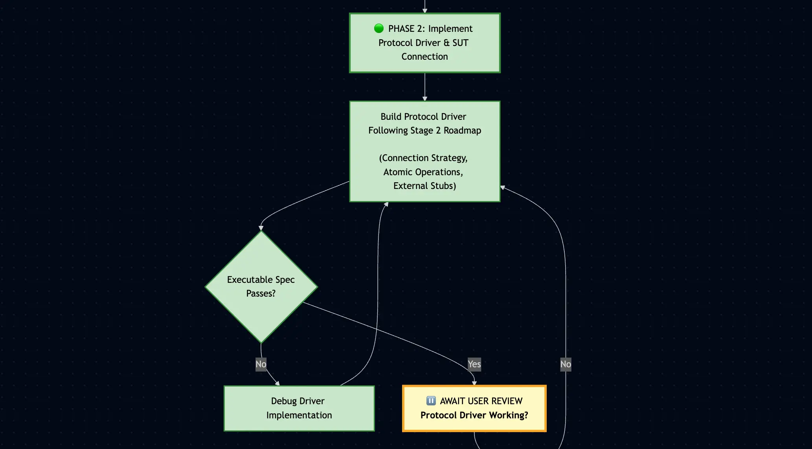

# AAID Acceptance Testing Workflow

_Professional Acceptance Testing for AI-Augmented Software Development_

🔻


## Table of Contents

- [Prerequisites & Overview](#prerequisites-overview)
- [Core Concepts](#core-concepts)
  - [What is Acceptance Testing?](#what-is-acceptance-testing)
  - [Behavior-Driven Development (BDD)](#bdd)
  - [The Three Levels of Test Isolation](#test-isolation)
- [The Four-Layer Model Architecture](#four-layer-architecture)
  - [Layer Overview](#layer-overview)
  - [Layer Responsibilities](#layer-responsibilities)
- [AI-Augmented Workflow](#ai-workflow)
  - [Workflow Philosophy](#workflow-philosophy)
  - [Workflow Diagram](#workflow-diagram)
  - [Stage 1: Context Providing](#stage-1-context)
  - [Stage 2: Planning & Analysis](#stage-2-planning)
  - [Stage 3: Three-Phase Test Cycle](#stage-3-cycle)
    - [Phase 1: Generate Executable Spec & DSL](#phase-1)
    - [Phase 2: Implement Protocol Driver & SUT Connection](#phase-2)
    - [Phase 3: Refactor Layers & Validate Isolation](#phase-3)
- [Layer Implementation Guide](#layer-implementation-guide)
  - [Project Structure](#project-structure)
  - [Layer 1: Executable Specifications](#layer-1-executable-specs)
    - [Mapping From Requirements to Executable Specs](#mapping-from-requirements-to-executable-specs)
  - [Layer 2: Domain-Specific Language](#layer-2-dsl)
    - [Core DSL Utilities](#core-utilities)
    - [Domain-Specific DSL Classes](#dsl-classes)
  - [Layer 3: Protocol Drivers & Stubs](#layer-3-protocol-drivers)
    - [Protocol Driver Interface](#protocol-driver-interface)
    - [Protocol Driver Factory](#protocol-driver-factory)
    - [Protocol Drivers](#protocol-drivers)
    - [Assertion Mechanism](#assertion-mechanism)
    - [External System Stubs](#external-stubs)
  - [Layer 4: System Under Test](#layer-4-sut)
- [Best Practices & Anti-Patterns](#best-practices)
  - [Critical Implementation Rules](#critical-rules)
  - [Common Anti-Patterns](#anti-patterns)
- [Validation & Reference](#validation-reference)
  - [Validation Checklist](#validation-checklist)
  - [Quick Reference](#quick-reference)
- [Protocol Driver Strategy Roadmap Template](#driver-strategy-roadmap)

<a id="prerequisites-overview"></a>

## Prerequisites & Overview

This blueprint combines Dave Farley's Four-Layer Model for acceptance testing with a disciplined AI-augmented workflow adopting `AAID` (Augmented AI Development) principles.

> To learn more about **ATDD** (Acceptance Test-Driven Development) and many of the concepts that inspired this `AAID` workflow, consider taking this course at [Continuous Delivery Training](https://courses.cd.training/pages/about-atdd-bdd-from-stories-to-executable-specifications).

**Prerequisites:**

- BDD scenarios already defined (Given-When-Then format)
- Ubiquitous Language established with stakeholders
- Basic understanding of test automation concepts

**What This Blueprint Provides:**

1. Transform BDD scenarios into executable specifications using AI assistance
2. Maintain clear separation of concerns across [four distinct layers](#four-layer-architecture)
3. Achieve comprehensive test isolation (system-level, functional, and temporal)
4. Create maintainable tests that survive implementation changes
5. Follow a disciplined workflow with review checkpoints at each phase

**`AAID` Workflow Philosophy:**

- 🧠 **You maintain control**: Review and understand every generated component
- 🪜 **Incremental progress**: Small, focused steps with validation between phases
- 🦾 **AI as augmentation**: The AI generates code, you architect and validate

<a id="core-concepts"></a>

## Core Concepts

<a id="what-is-acceptance-testing"></a>

### What is Acceptance Testing?

**Acceptance Testing** verifies that a system meets business requirements from an external user's perspective. It serves as an automated, objective Definition of Done.

**Key Characteristics:**

- **Defines behavior**: Specifies WHAT the system does, not HOW
- **Uses business language**: Written in terms stakeholders understand
- **Provides automated verification**: User story is complete only when acceptance tests pass
- **Creates living documentation**: Tests document actual system behavior
- **Forms executable specifications**: Tests ARE the specification in code

**Acceptance Testing vs E2E Testing:**

| Aspect                    | Acceptance Testing          | E2E Testing             |
| ------------------------- | --------------------------- | ----------------------- |
| **Scope**                 | Tests via system boundaries | Tests entire deployment |
| **External Dependencies** | Stubs third-party systems   | Uses real systems       |
| **Internal Dependencies** | Uses real database/cache    | Uses real everything    |
| **Failure Indicates**     | Business logic problems     | Could be anything       |
| **Speed**                 | Fast enough for CI/CD       | Often too slow          |
| **Reliability**           | Deterministic               | Can be flaky            |

<a id="bdd"></a>

### Behavior-Driven Development (BDD)

BDD creates shared understanding through **communication and collaboration** between business stakeholders, developers, and testers.

**Core Elements:**

- **Common language**: Everyone uses the same vocabulary (Ubiquitous Language)
- **Concrete examples**: Abstract requirements become specific scenarios
- **Collaborative sessions**: Teams define behavior together before coding

**Given-When-Then Format (Gherkin):**

```gherkin
Given the user has a completed todo "Buy milk"     # Initial app state
When they archive "Buy milk"                       # Action taken
Then "Buy milk" should be in archived todos        # Expected app state after action has occurred
And "Buy milk" should not be in active todos       # Additional outcome
```

<a id="test-isolation"></a>

### The Three Levels of Test Isolation

Per Dave Farley's definition, three levels of isolation are essential for reliable and fast acceptance testing.

Acceptance tests run against your real, production-like system, including the real database and cache. Unlike unit tests (which mock everything and can therefore run sequentially in milliseconds), acceptance tests are slower.

To keep test suites fast, we run tests in parallel. Isolation prevents tests from interfering with each other during parallel execution and ensures repeatable results across multiple runs.

#### 1. System-Level Isolation

**Be very specific about the boundaries of your system-under-test:**

- Test at your system boundary using its normal interfaces directly
- Use stubs **only** for external third-party dependencies to capture assertions or inject inputs
- Consider contract testing for external dependencies; mock during development, toggle to real calls before releases to verify the contract
- Critical: Do not stub your own database, cache, or internal services; they are part of the SUT and must be exercised in a production-like environment, which is why isolation is mandatory.

> For detailed guidance on which dependencies to mock versus use real in different test types, see [Appendix E: Dependencies and Mocking](../../appendix-e/dependencies-and-mocking.md).

#### 2. Functional Isolation

**Run many tests in any order, in parallel, or individually against the same production-like system (e.g. with its real database) without interference:**

- Each test creates its own unique data boundary (e.g., user account, customer record, workspace)
- All test operations happen within that partition's context (e.g., todos belong to that specific user)
- DSL methods use `params.alias()` to make identifiers unique: "<user@test.com>" → "user@test.com1", "user@test.com2", etc.
- Tests share the same deployed system and database but operate in their own isolated test scopes, enabling safe parallel execution
- Example:
  - For a school management app, each test might create a whole new school with all its various business logic entities and rules
  - For e-commerce, each test might create a unique customer and their products
- After a test run is over, your system will contain accumulated test data. That's okay! Discard the test SUT and start fresh for the next run

#### 3. Temporal Isolation

**Run the same test repeatedly and get the same results:**

- Combines with functional isolation to ensure deterministic behavior across runs
- Uses proxy-naming technique: the test uses stable names, the test infrastructure (DSL layer) maps to unique aliases per run
  - Account identifiers: "<user@test.com>" → "user@test.com1" (run 1), "user@test.com2" (run 2)
  - Data within account: "Buy milk" → "Buy milk1" (run 1), "Buy milk2" (run 2)
- Optional: treat time as an external dependency via a controllable clock to keep tests deterministic

> ℹ️ `DslContext` maintains a static `globalSequenceNumbers` map that persists across all tests within the process. Each test creates a fresh `DslContext` instance (which is destroyed after the test), but all instances share the same static counter, so Test 1 gets suffix "1", Test 2 gets "2", etc.
>
> This is the one intentional piece of shared state: it enables temporal isolation and deterministic numbering without manual cleanup. When you restart the test runner, the process terminates and the OS reclaims all process memory (including the static `globalSequenceNumbers` map), so the new process starts with a fresh empty map.

<a id="four-layer-architecture"></a>

## The Four-Layer Model Architecture

<a id="layer-overview"></a>

### Layer Overview

```
┌─────────────────────────────────────────────────┐
│    Layer 1: Test Cases (Executable Specs)       │
│    "WHAT the system does in business terms"     │
└─────────────────────────────────────────────────┘
                        │
                        ▼
┌─────────────────────────────────────────────────┐
│    Layer 2: Domain-Specific Language (DSL)      │
│         "Business vocabulary as code"           │
└─────────────────────────────────────────────────┘
                        │
                        ▼
┌─────────────────────────────────────────────────┐
│    Layer 3: Protocol Drivers & Stubs            │
│    "HOW to technically interact with system"    │
└─────────────────────────────────────────────────┘
                        │
                        ▼
┌─────────────────────────────────────────────────┐
│    Layer 4: System Under Test (SUT)             │
│    "The actual application being tested"        │
└─────────────────────────────────────────────────┘
```

<a id="layer-responsibilities"></a>

### Layer Responsibilities

#### ✅ Layer 1 Responsibilities: Test Cases (Executable Specifications)

**Purpose:** Express acceptance criteria in business language

**Characteristics:**

- Uses Given-When-Then structure
- Focuses on single outcomes
- Never references technical implementation
- Maps 1:1 to BDD scenarios

#### 🗣️ Layer 2 Responsibilities: Domain-Specific Language (DSL)

**Purpose:** Translate business language into system interactions, while handling test isolation and keeping executable specifications free of technical details

**Key Features:**

- **Natural language methods**: Match BDD scenarios exactly
- **Parameter handling**: Uses sensible defaults and optional parameters, to make the executable specifications readable and free from unecessary technical details
- **Isolation infrastructure**: Uses methods like `params.alias()` to implement functional and temporal test isolation, to enable safe parallel test execution
- **Pure translation layer**: NO assertions, NO failures, NO business or verification logic
- **Simply calls Protocol Driver**: Transforms business language to driver calls

#### 🔌 Layer 3 Responsibilities: Protocol Drivers & Stubs

**Purpose:** Handle all technical interaction with system AND all verification logic

**Protocol Drivers:**

- Translate abstract commands from DSL into concrete interactions with system's interfaces
- One driver per protocol: each communication channel (UI, API, CLI, message queue) gets its own dedicated driver class
- Implement a common `ProtocolDriver` interface: enables protocol abstraction and runtime switching
- Handle specifics of communication protocol (HTTP requests, browser automation, message queues)
- Contains ALL assertions and failures: This is where pass/fail decisions are made
- Framework-agnostic failures: throw standard `Error` (not framework-specific methods like `expect.fail()`)
- DSL depends only on the interface: never imports concrete driver implementations
- Each operation should be atomic and reliable
- Hide complex flows: `hasAccount` may involve register + login, establishing the functional isolation boundary for all subsequent operations

**External System Stubs:**

- Isolate the SUT from ONLY external third-party dependencies (payment gateways, third-party APIs)
- Never stub internal systems you control (your database, cache, message queues)
- Allow tests to define specific responses
- Ensure tests are predictable and reliable

#### 🏭 Layer 4 Responsibilities: System Under Test (SUT)

**Purpose:** The actual application being tested

**Configuration:**

- Deploy as in production
- Include your database, cache, and internal services; everything you are directly responsible for (as opposed to third-party external APIs)
- Optimize for fast startup
- Accept concurrent test data

<a id="ai-workflow"></a>

## AI-Augmented Workflow

<a id="workflow-philosophy"></a>

### Workflow Philosophy

This workflow adapts `AAID` (Augmented AI Development) principles for acceptance testing:

1. 🧠 - **Don't abandon your brain**: Understand every generated line
2. 🪜 - **Incremental steps**: One phase at a time, with reviews between
3. 🦾 - **AI as augmentation**: You architect, AI generates, you review

<a id="workflow-diagram"></a>

### Workflow Diagram

With context, specs, and environment in place, we're ready to start the AI-augmented acceptance testing cycle.  
This diagram shows the **formal workflow**, with detailed explanations for each step in [Stage 1–3](#ai-workflow).



The diagram distinguishes the three review-driven phases of the workflow, lightly mirroring the RED/GREEN/REFACTOR phases of TDD:

- **🔴 RED (Phase 1)**: Generate Executable Specs & DSL
- **🟢 GREEN (Phase 2)**: Implement Protocol Driver & Connect SUT
- **🧼 REFACTOR (Phase 3)**: Refactor Layers & Validate Isolation

| 🔗                                                                                                                                                                             |
| ------------------------------------------------------------------------------------------------------------------------------------------------------------------------------ |
| Click [this link](https://github.com/dawid-dahl-umain/augmented-ai-development/blob/main/appendices/appendix-a/aaid-at-workflow.diagram.mermaid) to **view** the full diagram. |

> If the diagram is not rendered on mobile, copy/paste the mermaid code into a [mermaid editor](https://mermaid.live).

<a id="stage-1-context"></a>

### Stage 1: Context Providing

Before any AI interaction, establish comprehensive context:

#### 1. Add Project Context

- Existing acceptance test structure and patterns
- DSL conventions already in use
- Protocol driver implementations
- Test framework setup

#### 2. Add BDD Scenarios

- User stories with Given-When-Then scenarios
- Ubiquitous Language glossary
- Business rules and constraints

#### 3. Add Technical Context

- System architecture overview
- Documentation on how to [map from requirements to executable specifications](#mapping-from-requirements-to-executable-specs)
- Available entry points (API, UI, CLI)
- Third-party integrations requiring stubs (NOT internal systems)

| 🤖 AI Understanding                                                                                     |
| ------------------------------------------------------------------------------------------------------- |
| The AI now understands your testing landscape and can generate consistent, appropriate test components. |

<a id="stage-2-planning"></a>

### Stage 2: Planning & Analysis

Collaborate with AI to analyze BDD scenarios and plan implementation. The output of this stage is a **Protocol Driver Strategy Roadmap** that represents your shared understanding with the AI about how to implement the acceptance tests.

#### 1. Extract Domain Concepts from BDD Scenarios

Identify the key domain objects (nouns from Ubiquitous Language) that will become DSL elements:

- Examples: `user`, `todo`, `archive`, `payment`, `order`, `cart`
- These become the main DSL objects that group related actions and assertions
- Each object represents a key concept from your business domain

#### 2. Choose Protocol Driver Type

Based on your system's interfaces, for example:

- **UI testing**: Playwright, Selenium
- **API testing**: HTTP clients
- **CLI testing**: Process spawning
- **Message testing**: Queue clients

#### 3. Create Protocol Driver Strategy Roadmap

Use the [template](#driver-strategy-roadmap) to document how tests will interact with the system:

- Protocol type and connection strategy
- How tests will achieve the [three levels of isolation](#test-isolation)
- System boundaries and entry points
- Which external third-party systems need stubbing (system-level isolation)
- Which data needs aliasing (functional isolation)
- How to achieve temporal isolation (repeated runs)

**Example strategy excerpt (shortened for readability):**

```markdown
# Acceptance Testing Strategy: Todo Archive Feature

## Connection Strategy

- **Protocol Type**: UI with Playwright
- **Entry Points**: /todos, /todos/archived

## Isolation Strategy

- **System-Level**: Stub EmailService and AnalyticsAPI (third-party only)
- **Functional** (parallel safe): Each test creates its own user account boundary
- **Temporal** (repeatable): Proxy-naming aliases account emails ("user@test.com1", "user@test.com2") and todo names ("Buy milk1", "Buy milk2")

[See complete roadmap template below for full structure]
```

> 📋 **Note**: This is a shortened version. See the [complete roadmap template](#driver-strategy-roadmap) for the full structure and all sections to include.

| 🤖 AI Alignment                                                                      |
| ------------------------------------------------------------------------------------ |
| AI and developer are now aligned on the testing approach and layer responsibilities. |

<a id="stage-3-cycle"></a>

### Stage 3: Three-Phase Test Cycle

The cycle follows three phases lightly mirroring the TDD RED/GREEN/REFACTOR pattern, each with mandatory review:

<a id="phase-1"></a>

#### 🔴 Phase 1: Generate Executable Spec & DSL

**AI generates:**

- Executable specification matching BDD scenarios exactly
- DSL layer with natural language methods
- Implements isolation strategy from Stage 2: uses `params.alias()` to make user-provided identifiers unique
- Keeps tests readable: uses `params.optional()`, `params.optionalSequence()`, and `params.optionalList()` to provide defaults

**Example generation:**

```typescript
// Executable Spec - 1:1 mapping to BDD
it("should archive a completed todo", async () => {
  // Given
  await dsl.user.hasAccount({ email: "user@test.com" });

  // And
  await dsl.user.hasCompletedTodo({ name: "Buy milk" });

  // When
  await dsl.user.archives({ todo: "Buy milk" });

  // Then
  await dsl.todo.confirmInArchive({ name: "Buy milk" });

  // And
  await dsl.todo.confirmNotInActive({ name: "Buy milk" });
});

// DSL Methods - Pure translation, NO business or verification logic
async hasAccount(args: AccountParams = {}): Promise<void> {
  const params = new Params(this.context, args);
  const email = params.alias("email");  // Functional isolation boundary

  await this.driver.hasAccount(email);
}

async hasCompletedTodo(args: TodoParams = {}): Promise<void> {
  const params = new Params(this.context, args);
  const name = params.alias("name");  // Temporal isolation within account
  const description = params.optional("description", "");  // Falls back to "" if not provided

  await this.driver.hasCompletedTodo(name, description);
}
```

| ⏸️ **STOP: AWAIT USER REVIEW**                                                                                                                                                                                          |
| ----------------------------------------------------------------------------------------------------------------------------------------------------------------------------------------------------------------------- |
| **Phase 1 Review Checklist:**<br>🔴 Natural language DSL methods match BDD scenarios<br>🔴 Proper aliasing for all identifiers<br>🔴 Only Gherkin comments in executable specs<br>🔴 Each BDD line maps to one DSL call |

<a id="phase-2"></a>

#### 🟢 Phase 2: Implement Protocol Driver & SUT Connection

**AI implements based on Stage 2 roadmap:**

- Protocol driver with atomic operations
- All assertions and failure logic
- Polling mechanisms for concluding events
- External system stubs (only third-party)
- Connection to actual SUT using the strategy defined in the roadmap

**Example implementation:**

```typescript
// protocol-driver/ui/driver.ts

import { Page } from "playwright"
import { ProtocolDriver } from "./interface"

export class UIDriver implements ProtocolDriver {
  constructor(private page: Page) {}

  // Creates account boundary - all operations happen within this account context
  async hasAccount(email: string): Promise<void> {
    try {
      await this.page.goto("/register")
      await this.page.fill('[data-testid="email"]', email)
      await this.page.fill('[data-testid="password"]', "test-password")
      await this.page.click('[data-testid="register-submit"]')
      await this.page.waitForSelector('[data-testid="user-menu"]')
    } catch (error) {
      throw new Error(
        `Unable to create account for '${email}': ${error.message}`
      )
    }
  }

  // Complex flow: create + complete todo, with assertion
  async hasCompletedTodo(name: string, description: string): Promise<void> {
    // Navigate, fill form, create todo, mark complete, verify state
    // Throws Error if any step fails or completion verification fails
  }

  // ... other interface methods following the same pattern
}
```

Key driver responsibilities: implements `ProtocolDriver` interface, throws standard `Error` on failures, hides complex flows, establishes/uses account boundaries.

| ⏸️ **STOP: AWAIT USER REVIEW**                                                                                                                                                                                              |
| --------------------------------------------------------------------------------------------------------------------------------------------------------------------------------------------------------------------------- |
| **Phase 2 Review Checklist:**<br>🟢 Tests passing with implemented drivers<br>🟢 Protocol driver successfully connects to SUT<br>🟢 Only external third-party systems stubbed<br>🟢 Driver contains all assertions/failures |

<a id="phase-3"></a>

#### 🧼 Phase 3: Refactor Layers & Validate Isolation

**AI evaluates and refactors (if needed):**

- Evaluate all four layers for potential improvements
- If no refactoring needed, explicitly state "No refactoring needed"
- When improvements identified:
  - Polish layers for clarity
  - Remove duplication across layers
  - Cleanup AI-generated comments
  - Ensure 1:1 BDD mapping maintained

**Validation tests (always run):**

- Run tests in parallel (functional isolation)
- Run same test twice (temporal isolation)
- Verify only third-party systems stubbed (system-level isolation)

| ⏸️ **STOP: AWAIT FINAL REVIEW**                                                                                                                                                                                          |
| ------------------------------------------------------------------------------------------------------------------------------------------------------------------------------------------------------------------------ |
| **Phase 3 Review Checklist:**<br>🧼 All three isolation levels working correctly<br>🧼 Natural language maintained throughout DSL<br>🧼 Clear separation between layers<br>🧼 Tests run in parallel without interference |

<a id="layer-implementation-guide"></a>

## Layer Implementation Guide

<a id="project-structure"></a>

### Project Structure

```text
acceptance-test/
├── executable-specs/         # Layer 1: Test cases
│   └── acceptance.spec.ts
├── dsl/                      # Layer 2: Business vocabulary
│   ├── utils/
│   │   ├── DslContext.ts     # Manages aliases & sequences
│   │   └── Params.ts         # Parameter parsing helper
│   ├── index.ts              # Main DSL exports
│   └── [concept].ts          # Domain concepts
├── protocol-driver/          # Layer 3: System interaction
│   ├── interface.ts          # ProtocolDriver interface
│   ├── factory.ts            # Protocol driver factory
│   ├── ui/
│   │   └── driver.ts         # UI implementation (Playwright, etc.)
│   ├── api/
│   │   └── driver.ts         # API implementation (HTTP client)
│   ├── cli/
│   │   └── driver.ts         # CLI implementation (process spawn)
│   └── stubs/
│       └── [external].stub.ts
└── sut/                      # Layer 4: System setup
    └── setup.ts
```

<a id="layer-1-executable-specs"></a>

### ✅ Layer 1: Executable Specifications


Transform BDD scenarios with natural language DSL. Structure requirements like this (adjust the headings if your organization uses a different naming convention):

Maintain a single executable spec file (for example `acceptance.spec.ts`) that exercises every protocol; when a protocol cannot drive a scenario, guard it with the runner's skip helper such as `test.skipIf(...)`.

```gherkin
Title: User archives completed todos

User Story:

As a user, I want to archive completed todos,
so that my active list stays clean.

Acceptance Criteria:

Feature: User archives completed todos

Scenario: Archive a completed todo
  Given the user has an account
  And they have a completed todo "Buy milk"
  When they archive "Buy milk"
  Then "Buy milk" should be in archived todos
  And "Buy milk" should not be in active todos

Scenario: ... # Next Scenario (follows same pattern with account creation)

# Linked technical implementation (non-behavioral) tasks (not mapped to acceptance tests):
# - UI Tasks: visual styling, screen reader accessibility, animations
# - Technical Tasks: infrastructure elements (adapters, repositories, monitoring tools, etc.)
```

> For more information on handling technical implementation details, see [Appendix D](../../appendix-d/handling-technical-implementation-details.md) of the main [AAID documentation](../../../docs/aidd-workflow.md).

<a id="mapping-from-requirements-to-executable-specs"></a>

#### Mapping From Requirements to Executable Specs

1. `Feature` → top-level `describe` block
2. Each `Scenario` → nested `describe` named after the scenario, containing a single `it` test
3. Name the `it` with the expected outcome (e.g., `it("should archive a completed todo")`)
4. Every `Given`/`When`/`Then` line → matching DSL call with the same Gherkin comment so each step maps 1:1
5. DSL method names mirror the scenario language so the executable spec stays business-readable

```typescript
// Feature → top-level describe
describe("<Feature>", () => {
  // Scenario → nested describe with a single it
  describe("<Scenario>", () => {
    it("<expected outcome>", async () => {
      // Given → dsl.<domain>.<context>(...)
      // When  → dsl.<domain>.<action>(...)
      // Then  → dsl.<domain>.<confirm>(...)
      // And   → dsl.<domain>.<additional>(...)
    });
  });

  describe("<Next Scenario>", () => {
    ...
  });
});
```

| ☝️                                                                                                                                                                                          |
| ------------------------------------------------------------------------------------------------------------------------------------------------------------------------------------------- |
| If your product hierarchy includes larger units (epics, initiatives, activities, themes), add a higher-level `describe` for that grouping above the feature block to preserve traceability. |

The transformation follows a 1:1 mapping pattern:

```typescript
// executable-specs/acceptance.spec.ts

import { beforeEach, describe, it } from "vitest"
import { Dsl } from "../dsl"
import { createProtocolDriver } from "../protocol-driver/factory"

describe("User archives completed todos", () => {
  let dsl: Dsl

  beforeEach(() => {
    const driver = createProtocolDriver(process.env.TEST_PROTOCOL || "ui")

    dsl = new Dsl(driver)
  })

  describe("Archive a completed todo", () => {
    it("should archive a completed todo", async () => {
      // Given
      await dsl.user.hasAccount({ email: "user@test.com" })

      // And
      await dsl.user.hasCompletedTodo({ name: "Buy milk" })

      // When
      await dsl.user.archives({ todo: "Buy milk" })

      // Then
      await dsl.todo.confirmInArchive({ name: "Buy milk" })

      // And
      await dsl.todo.confirmNotInActive({ name: "Buy milk" })
    })
  })

  describe("Attempt to archive an incomplete todo", () => {
    it("should not archive an incomplete todo", async () => {
      // Given
      await dsl.user.hasAccount({ email: "user@test.com" })

      // And
      await dsl.user.hasIncompleteTodo({ name: "Walk dog" })

      // When
      await dsl.user.attemptsToArchive({ todo: "Walk dog" })

      // Then
      await dsl.todo.confirmErrorMessage()

      // And
      await dsl.todo.confirmInActive({ name: "Walk dog" })
    })
  })

  describe("Restore an archived todo", () => {
    it("should restore an archived todo", async () => {
      // Given
      await dsl.user.hasAccount({ email: "user@test.com" })

      // And
      await dsl.user.hasArchivedTodo({ name: "Review code" })

      // When
      await dsl.user.restores({ todo: "Review code" })

      // Then
      await dsl.todo.confirmInActive({ name: "Review code" })
    })
  })
})
```

Instantiating `new Dsl(driver)` inside `beforeEach` guarantees every test receives a fresh `DslContext` and freshly wired driver, so aliasing and state never leak between scenarios. Each test then establishes its own functional isolation boundary by creating a unique user account.

| ☝️                                                                                                                                                                                                                                                                                                                                   |
| ------------------------------------------------------------------------------------------------------------------------------------------------------------------------------------------------------------------------------------------------------------------------------------------------------------------------------------ |
| When writing executable specs, always create the DSL inside the suite's setup (for example with `let dsl: Dsl;` followed by a `beforeEach` that instantiates it). Avoid storing DSL instances in shared modules; keeping the instantiation local to each suite is the test author's responsibility and is what guarantees isolation. |

**Protocol Selection:**

The test file imports the factory function from `protocol-driver/factory.ts`, which enables runtime protocol selection via environment variable. The test logic remains identical across all protocols - the same executable specifications work with UI testing (Playwright), API testing (HTTP client), or CLI testing (process spawn) without any changes to the test code.

Even when a protocol driver wraps Playwright or another browser tool, the executable spec stays inside Vitest or Jest. The runner marks the scenario as passed when the driver method completes without returning a value (the promise resolves), and marks it as failed only if the driver throws a plain `Error`. That single convention keeps the spec runner-agnostic across every protocol.

<a id="layer-2-dsl"></a>

### 🗣️ Layer 2: Domain Specific Language (DSL)


The DSL layer bridges business language and technical implementation. It contains NO logic or assertions - just parameter handling and driver delegation.

<a id="core-utilities"></a>

#### Core DSL Utilities

The core utilities (`DslContext` and `Params`) provide automatic functional and temporal isolation through proxy-naming.

> **Full Implementation**: See example implementations in TypeScript of `DslContext` and `Params` with tests [ 🔗 [HERE](https://github.com/dawid-dahl-umain/augmented-ai-development-demo/tree/main/acceptance-test/dsl/utils) ].

**DslContext - Manages Test Isolation:**

```typescript
// dsl/utils/DslContext.ts

export class DslContext {
  // Creates unique aliases for functional & temporal isolation
  // "Buy milk" becomes "Buy milk1" consistently within test
  public alias(name: string): string {
    /* ... */
  }

  // Generates sequential unique values for a name
  public sequenceNumberForName(name: string, start: number): string {
    /* ... */
  }
}
```

**Params - Parameter Handling with Isolation:**

The `Params` class is constructed with the args object passed to a DSL method. Methods like `alias("email")` extract the value from `args.email`, then process it (e.g., make it unique).

```typescript
// dsl/utils/Params.ts

export class Params {
  constructor(context: DslContext, args: ParamsArgs) {
    /* ... */
  }

  // Retrieves value or falls back to default
  // Keeps tests concise and readable by only specifying what matters for each scenario
  public optional(name: string, defaultValue: string): string {
    /* ... */
  }

  // Creates unique alias for functional & temporal isolation
  // Required for identifiers that establish boundaries or need uniqueness
  public alias(name: string): string {
    /* ... */
  }

  // Generates sequential IDs scoped to test context
  public optionalSequence(name: string, start: number): string {
    /* ... */
  }

  // Retrieves list or falls back to defaults
  public optionalList(name: string, defaults: string[]): string[] {
    /* ... */
  }
}

type ParamsArgs = Record<string, string | string[]>
```

**Key distinction:**

- `alias()` implements isolation (functional/temporal) - makes identifiers unique across tests
- `optional()` keeps tests readable: test author writes `dsl.user.hasCompletedTodo({ name: "Buy milk" })` in business language; DSL method uses `optional()` to fill technical details (description, priority, etc.) that don't matter for this scenario

<a id="dsl-classes"></a>

#### Domain-Specific DSL Classes

DSL methods must read like natural language, matching the BDD scenarios. They contain NO business or verification logic - just isolation handling and driver calls:

```typescript
// dsl/user.ts

import { DslContext } from "./utils/DslContext"
import { Params } from "./utils/Params"
import { ProtocolDriver } from "../protocol-driver/interface"

interface AccountParams {
  email?: string
}

interface TodoParams {
  name?: string
  description?: string
}

interface ArchiveParams {
  todo?: string
}

export class UserDsl {
  constructor(
    private context: DslContext,
    private driver: ProtocolDriver // ← Depends on interface, not concrete implementation
  ) {}

  // Named to match BDD: "Given the user has an account"
  async hasAccount(args: AccountParams = {}): Promise<void> {
    const params = new Params(this.context, args)
    const email = params.alias("email") // Functional isolation boundary

    await this.driver.hasAccount(email)
  }

  // Named to match BDD: "And they have a completed todo"
  async hasCompletedTodo(args: TodoParams = {}): Promise<void> {
    const params = new Params(this.context, args)
    const name = params.alias("name") // Temporal isolation within account
    const description = params.optional("description", "") // Falls back to "" if not provided

    await this.driver.hasCompletedTodo(name, description)
  }

  // Named to match BDD: "When they archive"
  async archives(args: ArchiveParams): Promise<void> {
    const params = new Params(this.context, args)
    const name = params.alias("todo")

    await this.driver.archives(name)
  }

  // Named to match BDD: "When they attempt to archive"
  async attemptsToArchive(args: ArchiveParams): Promise<void> {
    const params = new Params(this.context, args)
    const name = params.alias("todo")

    await this.driver.attemptsToArchive(name)
  }
}
```

```typescript
// dsl/todo.ts

import { ProtocolDriver } from "../protocol-driver/interface"

export class TodoDsl {
  constructor(
    private context: DslContext,
    private driver: ProtocolDriver // ← Depends on interface, not concrete implementation
  ) {}

  // Named to match BDD: "Then X should be in archived todos"
  async confirmInArchive(args: { name?: string }): Promise<void> {
    const params = new Params(this.context, args)
    const name = params.alias("name")

    await this.driver.confirmInArchive(name)
  }

  // Named to match BDD: "And X should not be in active todos"
  async confirmNotInActive(args: { name?: string }): Promise<void> {
    const params = new Params(this.context, args)
    const name = params.alias("name")

    await this.driver.confirmNotInActive(name)
  }
}
```

**Main DSL Export:**

```typescript
// dsl/index.ts

import { DslContext } from "./utils/DslContext"
import { UserDsl } from "./user"
import { TodoDsl } from "./todo"
import { ProtocolDriver } from "../protocol-driver/interface"

export class Dsl {
  public readonly user: UserDsl
  public readonly todo: TodoDsl

  constructor(driver: ProtocolDriver) {
    // ← Accepts driver via dependency injection
    const context = new DslContext()

    // Wire domain DSL classes with the injected protocol driver
    // Driver can be UI (Playwright), API (HTTP client), CLI (process spawn), etc.
    this.user = new UserDsl(context, driver)
    this.todo = new TodoDsl(context, driver)
  }
}
```

Encapsulating DSL domain objects in a class ensures each test receives a fresh `DslContext` and newly wired protocol drivers. This guarantees isolation: tests cannot share state, aliases are scoped per-test, and parallel execution is safe. The first action in each test typically establishes the functional isolation boundary (creating a unique account), with subsequent operations operating within that boundary.

<a id="layer-3-protocol-drivers"></a>

### 🔌 Layer 3: Protocol Drivers & Stubs


Layer 3 handles all technical interaction with the system AND all verification logic. This layer translates abstract DSL commands into concrete system operations through protocol-specific drivers.

**Key Responsibilities:**

- Implement `ProtocolDriver` interface for protocol abstraction
- Handle technical communication (HTTP requests, browser automation, CLI commands)
- Contain all assertions and failure logic (throw standard `Error`)
- Support multiple protocols (UI, API, CLI) through runtime selection
- Stub external third-party systems for deterministic testing

<a id="protocol-driver-interface"></a>

#### Protocol Driver Interface

The `ProtocolDriver` interface defines all operations that tests can perform, enabling protocol abstraction and runtime switching:

```typescript
// protocol-driver/interface.ts

export interface ProtocolDriver {
  // Account Management
  hasAccount(email: string): Promise<void>

  // User Operations
  hasCompletedTodo(name: string, description: string): Promise<void>
  hasIncompleteTodo(name: string, description: string): Promise<void>
  hasArchivedTodo(name: string): Promise<void>
  archives(name: string): Promise<void>
  attemptsToArchive(name: string): Promise<void>
  restores(name: string): Promise<void>

  // Verification Operations
  confirmInArchive(name: string): Promise<void>
  confirmNotInActive(name: string): Promise<void>
  confirmInActive(name: string): Promise<void>
  confirmErrorMessage(): Promise<void>
}
```

**Key Principles:**

- **Single contract**: All protocol implementations (UI, API, CLI) implement the same interface
- **Operation-based**: Methods represent business operations and verifications
- **DSL dependency**: DSL depends only on this interface, never concrete implementations
- **Runtime selection**: Tests can switch protocols via environment variable without code changes

<a id="protocol-driver-factory"></a>

#### Protocol Driver Factory

The factory function centralizes protocol driver instantiation, enabling runtime selection without duplicating code across test files:

```typescript
// protocol-driver/factory.ts

import { ProtocolDriver } from "./interface"
import { UIDriver } from "./ui/driver"
import { APIDriver } from "./api/driver"
import { CLIDriver } from "./cli/driver"

export const createProtocolDriver = (protocol: string): ProtocolDriver => {
  switch (protocol) {
    case "ui":
      return new UIDriver(global.page)
    case "api":
      return new APIDriver(process.env.API_BASE_URL || "http://localhost:3000")
    case "cli":
      return new CLIDriver()
    default:
      throw new Error(`Unknown protocol: ${protocol}`)
  }
}
```

**Usage in tests:**

```typescript
import { createProtocolDriver } from "../protocol-driver/factory"

beforeEach(() => {
  const driver = createProtocolDriver(process.env.TEST_PROTOCOL || "ui")

  dsl = new Dsl(driver)
})
```

Run tests with different protocols:

- `TEST_PROTOCOL=ui npm test` (default)
- `TEST_PROTOCOL=api npm test`
- `TEST_PROTOCOL=cli npm test`

<a id="protocol-drivers"></a>

#### Protocol Drivers

Each protocol (UI, API, CLI) has its own driver implementation that handles the specifics of that communication channel:

```typescript
// protocol-driver/ui/driver.ts

import { Page } from "playwright"
import { ProtocolDriver } from "./interface"

export class UIDriver implements ProtocolDriver {
  constructor(private page: Page) {}

  // Action methods perform operations and throw on failure
  async hasAccount(email: string): Promise<void> {
    try {
      await this.page.goto("/register")
      await this.page.fill('[data-testid="email"]', email)
      await this.page.fill('[data-testid="password"]', "test-password")
      await this.page.click('[data-testid="register-submit"]')
      await this.page.waitForSelector('[data-testid="user-menu"]')
    } catch (error) {
      throw new Error(
        `Unable to create account for '${email}': ${error.message}`
      )
    }
  }

  // Verification methods check state and throw if assertion fails
  async confirmInArchive(name: string): Promise<void> {
    await this.page.goto("/todos/archived")
    const count = await this.page.locator(`text="${name}"`).count()

    if (count === 0) {
      throw new Error(`Todo '${name}' not found in archive`)
    }
  }

  // ... other methods following the same pattern
}
```

**Key Principles:**

- Implements `ProtocolDriver` interface for all operations
- Throws standard `Error` with descriptive messages (framework-agnostic)
- Atomic operations: each method fully succeeds or clearly fails
- Hides complex flows: `hasAccount` may involve register + login
- Clear error context helps debugging

> **Full Example**: See complete UIDriver implementation with all operations in the [demo repository](https://github.com/dawid-dahl-umain/augmented-ai-development-demo).

<a id="assertion-mechanism"></a>

#### Assertion Mechanism

All verification logic lives in Layer 3 (Protocol Driver). Methods starting with `confirm` (e.g., `confirmInArchive`, `confirmWinner`) verify state by throwing `Error` on failure or completing without throwing on success.

**Flow Through Layers:**

```text
Success: Layer 1 → Layer 2 → Layer 3 completes → Promise resolves → Test passes

Failure: Layer 1 → Layer 2 → Layer 3 throws Error → Promise rejects → Test fails
```

**Why This Matters:**

Drivers throw plain `Error` objects rather than framework-specific assertions (no `expect.fail()`, `assert.throws()`, etc.). This keeps protocol drivers framework-agnostic and enables a single executable specification file to run across all protocols (UI, API, CLI) without modification.

Switch protocols via environment variable. When using browser automation libraries (e.g., Playwright, Puppeteer), they function as tools within the driver; your test runner (Vitest, Jest, etc.) still handles test execution and catches the rejected promises.

<a id="external-stubs"></a>

#### External System Stubs

Implement system-level isolation - stub ONLY third-party systems:

```typescript
// protocol-driver/stubs/email-service.stub.ts

export class EmailServiceStub {
  private sentEmails = new Map<string, any[]>()

  async setupSuccessResponse(): Promise<void> {
    // Configure stub to return success for any email send
  }

  async setupFailureResponse(reason: string): Promise<void> {
    // Configure stub to fail with specific reason
  }

  async sendEmail(to: string, subject: string, body: string): Promise<void> {
    const emails = this.sentEmails.get(to) || []
    emails.push({ subject, body, timestamp: Date.now() })
    this.sentEmails.set(to, emails)
  }

  async getEmailsSentTo(address: string): Promise<any[]> {
    return this.sentEmails.get(address) || []
  }

  async reset(): Promise<void> {
    this.sentEmails.clear()
  }
}
```

> **Note**: We only stub external third-party systems (payment gateways, email services, analytics). Never stub your own database, cache, or internal services - they're part of your system under test.

<a id="layer-4-sut"></a>

### 🏭 Layer 4: System Under Test (SUT)


The SUT is your actual application running in a test environment:

**Configuration Requirements:**

- **Deploy as production-like**: Same architecture, same technologies
- **Include all internal systems**: Database, cache, message queues, internal services you control
- **Stub external dependencies**: Third-party APIs, payment gateways, external services you don't control (use contract testing to verify these integrations separately)
- **Optimize for testing**: Fast startup, test data cleanup strategies
- **Support concurrent testing**: Handle multiple test runs simultaneously

<a id="best-practices"></a>

## Best Practices & Anti-Patterns

<a id="critical-rules"></a>

### Critical Implementation Rules

#### Layer Separation Rules

**✅ Executable Specifications**:

1. **ONLY Gherkin comments**: `// Given`, `// When`, `// Then`, `// And`, `// But`
2. **NO explanatory comments**: DSL should be self-explanatory
3. **BDD mapping**: Each BDD line maps to a DSL call
4. **Business readable**: Non-technical people should understand

**🗣️ DSL Layer**:

1. **Natural Language**: Methods match BDD scenarios exactly
2. **Business Readable**: `hasCompletedTodo` not `createCompleted`, `confirmInArchive` not `assertInArchive`
3. **Pure Translation**: Transform business language to driver calls
4. **Object Parameters**: Type-safe objects for flexibility
5. **Aliasing Infrastructure**: Uses `params.alias()` to make identifiers unique for test isolation
6. **Sensible Defaults**: Optional parameters with business-appropriate defaults
7. **Interface Dependency**: Depends ONLY on `ProtocolDriver` interface, never concrete implementations

**🔌 Protocol Drivers**:

1. **Implement Interface**: All drivers implement the `ProtocolDriver` interface
2. **Framework-Agnostic Assertions**: Throw standard `Error` (not framework-specific methods like `expect.fail()`)
3. **Contains All Assertions**: This is where pass/fail decisions are made
4. **Atomic Operations**: Each method either fully succeeds or fails clearly
5. **Hide Complex Flows**: `hasAccount` may involve register + login
6. **Handle System Boundaries**: Interact with SUT through its normal interfaces
7. **Clear Error Messages**: Include context in failure messages
8. **External System Stubs**: Stub ONLY third-party dependencies you don't control
9. **Never stub internal systems**: Your database, cache, queues are part of your system

#### Naming Conventions

- DSL methods use natural business language: `hasCompletedTodo` not `createTodo`
- Assertions use `confirm` prefix: `confirmInArchive` not `assertInArchive`
- Protocol driver method names preferably match DSL method names exactly (e.g., `dsl.hasAccount()` → `driver.hasAccount()`). Method arguments naturally differ: DSL takes object parameters, driver takes primitives. Minor pragmatic deviations in naming are acceptable if they improve technical clarity.

<a id="anti-patterns"></a>

### Common Anti-Patterns

**❌ Assertions in DSL Layer:**

```typescript
// BAD: DSL contains logic and assertions
async hasCompletedTodo(args) {
  // ...
  if (!success) {
    this.fail("Failed to create todo");  // WRONG!
  }
}

// GOOD: DSL just calls driver
async hasCompletedTodo(args) {
  // ...
  await this.driver.hasCompletedTodo(name, description);
}
```

**❌ Protocol Driver Returns Boolean:**

```typescript
// BAD: Driver returns success/failure. DSL shouldn't handle assertions.
async createTodo(name: string): Promise<boolean> {
  try {
    // ...
    return true;
  } catch {
    return false;
  }
}

// GOOD: Driver handles assertions directly with framework-agnostic Error
async createTodo(name: string): Promise<void> {
  try {
    // ...
  } catch (error) {
    throw new Error(`Failed to create todo '${name}': ${error.message}`);
  }
}
```

**❌ Framework-Specific Assertions:**

```typescript
// BAD: Using test framework's assertion methods
import { expect } from "vitest"

async confirmInArchive(name: string): Promise<void> {
  const count = await this.page.locator(`text="${name}"`).count()
  if (count === 0) {
    expect.fail(`Todo '${name}' not found`)  // Couples to test framework
  }
}

// GOOD: Framework-agnostic with standard Error
async confirmInArchive(name: string): Promise<void> {
  const count = await this.page.locator(`text="${name}"`).count()
  if (count === 0) {
    throw new Error(`Todo '${name}' not found`)  // Works with any framework
  }
}
```

**❌ DSL Depends on Concrete Driver:**

```typescript
// BAD: DSL imports and depends on concrete implementation
import { UIDriver } from "../protocol-driver/ui/driver"

export class UserDsl {
  constructor(private context: DslContext, private driver: UIDriver) {}
}

// GOOD: DSL depends only on interface
import { ProtocolDriver } from "../protocol-driver/interface"

export class UserDsl {
  constructor(private context: DslContext, private driver: ProtocolDriver) {}
}
```

**❌ Testing Implementation Details:**

```typescript
// BAD: Tests UI structure
await page.click("#submit-button")
await expect(page.locator(".success-toast")).toBeVisible()

// GOOD: Tests behavior
await dsl.user.submitsForm()
await dsl.form.confirmSuccessMessage()
```

**❌ Stubbing Internal Systems:**

```typescript
// BAD: Mocking your own database
const mockDatabase = mock("./database")

// GOOD: Only mock third-party systems you don't control
const emailServiceStub = new EmailServiceStub()
```

**❌ Missing Isolation:**

```typescript
// BAD: No account boundary or aliasing → collisions in parallel/retry runs
async hasCompletedTodo(name: string) {
  return this.driver.hasCompletedTodo(name);  // Direct pass-through, no isolation
}

// GOOD: Account boundary + aliasing prevents conflicts
// Each test creates fresh DSL + driver instances (via beforeEach), so no shared state across tests

// Step 1: Establish functional isolation boundary (first action in every test)
async hasAccount(args: AccountParams = {}) {
  const params = new Params(this.context, args);
  const email = params.alias("email");  // Creates unique account: user@test.com1, user@test.com2, etc.

  return this.driver.hasAccount(email);  // Driver stores account in instance variable for this test's operations
}

// Step 2: Operate within that account with temporal isolation
async hasCompletedTodo(args: TodoParams = {}) {
  const params = new Params(this.context, args);
  const name = params.alias("name");  // Unique within account: "Buy milk1", "Buy milk2", etc.

  return this.driver.hasCompletedTodo(name);  // Uses the account this driver instance stored
}
```

<a id="validation-reference"></a>

## Validation & Reference

<a id="validation-checklist"></a>

### Validation Checklist

**AI Workflow Validation:**

- [ ] Context provided (Stage 1)
- [ ] Domain concepts extracted from BDD scenarios (Stage 2)
- [ ] Protocol Driver Strategy documented with connection details (Stage 2)
- [ ] Each phase reviewed before proceeding
- [ ] All four layers implemented

**Layer Implementation:**

- [ ] Test Cases use only DSL methods with Gherkin comments
- [ ] DSL depends ONLY on `ProtocolDriver` interface (not concrete implementations)
- [ ] DSL contains NO logic or assertions - just parameter handling and isolation
- [ ] All Protocol Drivers implement `ProtocolDriver` interface
- [ ] All assertions and failures in Protocol Drivers throw standard `Error`
- [ ] Each layer has clear, single responsibility

**Test Quality:**

- [ ] DSL reads like natural language from BDD scenarios
- [ ] Each BDD line maps to exactly one DSL call
- [ ] Clear failure messages from Protocol Drivers
- [ ] Tests run in parallel without interference
- [ ] Internal systems (database, cache) NOT stubbed

**Isolation Verification:**

- [ ] System-level: External third-party dependencies stubbed
- [ ] Functional: Each test creates its own natural boundaries (e.g., accounts, products) without sharing with other tests
- [ ] Temporal: Proxy-naming produces unique aliases (e.g., "user@test.com1", "Buy milk2") allowing same test to run repeatedly

<a id="quick-reference"></a>

### Quick Reference

**AI Workflow Phases:**

```
🔴 Phase 1: Generate Executable Spec & DSL → Review
🟢 Phase 2: Implement Protocol Driver & SUT → Review
🧼 Phase 3: Refactor Layers & Validate → Review
```

**BDD to DSL Transformation Pattern:**

```
BDD:  Given the user has an account
DSL:  await dsl.user.hasAccount({ email: "user@test.com" })

BDD:  And they have a completed todo "Buy milk"
DSL:  await dsl.user.hasCompletedTodo({ name: "Buy milk" })

BDD:  When they archive "Buy milk"
DSL:  await dsl.user.archives({ todo: "Buy milk" })

BDD:  Then "Buy milk" should be in archived todos
DSL:  await dsl.todo.confirmInArchive({ name: "Buy milk" })
```

**Layer Responsibilities:**

```
Test Case:  Uses DSL methods only
DSL:        Translate business language into system interactions + test isolation handling
            Depends on ProtocolDriver interface
Driver:     Technical interaction with SUT + throw Error()
            Implements ProtocolDriver interface
SUT:        Your actual system
```

<a id="driver-strategy-roadmap"></a>

## Protocol Driver Strategy Roadmap Template

Use this template in Stage 2 Planning to document how tests will interact with the system:

```markdown
# Acceptance Testing Strategy: [Feature Name]

## System Understanding

**What are we testing?**

- Business capability: [What user need does this serve?]
- User perspective: [Who uses this and what are they trying to achieve?]

## Connection Strategy

- **Protocol Type**: [UI/API/CLI/Message Queue]
- **Framework/Tools**: [Playwright/REST client/Process spawn/etc]
- **Entry Points**: [Specific URLs/endpoints/commands]
- **Authentication**: [How tests authenticate if needed]

## Test Isolation Strategy

### System-Level Isolation

- **System boundaries**: [Where does our system start/end?]
- **External dependencies to stub** (third-party only):
  - [Service name]: [Why we need to control it]
- **NOT stubbing**: [Our database, cache, queues - they're part of our system]

### Functional Isolation (Parallel Execution Safety)

- **Natural boundaries**: [What domain concepts create natural boundaries? E.g., user accounts, customer records, product catalogs, workspaces - each test will create its own]
- **Why this matters**: Tests run in parallel against the same database without interfering; each operates in its own isolated boundary
- **Strategy**: First action in each test should create a fresh boundary (e.g., new user account, new customer record)

### Temporal Isolation (Repeatability)

- **Proxy-naming approach**: Use aliasing technique to give identifiers unique suffixes for each test run
- **What gets aliased**: [List all identifiers: account emails, usernames, product IDs, order numbers, todo names, etc.]
- **Why this matters**: Same test can run multiple times with deterministic results. "user@test.com" becomes "user@test.com1" (run 1), "user@test.com2" (run 2), etc.

## Notes

[Important considerations or open questions for implementation]
```

### Example Generated Roadmap

Here's an example of how the AI should fill out this roadmap for a todo archive feature:

```markdown
# Acceptance Testing Strategy: Todo Archive Feature

## System Understanding

**What are we testing?**

- Business capability: Users can archive completed todos to keep their active list focused
- User perspective: Users want to declutter their workspace while preserving completed work

## Connection Strategy

- **Protocol Type**: UI
- **Framework/Tools**: Playwright
- **Entry Points**:
  - Main app: http://localhost:3000/todos
  - Archive view: http://localhost:3000/todos/archived
- **Authentication**: Tests create and log in with new user per test

## Test Isolation Strategy

### System-Level Isolation

- **System boundaries**: Todo web application (frontend + backend + database)
- **External dependencies to stub** (third-party only):
  - EmailService: Need deterministic behavior for archive notifications
  - AnalyticsAPI: External tracking service we don't control
- **NOT stubbing**: PostgreSQL database, Redis cache (part of our system)

### Functional Isolation (Parallel Execution Safety)

- **Natural boundaries**: User accounts (each test creates its own user)
- **Why this matters**: Tests run in parallel against the same database without interfering; each operates in its own account boundary
- **Strategy**: First action in each test should create a fresh user account

### Temporal Isolation (Repeatability)

- **Proxy-naming approach**: Use aliasing to give identifiers unique suffixes for each test run
- **What gets aliased**:
  - Account identifiers: emails → "user@test.com1" (run 1), "user@test.com2" (run 2)
  - Todo names: "Buy milk" → "Buy milk1" (run 1), "Buy milk2" (run 2)
- **Why this matters**: Same test can run multiple times with deterministic results without colliding with previous data

## Notes

- Archive retention policy doesn't affect test behavior
- Email notification stubbing needs careful sequencing for batch operations
```

This roadmap ensures alignment on the testing approach before implementation begins.

## Summary

This blueprint combines Dave Farley's Four-Layer Model with a disciplined AI workflow to create acceptance tests that:

- **Survive refactoring** through clear layer separation and interface-based abstraction
- **Work across protocols** via runtime selection (UI, API, CLI) without changing test code
- **Remain framework-agnostic** by throwing standard `Error` instead of framework-specific assertions
- **Run in parallel** with comprehensive isolation (system-level, functional, temporal)
- **Mirror business requirements** using natural language DSL
- **Increase speed without sacrificing quality** through AI assistance and human review
- **Provide confidence** through automated business verification

The AI augmentation accelerates the Acceptance Test implementation process, while the mandatory human review checkpoints ensure quality. The result is an automated Definition of Done using tests that business people can read, developers can maintain, and that reliably verify the system meets the specified requirements across any protocol or test framework.
