# AI-Augmented Acceptance Testing Blueprint

_Four-Layer Model Implementation with AI-Assisted Workflow_

## Table of Contents

- [Prerequisites & Overview](#prerequisites-overview)
- [Core Concepts](#core-concepts)
  - [What is Acceptance Testing?](#what-is-acceptance-testing)
  - [Behavior-Driven Development (BDD)](#bdd)
  - [The Three Levels of Test Isolation](#test-isolation)
- [The Four-Layer Model Architecture](#four-layer-architecture)
  - [Layer Overview](#layer-overview)
  - [Layer Responsibilities](#layer-responsibilities)
- [AI-Augmented Workflow](#ai-workflow)
  - [Workflow Philosophy](#workflow-philosophy)
  - [Workflow Diagram](#workflow-diagram)
  - [Stage 1: Context Providing](#stage-1-context)
  - [Stage 2: Planning & Analysis](#stage-2-planning)
  - [Stage 3: Four-Layer Test Cycle](#stage-3-cycle)
    - [Phase 1: Generate Executable Spec & DSL](#phase-1)
    - [Phase 2: Research Protocol Driver Strategy](#phase-2)
    - [Phase 3: Implement Protocol Driver & SUT Connection](#phase-3)
    - [Phase 4: Refactor All Layers & Validate Isolation](#phase-4)
- [Implementation Guide](#implementation-guide)
  - [Project Structure](#project-structure)
  - [Executable Specifications](#executable-specs)
  - [Core DSL Utilities](#core-utilities)
  - [Domain-Specific DSL Classes](#dsl-classes)
  - [Protocol Drivers](#protocol-drivers)
  - [External System Stubs](#external-stubs)
- [Critical Implementation Rules](#critical-rules)
- [Common Anti-Patterns](#anti-patterns)
- [Validation Checklist](#validation-checklist)
- [Quick Reference](#quick-reference)
- [Protocol Driver Strategy Roadmap Template](#driver-strategy-roadmap)

---

<a id="prerequisites-overview"></a>

## Prerequisites & Overview

This blueprint combines Dave Farley's Four-Layer Model for acceptance testing with a disciplined AI-augmented workflow adopting `AAID` (Augmented AI Development) principles.

**Prerequisites:**

- BDD scenarios already defined (Given-When-Then format)
- Ubiquitous Language established with stakeholders
- Basic understanding of test automation concepts

**What This Blueprint Provides:**

1. Transform BDD scenarios into executable specifications using AI assistance
2. Maintain clear separation of concerns across [four distinct layers](#four-layer-architecture)
3. Achieve comprehensive test isolation (system-level, functional, and temporal)
4. Create maintainable tests that survive implementation changes
5. Follow a disciplined workflow with review checkpoints at each phase

**`AAID` Workflow Philosophy:**

- 🧠 **You maintain control**: Review and understand every generated component
- 🪜 **Incremental progress**: Small, focused steps with validation between phases
- 🦾 **AI as augmentation**: The AI generates code, you architect and validate

---

<a id="core-concepts"></a>

## Core Concepts

<a id="what-is-acceptance-testing"></a>

### What is Acceptance Testing?

**Acceptance Testing** verifies that a system meets business requirements from an external user's perspective. It serves as an automated, objective Definition of Done.

**Key Characteristics:**

- **Defines behavior**: Specifies WHAT the system does, not HOW
- **Uses business language**: Written in terms stakeholders understand
- **Provides automated verification**: User story is complete only when acceptance tests pass
- **Creates living documentation**: Tests document actual system behavior
- **Forms executable specifications**: Tests ARE the specification in code

**Acceptance Testing vs E2E Testing:**

| Aspect                    | Acceptance Testing          | E2E Testing             |
| ------------------------- | --------------------------- | ----------------------- |
| **Scope**                 | Tests via system boundaries | Tests entire deployment |
| **External Dependencies** | Stubs third-party systems   | Uses real systems       |
| **Internal Dependencies** | Uses real database/cache    | Uses real everything    |
| **Failure Indicates**     | Business logic problems     | Could be anything       |
| **Speed**                 | Fast enough for CI/CD       | Often too slow          |
| **Reliability**           | Deterministic               | Can be flaky            |

<a id="bdd"></a>

### Behavior-Driven Development (BDD)

BDD creates shared understanding through **communication and collaboration** between business stakeholders, developers, and testers.

**Core Elements:**

- **Common language**: Everyone uses the same vocabulary (Ubiquitous Language)
- **Concrete examples**: Abstract requirements become specific scenarios
- **Collaborative sessions**: Teams define behavior together before coding

**Given-When-Then Format (Gherkin):**

```gherkin
Given the user has a completed todo "Buy milk"     # Initial context
When they archive "Buy milk"                       # Action taken
Then "Buy milk" should be in archived todos        # Expected outcome
And "Buy milk" should not be in active todos       # Additional outcome
```

<a id="test-isolation"></a>

### The Three Levels of Test Isolation

Per Dave Farley's definition, three levels of isolation are essential for reliable and fast acceptance testing:

#### 1. System-Level Isolation

**Be very specific about the boundaries of your system-under-test:**

- Test right at the boundary of your system using its normal interfaces directly
- Use stubs ONLY for external third-party dependencies to collect data for assertions or inject data to invoke behaviors
- Consider Contract Testing for external dependencies. Mock during development, toggle to real calls before big releases to ensure contract holds
- **Critical**: Never stub your own database, cache, or internal services: they're part of your system

#### 2. Functional Isolation

**Use natural boundaries within a multi-user system to isolate test cases:**

- Each test creates new accounts, products, marketplaces (whatever represents natural functional boundaries)
- Share the startup costs of a large complex system
- Run many tests together, in parallel, without them disturbing one another
- Example: Testing an e-commerce site - each test begins by registering a new account and creating new products for sale
- After test run is over, your system will contain a lot of junk data. That's okay! Discard old test SUT and start fresh next test run

#### 3. Temporal Isolation

**Run the same test repeatedly and get the same results:**

- Combines with functional isolation technique above
- Uses proxy-naming technique: test infrastructure creates an alias for names
- Within test scope, test uses its chosen name (e.g., "Buy milk")
- Test infrastructure maps to unique name it chose (e.g., "Buy milk1")
- Allows same test to run over and over in the same running system

---

<a id="four-layer-architecture"></a>

## The Four-Layer Model Architecture

<a id="layer-overview"></a>

### Layer Overview

```
┌─────────────────────────────────────────────────┐
│    Layer 1: Test Cases (Executable Specs)       │
│    "WHAT the system does in business terms"     │
└─────────────────────────────────────────────────┘
                        │
                        ▼
┌─────────────────────────────────────────────────┐
│    Layer 2: Domain-Specific Language (DSL)      │
│    "Business vocabulary as code methods"        │
└─────────────────────────────────────────────────┘
                        │
                        ▼
┌─────────────────────────────────────────────────┐
│    Layer 3: Protocol Drivers & Stubs            │
│    "HOW to technically interact with system"    │
└─────────────────────────────────────────────────┘
                        │
                        ▼
┌─────────────────────────────────────────────────┐
│    Layer 4: System Under Test (SUT)             │
│    "The actual application being tested"        │
└─────────────────────────────────────────────────┘
```

<a id="layer-responsibilities"></a>

### Layer Responsibilities

#### Layer 1: Test Cases (Executable Specifications)

**Purpose:** Express acceptance criteria in business language

**Characteristics:**

- Uses Given-When-Then structure
- Focuses on single outcomes
- Never references technical implementation
- Maps 1:1 to BDD scenarios

#### Layer 2: Domain-Specific Language (DSL)

**Purpose:** Bridge between business language and technical implementation

**Key Features:**

- **Natural language methods**: Match BDD scenarios exactly
- **Parameter handling**: Uses sensible defaults and optional parameters
- **Automatic aliasing**: Implements functional and temporal isolation transparently
- **Pure translation layer**: NO assertions, NO failures, NO business or verification logic
- **Simply calls Protocol Driver**: Transforms business language to driver calls

#### Layer 3: Protocol Drivers & Stubs

**Purpose:** Handle all technical interaction with system AND all verification logic

**Protocol Drivers:**

- Translate abstract commands from DSL into concrete interactions with system's interfaces
- Separate driver per communication channel (e.g., UI, API, CLI)
- Handle specifics of communication protocol (HTTP requests, browser automation, message queues)
- Contains ALL assertions and failures: This is where pass/fail decisions are made
- Uses test framework's fail mechanism directly: e.g., `expect.fail()` in Vitest
- Each operation should be atomic and reliable

**External System Stubs:**

- Isolate the SUT from ONLY external third-party dependencies (payment gateways, third-party APIs)
- Never stub internal systems you control (your database, cache, message queues)
- Allow tests to define specific responses
- Ensure tests are predictable and reliable

#### Layer 4: System Under Test (SUT)

**Purpose:** The actual application being tested

**Configuration:**

- Deploy as in production
- Include your database, cache, and internal services; everything you are directly responsible for (as opposed to third-party external APIs)
- Optimize for fast startup
- Accept concurrent test data

---

<a id="ai-workflow"></a>

## AI-Augmented Workflow

<a id="workflow-philosophy"></a>

### Workflow Philosophy

This workflow adapts `AAID` (Augmented AI Development) principles for acceptance testing:

1. 🧠 - **Don't check your brain at the door**: Understand every generated line
2. 🪜 - **Incremental steps**: One phase at a time, with reviews between
3. 🦾 - **AI as augmentation**: You architect, AI generates, you review

<a id="workflow-diagram"></a>

### Workflow Diagram

```mermaid
graph TD
    Start["🚀 Acceptance Testing Begins<br/>(BDD Scenarios Ready)"]

    Start --> ContextPhase["📚 Stage 1: CONTEXT PROVIDING<br/>(Project Setup, BDD Scenarios, Existing Patterns)"]

    ContextPhase --> PlanningPhase["🎯 Stage 2: PLANNING & ANALYSIS<br/>(Extract Domain Concepts, Choose Protocol Driver Type)"]

    PlanningPhase --> FirstCheck{"First Acceptance Test<br/>for this Feature?"}
    FirstCheck -->|Yes| CreateUtils["Create Core Utilities<br/>(DslContext, Params, BaseDSL)"]
    FirstCheck -->|No| ReuseUtils["Reuse Existing DSL/Drivers"]

    CreateUtils --> ATCycle
    ReuseUtils --> ATCycle

    ATCycle["🔄 Stage 3: FOUR-LAYER TEST CYCLE"]

    %% PHASE 1 - RED-like
    ATCycle --> Phase1["🔴 PHASE 1: Generate Executable Spec & DSL"]
    Phase1 --> P1_Act["Create Executable Specification & DSL Layer<br/>(Natural Language Methods, Functional/Temporal Isolation)"]
    P1_Act --> P1_Check{"Executable Spec<br/>Fails?"}
    P1_Check -->|No| P1_Fix["Debug: Spec Should Fail<br/>(Not Implemented Yet)"]
    P1_Check -->|Yes| P1_Review
    P1_Fix --> P1_Act

    P1_Review["⏸️ AWAIT USER REVIEW<br/><b>Executable Spec & DSL Approved?</b>"]
    P1_Review --> P1_Approve{"Approve?"}
    P1_Approve -->|No| P1_Act
    P1_Approve -->|Yes| Phase2

    %% PHASE 2 - Research
    Phase2["🔍 PHASE 2: Research Protocol Driver Strategy"]
    Phase2 --> P2_Act["Analyze How Protocol Driver Connects to System Under Test<br/>(Connection Strategy, External Stubs, Atomic Operations)"]
    P2_Act --> P2_Check["Executable Spec Still Failing<br/>(Expected - No Implementation)"]
    P2_Check --> P2_Review

    P2_Review["⏸️ AWAIT USER REVIEW<br/><b>Connection Strategy Approved?</b>"]
    P2_Review --> P2_Approve{"Approve?"}
    P2_Approve -->|No| P2_Act
    P2_Approve -->|Yes| Phase3

    %% PHASE 3 - GREEN-like
    Phase3["🟢 PHASE 3: Implement Protocol Driver & SUT Connection"]
    Phase3 --> P3_Act["Build Protocol Driver & Connect to System Under Test<br/>(Atomic Operations, Polling, External System Stubs)"]
    P3_Act --> P3_Check{"Executable Spec<br/>Passes?"}
    P3_Check -->|No| P3_Fix["Debug Driver Implementation"]
    P3_Check -->|Yes| P3_Review
    P3_Fix --> P3_Act

    P3_Review["⏸️ AWAIT USER REVIEW<br/><b>Protocol Driver Working?</b>"]
    P3_Review --> P3_Approve{"Approve?"}
    P3_Approve -->|No| P3_Act
    P3_Approve -->|Yes| Phase4

    %% PHASE 4 - REFACTOR-like
    Phase4["🧼 PHASE 4: Refactor All Layers & Validate Isolation"]
    Phase4 --> P4_Act["Polish All Four Layers<br/>(Verify Three Isolations, Natural Language, 1:1 BDD Mapping)"]
    P4_Act --> P4_Check{"Executable Spec<br/>Still Passes?"}
    P4_Check -->|No| P4_Fix["Fix Regression"]
    P4_Check -->|Yes| P4_Review
    P4_Fix --> P4_Act

    P4_Review["⏸️ AWAIT FINAL REVIEW<br/><b>Ready for Next Scenario?</b>"]
    P4_Review --> P4_Approve{"Approve?"}
    P4_Approve -->|No| P4_Act
    P4_Approve -->|Yes| NextScenario

    %% COMPLETION
    NextScenario{"More BDD<br/>Scenarios?"}
    NextScenario -->|Yes| NextInstruction["📌 Process Next Scenario<br/><i>Return to Stage 3 with same DSL/Drivers</i>"]
    NextScenario -->|No| Complete

    Complete["✨ Feature Complete<br/>(All BDD Scenarios Passing)"]

    %% STYLES - Match AAID colors
    style Start fill:#f9f9f9,stroke:#333,stroke-width:3px,color:#000
    style ContextPhase fill:#1976d2,stroke:#0d47a1,stroke-width:3px,color:#fff
    style PlanningPhase fill:#f57c00,stroke:#e65100,stroke-width:3px,color:#fff
    style FirstCheck fill:#fff3e0,stroke:#f57c00,stroke-width:2px,color:#000
    style CreateUtils fill:#fff3e0,stroke:#f57c00,stroke-width:2px,color:#000
    style ReuseUtils fill:#fff3e0,stroke:#f57c00,stroke-width:2px,color:#000
    style ATCycle fill:#7b1fa2,stroke:#4a148c,stroke-width:3px,color:#fff

    %% Phase 1 - Red theme
    style Phase1 fill:#ffebee,stroke:#d32f2f,stroke-width:3px,color:#000
    style P1_Act fill:#ffebee,stroke:#d32f2f,stroke-width:2px,color:#000
    style P1_Check fill:#ffebee,stroke:#d32f2f,stroke-width:2px,color:#000
    style P1_Fix fill:#ffebee,stroke:#d32f2f,stroke-width:2px,color:#000
    style P1_Review fill:#fff9c4,stroke:#f9a825,stroke-width:4px,color:#000
    style P1_Approve fill:#fff9c4,stroke:#f9a825,stroke-width:2px,color:#000

    %% Phase 2 - Blue theme (research)
    style Phase2 fill:#e1f5fe,stroke:#0277bd,stroke-width:3px,color:#000
    style P2_Act fill:#e1f5fe,stroke:#0277bd,stroke-width:2px,color:#000
    style P2_Check fill:#e1f5fe,stroke:#0277bd,stroke-width:2px,color:#000
    style P2_Review fill:#fff9c4,stroke:#f9a825,stroke-width:4px,color:#000
    style P2_Approve fill:#fff9c4,stroke:#f9a825,stroke-width:2px,color:#000

    %% Phase 3 - Green theme
    style Phase3 fill:#c8e6c9,stroke:#388e3c,stroke-width:3px,color:#000
    style P3_Act fill:#c8e6c9,stroke:#388e3c,stroke-width:2px,color:#000
    style P3_Check fill:#c8e6c9,stroke:#388e3c,stroke-width:2px,color:#000
    style P3_Fix fill:#c8e6c9,stroke:#388e3c,stroke-width:2px,color:#000
    style P3_Review fill:#fff9c4,stroke:#f9a825,stroke-width:4px,color:#000
    style P3_Approve fill:#fff9c4,stroke:#f9a825,stroke-width:2px,color:#000

    %% Phase 4 - Purple theme (refactor)
    style Phase4 fill:#f3e5f5,stroke:#7b1fa2,stroke-width:3px,color:#000
    style P4_Act fill:#f3e5f5,stroke:#7b1fa2,stroke-width:2px,color:#000
    style P4_Check fill:#f3e5f5,stroke:#7b1fa2,stroke-width:2px,color:#000
    style P4_Fix fill:#f3e5f5,stroke:#7b1fa2,stroke-width:2px,color:#000
    style P4_Review fill:#fff9c4,stroke:#f9a825,stroke-width:4px,color:#000
    style P4_Approve fill:#fff9c4,stroke:#f9a825,stroke-width:2px,color:#000

    %% Completion
    style NextScenario fill:#f5f5f5,stroke:#666,stroke-width:2px,color:#000
    style NextInstruction fill:#fef9e7,stroke:#f9a825,stroke-width:2px,color:#000
    style Complete fill:#4caf50,stroke:#2e7d32,stroke-width:3px,color:#fff
```



<a id="stage-1-context"></a>

### Stage 1: Context Providing

Before any AI interaction, establish comprehensive context:

**1. Add Project Context**

- Existing acceptance test structure and patterns
- DSL conventions already in use
- Protocol driver implementations
- Test framework setup

**2. Add BDD Scenarios**

- User stories with Given-When-Then scenarios
- Ubiquitous Language glossary
- Business rules and constraints

**3. Add Technical Context**

- System architecture overview
- Available entry points (API, UI, CLI)
- Third-party integrations requiring stubs (NOT internal systems)

| 🤖 AI Understanding                                                                                     |
| ------------------------------------------------------------------------------------------------------- |
| The AI now understands your testing landscape and can generate consistent, appropriate test components. |

<a id="stage-2-planning"></a>

### Stage 2: Planning & Analysis

Collaborate with AI to analyze BDD scenarios and plan implementation:

**1. Extract Domain Concepts from BDD Scenarios**

Analyze your BDD scenarios to identify the domain concepts that will become DSL elements:

- **Domain Objects** (nouns from Ubiquitous Language → DSL objects):
  - Examples: `user`, `todo`, `archive`, `payment`
- **Domain Actions** (verbs → DSL methods):
  - Examples: `hasCompletedTodo`, `archives`, `restores`, `submits`
- **Domain Assertions** (confirmations → DSL validation methods):
  - Examples: `confirmInArchive`, `confirmNotInActive`, `confirmErrorMessage`

> For assertions, always use the word "confirm" to avoid developer-specific language. E.g. `dsl.order.confirmSubmitted` not `dsl.order.assertSubmitted`.

**Transformation Pattern:**

```
BDD:  Given the user has a completed todo "Buy milk"
DSL:  await dsl.user.hasCompletedTodo({ name: "Buy milk" })

BDD:  When they archive "Buy milk"
DSL:  await dsl.user.archives({ todo: "Buy milk" })

BDD:  Then "Buy milk" should be in archived todos
DSL:  await dsl.todo.confirmInArchive({ name: "Buy milk" })

BDD:  And "Buy milk" should not be in active todos
DSL:  await dsl.todo.confirmNotInActive({ name: "Buy milk" })
```

Notice how:

- The DSL reads like natural language matching the BDD
- Actions are on the actor (`user.archives`)
- Assertions (using the word "confirm") are on the subject (`todo.confirmInArchive`)
- Parameters use business language from scenarios

**2. Choose Protocol Driver Type**

Based on your system's interfaces:

- **UI testing**: Playwright, Selenium
- **API testing**: HTTP clients
- **CLI testing**: Process spawning
- **Message testing**: Queue clients

**3. Create Protocol Driver Strategy Roadmap**

Use the [template](#driver-strategy-roadmap) to make sure you and the AI are aligned on how to implement the Acceptance Test suite:

- Protocol type
- Connection strategy
- Which external third-party systems need stubbing (system-level isolation)
- Which data needs aliasing (functional isolation)
- How to achieve temporal isolation (repeated runs)

| 🤖 AI Alignment                                                                      |
| ------------------------------------------------------------------------------------ |
| AI and developer are now aligned on the testing approach and layer responsibilities. |

<a id="stage-3-cycle"></a>

### Stage 3: Four-Layer Test Cycle

The cycle follows four phases, each with mandatory review:

<a id="phase-1"></a>

#### 🔴 Phase 1: Generate Executable Spec & DSL

**AI generates:**

- Executable specification matching BDD scenarios exactly
- DSL layer with natural language methods
- Functional/temporal isolation via aliasing

**Example generation:**

```typescript
// Executable Spec - 1:1 mapping to BDD
it("should archive a completed todo", async () => {
  // Given
  await dsl.user.hasCompletedTodo({ name: "Buy milk" });

  // When
  await dsl.user.archives({ todo: "Buy milk" });

  // Then
  await dsl.todo.confirmInArchive({ name: "Buy milk" });

  // And
  await dsl.todo.confirmNotInActive({ name: "Buy milk" });
});

// DSL Method - Pure translation, NO business or verification logic
async hasCompletedTodo(args: TodoParams = {}): Promise<void> {
  const params = new Params(this.context, args);
  const name = params.Alias("name");  // Implements isolation
  const description = params.Optional("description", "");

  await this.driver.hasCompletedTodo(name, description);
}
```

| ⏸️ **STOP: AWAIT USER REVIEW**                                                                                                                                                                                          |
| ----------------------------------------------------------------------------------------------------------------------------------------------------------------------------------------------------------------------- |
| **Phase 1 Review Checklist:**<br>🔴 Natural language DSL methods match BDD scenarios<br>🔴 Proper aliasing for all identifiers<br>🔴 Only Gherkin comments in executable specs<br>🔴 Each BDD line maps to one DSL call |

<a id="phase-2"></a>

#### 🔍 Phase 2: Research Protocol Driver Strategy

**AI analyzes and creates a strategy roadmap:**

- How tests will achieve three levels of isolation
- System boundaries and connection approach
- External third-party dependencies to stub (never internal systems)
- Key alignment points

**Example strategy excerpt (shortened for readability):**

```markdown
# Acceptance Testing Strategy: Todo Archive Feature

## Connection Strategy

- **Protocol Type**: UI with Playwright
- **Entry Points**: /todos, /todos/archived

## Isolation Strategy

- **System-Level**: Stub EmailService and AnalyticsAPI (third-party only)
- **Functional & Temporal**: User accounts provide natural boundaries,
  DslContext handles aliasing automatically

[See complete roadmap template below for full structure]
```

> 📋 **Note**: This is a shortened version. See the [complete roadmap template](#driver-strategy-roadmap) for the full structure and all sections to include.

| ⏸️ **STOP: AWAIT USER REVIEW**                                                                                                                                                                                              |
| --------------------------------------------------------------------------------------------------------------------------------------------------------------------------------------------------------------------------- |
| **Phase 2 Review Checklist:**<br>🔍 Clear understanding of system boundaries<br>🔍 External dependencies identified for stubbing<br>🔍 Isolation strategy defined for all three levels<br>🔍 Connection strategy documented |

<a id="phase-3"></a>

#### 🟢 Phase 3: Implement Protocol Driver & SUT Connection

**AI implements:**

- Protocol driver with atomic operations
- All assertions and failure logic
- Polling mechanisms for concluding events
- External system stubs (only third-party)
- Connection to actual SUT

**Example implementation:**

```typescript
// Protocol Driver - Contains ALL assertions and failures
export class UIUserDriver {
  // Method name preferably matches DSL method name exactly

  async hasCompletedTodo(name: string, desc: string): Promise<void> {
    try {
      await this.page.goto("/todos");
      await this.page.fill('[data-testid="new-todo-name"]', name);
      await this.page.click('[data-testid="add-todo"]');

      // Wait for todo to appear
      await this.page.waitForSelector(`[data-testid="todo-${name}"]`);

      await this.page.click(
        `[data-testid="todo-${name}"] [data-testid="complete"]`
      );

      // Verify completion state
      const isCompleted = await this.page
        .locator(`[data-testid="todo-${name}"]`)
        .getAttribute("data-completed");

      // ASSERTION happens here in the driver
      if (isCompleted !== "true") {
        expect.fail(`Failed to create completed todo '${name}'`);
      }
    } catch (error) {
      expect.fail(
        `Unable to create completed todo '${name}': ${error.message}`
      );
    }
  }

  async archives(name: string): Promise<void> {
    try {
      await this.page.click(
        `[data-testid="todo-${name}"] [data-testid="archive"]`
      );

      // Wait for todo to disappear from active list
      await this.page.waitForSelector(`[data-testid="todo-${name}"]`, {
        state: "hidden",
        timeout: 5000,
      });
    } catch (error) {
      expect.fail(`Failed to archive todo '${name}': ${error.message}`);
    }
  }
}
```

| ⏸️ **STOP: AWAIT USER REVIEW**                                                                                                                                                                                              |
| --------------------------------------------------------------------------------------------------------------------------------------------------------------------------------------------------------------------------- |
| **Phase 3 Review Checklist:**<br>🟢 Tests passing with implemented drivers<br>🟢 Protocol driver successfully connects to SUT<br>🟢 Only external third-party systems stubbed<br>🟢 Driver contains all assertions/failures |

<a id="phase-4"></a>

#### 🧼 Phase 4: Refactor All Layers & Validate Isolation

**AI refactors and validates:**

- Polish all four layers for clarity
- Verify three isolation levels work
- Ensure 1:1 BDD mapping maintained
- Remove duplication across layers
- Cleanup AI-generated comments

**Validation tests:**

- Run tests in parallel (functional isolation)
- Run same test twice (temporal isolation)
- Verify only third-party systems stubbed (system-level isolation)

| ⏸️ **STOP: AWAIT FINAL REVIEW**                                                                                                                                                                                          |
| ------------------------------------------------------------------------------------------------------------------------------------------------------------------------------------------------------------------------ |
| **Phase 4 Review Checklist:**<br>🧼 All three isolation levels working correctly<br>🧼 Natural language maintained throughout DSL<br>🧼 Clear separation between layers<br>🧼 Tests run in parallel without interference |

---

<a id="implementation-guide"></a>

## Implementation Guide

<a id="project-structure"></a>

### Project Structure

```
acceptance-test/
├── executable-spec/          # Layer 1: Test cases
│   └── [feature].spec.ts
├── dsl/                      # Layer 2: Business vocabulary
│   ├── utils/
│   │   ├── DslContext.ts     # Manages aliases & sequences
│   │   └── Params.ts         # Parameter parsing helper
│   ├── index.ts              # Main DSL exports
│   └── [concept].dsl.ts      # Domain concepts
├── protocol-driver/          # Layer 3: System interaction
│   ├── stubs/
│   │   └── [external].stub.ts
│   └── [concept].driver.ts
└── sut/                      # Layer 4: System setup
    └── setup.ts
```

<a id="executable-specs"></a>

### Executable Specifications

Transform BDD scenarios with natural language DSL:

```typescript
// executable-spec/archive-todos.spec.ts

import { describe, it, beforeEach } from "vitest";
import { dsl } from "../dsl";

describe("Feature: User archives completed todos", () => {
  beforeEach(() => {
    dsl.reset(); // Critical for isolation
  });

  it("should archive a completed todo", async () => {
    // Given
    await dsl.user.hasCompletedTodo({ name: "Buy milk" });

    // When
    await dsl.user.archives({ todo: "Buy milk" });

    // Then
    await dsl.todo.confirmInArchive({ name: "Buy milk" });

    // And
    await dsl.todo.confirmNotInActive({ name: "Buy milk" });
  });

  it("should not archive an incomplete todo", async () => {
    // Given
    await dsl.user.hasIncompleteTodo({ name: "Walk dog" });

    // When
    await dsl.user.attemptsToArchive({ todo: "Walk dog" });

    // Then
    await dsl.todo.confirmErrorMessage();

    // And
    await dsl.todo.confirmInActive({ name: "Walk dog" });
  });

  it("should restore an archived todo", async () => {
    // Given
    await dsl.user.hasArchivedTodo({ name: "Review code" });

    // When
    await dsl.user.restores({ todo: "Review code" });

    // Then
    await dsl.todo.confirmInActive({ name: "Review code" });
  });
});
```

<a id="core-utilities"></a>

### Core DSL Utilities

The core utilities (`DslContext` and `Params`) provide automatic functional and temporal isolation through proxy-naming.

> **Full Implementation**: See example implementations in TypeScript of `DslContext` and `Params` with tests at [github.com/dawid-dahl-umain/aaid-at-demo](https://github.com/dawid-dahl-umain/aaid-at-demo/tree/main/src/dsl)

#### DslContext - Manages Test Isolation

```typescript
// dsl/utils/DslContext.ts

export class DslContext {
  // Creates unique aliases for functional & temporal isolation
  // "Buy milk" becomes "Buy milk1" consistently within test
  public alias(name: string): string {
    /* ... */
  }

  // Generates sequential unique values for a name
  public sequenceNumberForName(name: string, start?: number): string {
    /* ... */
  }

  // Resets test-local state between tests
  public reset(): void {
    /* ... */
  }
}
```

#### Params - Type-Safe Parameter Handling

```typescript
// dsl/utils/Params.ts

export class Params<T extends Record<string, any>> {
  // Type-safe parameter handling with automatic aliasing
  public Optional<K extends keyof T>(name: K, defaultValue: T[K]): T[K] {
    /* ... */
  }
  public Alias(name: keyof T): string {
    /* ... */
  }
  public OptionalAlias(name: keyof T, defaultValue: string): string {
    /* ... */
  }
  public OptionalSequence(name: keyof T, start?: number): string {
    /* ... */
  }
}
```

<a id="dsl-classes"></a>

### Domain-Specific DSL Classes

DSL methods must read like natural language, matching the BDD scenarios. They contain NO business or verification logic - just isolation handling and driver calls:

```typescript
// dsl/user.dsl.ts

import { DslContext } from "./utils/DslContext";
import { Params } from "./utils/Params";
import { UIUserDriver } from "../protocol-driver/ui.user.driver";

interface TodoParams {
  name?: string;
  description?: string;
}

interface ArchiveParams {
  todo?: string;
}

export class UserDSL {
  private driver: UIUserDriver;

  constructor(private context: DslContext, driver: UIUserDriver) {
    this.driver = driver;
  }

  // Named to match BDD: "Given the user has a completed todo"
  async hasCompletedTodo(args: TodoParams = {}): Promise<void> {
    const params = new Params(this.context, args);
    const name = params.Alias("name"); // Always alias for isolation
    const description = params.Optional("description", "");

    await this.driver.hasCompletedTodo(name, description);
  }

  // Named to match BDD: "When they archive"
  async archives(args: ArchiveParams): Promise<void> {
    const params = new Params(this.context, args);
    const name = params.Alias("todo");

    await this.driver.archives(name);
  }

  // Named to match BDD: "When they attempt to archive"
  async attemptsToArchive(args: ArchiveParams): Promise<void> {
    const params = new Params(this.context, args);
    const name = params.Alias("todo");

    await this.driver.attemptsToArchive(name);
  }
}
```

```typescript
// dsl/todo.dsl.ts

export class TodoDSL {
  private driver: UITodoDriver;

  constructor(private context: DslContext, driver: UITodoDriver) {
    this.driver = driver;
  }

  // Named to match BDD: "Then X should be in archived todos"
  async confirmInArchive(args: { name?: string }): Promise<void> {
    const params = new Params(this.context, args);
    const name = params.Alias("name");

    await this.driver.confirmInArchive(name);
  }

  // Named to match BDD: "And X should not be in active todos"
  async confirmNotInActive(args: { name?: string }): Promise<void> {
    const params = new Params(this.context, args);
    const name = params.Alias("name");

    await this.driver.confirmNotInActive(name);
  }
}
```

```typescript
// dsl/index.ts - Main export

import { DslContext } from "./utils/DslContext";
import { UserDSL } from "./user.dsl";
import { TodoDSL } from "./todo.dsl";
import { UIUserDriver } from "../protocol-driver/ui.user.driver";
import { UITodoDriver } from "../protocol-driver/ui.todo.driver";

class DSL {
  private context: DslContext;
  public user: UserDSL;
  public todo: TodoDSL;

  constructor() {
    this.context = new DslContext();

    // In reality, drivers would connect to real SUT
    // For demo, using global.page from Playwright
    const userDriver = new UIUserDriver(global.page);
    const todoDriver = new UITodoDriver(global.page);

    this.user = new UserDSL(this.context, userDriver);
    this.todo = new TodoDSL(this.context, todoDriver);
  }

  reset(): void {
    this.context.reset();
  }
}

// Export singleton instance
export const dsl = new DSL();
```

<a id="protocol-drivers"></a>

### Protocol Drivers

Protocol Drivers handle the technical interaction with the system AND all pass/fail logic:

```typescript
// protocol-driver/ui.user.driver.ts

import { Page } from "@playwright/test";
import { expect } from "vitest";

export class UIUserDriver {
  constructor(private page: Page) {}

  /**
   * Create todo and mark as completed
   * This represents a complete user action from business perspective
   */
  async hasCompletedTodo(name: string, description: string): Promise<void> {
    try {
      await this.page.goto("/todos");
      await this.page.fill('[data-testid="new-todo-name"]', name);
      if (description) {
        await this.page.fill('[data-testid="new-todo-desc"]', description);
      }
      await this.page.click('[data-testid="add-todo"]');

      // Wait for todo to appear
      await this.page.waitForSelector(`[data-testid="todo-${name}"]`);

      await this.page.click(
        `[data-testid="todo-${name}"] [data-testid="complete"]`
      );

      // Verify completion state
      const isCompleted = await this.page
        .locator(`[data-testid="todo-${name}"]`)
        .getAttribute("data-completed");

      if (isCompleted !== "true") {
        expect.fail(`Todo '${name}' was not marked as completed`);
      }
    } catch (error) {
      if (error.message.includes("expect.fail")) throw error;
      expect.fail(
        `Unable to create completed todo '${name}': ${error.message}`
      );
    }
  }

  async archives(name: string): Promise<void> {
    try {
      await this.page.click(
        `[data-testid="todo-${name}"] [data-testid="archive"]`
      );

      // Wait for todo to disappear from active list
      await this.page.waitForSelector(`[data-testid="todo-${name}"]`, {
        state: "hidden",
        timeout: 5000,
      });
    } catch (error) {
      expect.fail(`Failed to archive todo '${name}': ${error.message}`);
    }
  }

  async attemptsToArchive(name: string): Promise<void> {
    // Note: This doesn't fail even if archive doesn't succeed
    // because we're testing the attempt, not the success
    try {
      await this.page.click(
        `[data-testid="todo-${name}"] [data-testid="archive"]`
      );
      // Give it a moment to process
      await this.page.waitForTimeout(500);
    } catch (error) {
      // Clicking the button failed - that's a real problem
      expect.fail(`Could not attempt to archive '${name}': ${error.message}`);
    }
  }
}
```

```typescript
// protocol-driver/ui.todo.driver.ts - Assertion methods

import { Page } from "@playwright/test";
import { expect } from "vitest";

export class UITodoDriver {
  constructor(private page: Page) {}

  async confirmInArchive(name: string): Promise<void> {
    await this.page.goto("/todos/archived");
    const count = await this.page.locator(`text="${name}"`).count();

    if (count === 0) {
      expect.fail(`Todo '${name}' not found in archive`);
    }
  }

  async confirmNotInActive(name: string): Promise<void> {
    await this.page.goto("/todos");
    const count = await this.page
      .locator(`[data-testid="todo-${name}"]`)
      .count();

    if (count > 0) {
      expect.fail(`Todo '${name}' should not be in active todos but was found`);
    }
  }

  async confirmErrorMessage(): Promise<void> {
    const errorVisible = await this.page
      .locator('[data-testid="error-message"]')
      .isVisible();

    if (!errorVisible) {
      expect.fail("Expected error message was not displayed");
    }
  }
}
```

<a id="external-stubs"></a>

### External System Stubs

Implement system-level isolation - stub ONLY third-party systems:

```typescript
// protocol-driver/stubs/email-service.stub.ts

export class EmailServiceStub {
  private sentEmails = new Map<string, any[]>();

  async setupSuccessResponse(): Promise<void> {
    // Configure stub to return success for any email send
  }

  async setupFailureResponse(reason: string): Promise<void> {
    // Configure stub to fail with specific reason
  }

  async sendEmail(to: string, subject: string, body: string): Promise<void> {
    const emails = this.sentEmails.get(to) || [];
    emails.push({ subject, body, timestamp: Date.now() });
    this.sentEmails.set(to, emails);
  }

  async getEmailsSentTo(address: string): Promise<any[]> {
    return this.sentEmails.get(address) || [];
  }

  async reset(): Promise<void> {
    this.sentEmails.clear();
  }
}
```

> **Note**: We only stub external third-party systems (payment gateways, email services, analytics). Never stub your own database, cache, or internal services - they're part of your system under test.

---

<a id="critical-rules"></a>

## Critical Implementation Rules

### Executable Specification Rules

1. **ONLY Gherkin comments**: `// Given`, `// When`, `// Then`, `// And`, `// But`
2. **NO explanatory comments**: DSL should be self-explanatory
3. **BDD mapping**: Each BDD line maps to a DSL call
4. **Business readable**: Non-technical people should understand

### DSL Design Principles

1. **Natural Language**: Methods match BDD scenarios exactly
2. **Business Readable**: `hasCompletedTodo` not `createCompleted`, `confirmInArchive` not `assertInArchive`
3. **Pure Translation**: Transform business language to driver calls
4. **Object Parameters**: Type-safe objects for flexibility
5. **Automatic Aliasing**: Implements isolation transparently
6. **Sensible Defaults**: Optional parameters with business-appropriate defaults

### Protocol Driver Guidelines

1. **Contains All Assertions**: Use `expect.fail()` or your framework's fail mechanism
2. **Atomic Operations**: Each method either fully succeeds or fails clearly
3. **Hide Complex Flows**: `hasAuthorisedAccount` may involve register + login
4. **Handle System Boundaries**: Interact with SUT through its normal interfaces
5. **Clear Error Messages**: Include context in failure messages
6. **External System Stubs**: Stub ONLY third-party dependencies you don't control
7. **Never stub internal systems**: Your database, cache, queues are part of your system

---

<a id="anti-patterns"></a>

## Common Don'ts

### ❌ Assertions in DSL Layer

```typescript
// BAD: DSL contains logic and assertions
async hasCompletedTodo(args) {
  // ...
  if (!success) {
    this.fail("Failed to create todo");  // WRONG!
  }
}

// GOOD: DSL just calls driver
async hasCompletedTodo(args) {
  // ...
  await this.driver.hasCompletedTodo(name, description);
}
```

### ❌ Protocol Driver Returns Boolean

```typescript
// BAD: Driver returns success/failure
async createTodo(name: string): Promise<boolean> {
  try {
    // ...
    return true;
  } catch {
    return false;
  }
}

// GOOD: Driver handles assertions directly
async createTodo(name: string): Promise<void> {
  try {
    // ...
  } catch (error) {
    expect.fail(`Failed to create todo '${name}': ${error.message}`);
  }
}
```

### ❌ Testing Implementation Details

```typescript
// BAD: Tests UI structure
await page.click("#submit-button");
await expect(page.locator(".success-toast")).toBeVisible();

// GOOD: Tests behavior
await dsl.user.submitsForm();
await dsl.form.confirmSuccessMessage();
```

### ❌ Mocking Internal Systems

```typescript
// BAD: Mocking your own database
const mockDatabase = mock("./database");

// GOOD: Only mock third-party systems you don't control
const emailServiceStub = new EmailServiceStub();
```

---

<a id="validation-checklist"></a>

## Validation Checklist

### AI Workflow

- [ ] Context provided (Stage 1)
- [ ] Domain concepts extracted from BDD scenarios (Stage 2)
- [ ] Protocol Driver Strategy documented with connection details
- [ ] Each phase reviewed before proceeding
- [ ] All four layers implemented

### Layer Separation

- [ ] Test Cases use only DSL methods
- [ ] DSL contains NO logic or assertions - just parameter handling / test isolation strategies
- [ ] All assertions and failures in Protocol Drivers
- [ ] Each layer have clear responsibilities

### Test Isolation (Dave Farley's Three Levels)

- [ ] System-level: Testing at system boundaries, stubbing ONLY external third-party dependencies
- [ ] Functional: Each test creates unique data using natural boundaries
- [ ] Temporal: Proxy-naming aliases enable repeated test runs

### Test Quality

- [ ] DSL reads like natural language from BDD
- [ ] _Only_ Gherkin keyword comments in executable specs
- [ ] Each BDD line maps to a DSL call
- [ ] Clear failure messages from Protocol Drivers
- [ ] Tests run in parallel without interference
- [ ] Internal systems (database, cache) NOT stubbed

---

<a id="quick-reference"></a>

## Quick Reference

### AI Workflow Phases

```
🔴 Phase 1: Generate Executable Spec & DSL → Review
🔍 Phase 2: Research Protocol Driver Strategy → Review
🟢 Phase 3: Implement Protocol Driver & SUT → Review
🧼 Phase 4: Refactor All Layers & Validate → Review
```

### Layer Responsibilities

```typescript
Test Case:  Uses DSL methods only
DSL:        Test isolation handling, call driver.method()
Driver:     Technical interaction + expect.fail()
SUT:        Your actual system
```

### The Three Levels of Isolation (Dave Farley)

```typescript
System-Level: Stub ONLY external third-party dependencies
Functional:   Each test creates unique data (new accounts/todos)
Temporal:     Proxy-naming aliases ("Buy milk" → "Buy milk1")
```

### Core Principles

- **Natural Language DSL**: Methods read like BDD scenarios
- **Clear Layer Separation**: Each layer has ONE job
- **Assertions in Drivers**: ALL pass/fail logic in Protocol Drivers
- **External Stubs Only**: Never stub your own database/cache
- **Parallel Execution**: Enabled by functional isolation

---

<a id="driver-strategy-roadmap"></a>

## Protocol Driver Strategy Roadmap Template

Use this template in Phase 2 to plan how tests will interact with the system:

```markdown
# Acceptance Testing Strategy: [Feature Name]

## System Understanding

**What are we testing?**

- Business capability: [What user need does this serve?]
- User perspective: [Who uses this and what are they trying to achieve?]

## Connection Strategy

- **Protocol Type**: [UI/API/CLI/Message Queue]
- **Framework/Tools**: [Playwright/REST client/Process spawn/etc]
- **Entry Points**: [Specific URLs/endpoints/commands]
- **Authentication**: [How tests authenticate if needed]

## Test Isolation Strategy

### System-Level Isolation

- **System boundaries**: [Where does our system start/end?]
- **External dependencies to stub** (third-party only):
  - [Service name]: [Why we need to control it]
- **NOT stubbing**: [Our database, cache, queues - they're part of our system]

### Functional & Temporal Isolation

- **Natural boundaries**: [User accounts/products/workspaces/orders?]
- **Aliasing strategy**: Standard DslContext/Params utilities handle all aliasing automatically
- **What gets aliased**: [User names, product IDs, order numbers, etc]

## Notes

[Important considerations or open questions for implementation]
```

### Example Generated Roadmap

Here's an example of how the AI should fill out this roadmap for a todo archive feature:

```markdown
# Acceptance Testing Strategy: Todo Archive Feature

## System Understanding

**What are we testing?**

- Business capability: Users can archive completed todos to keep their active list focused
- User perspective: Users want to declutter their workspace while preserving completed work

## Connection Strategy

- **Protocol Type**: UI
- **Framework/Tools**: Playwright
- **Entry Points**:
  - Main app: http://localhost:3000/todos
  - Archive view: http://localhost:3000/todos/archived
- **Authentication**: Tests create and log in with new user per test

## Test Isolation Strategy

### System-Level Isolation

- **System boundaries**: Todo web application (frontend + backend + database)
- **External dependencies to stub** (third-party only):
  - EmailService: Need deterministic behavior for archive notifications
  - AnalyticsAPI: External tracking service we don't control
- **NOT stubbing**: PostgreSQL database, Redis cache (part of our system)

### Functional & Temporal Isolation

- **Natural boundaries**: User accounts
- **Aliasing strategy**: Standard DslContext/Params utilities handle all aliasing automatically
- **What gets aliased**:
  - User emails: "alice@test.com" → "alice@test.com1"
  - Todo titles: "Buy milk" → "Buy milk1"
  - Archive names: "Q1 Archive" → "Q1 Archive1"

## Notes

- Archive retention policy doesn't affect test behavior
- Email notification stubbing needs careful sequencing for batch operations
```

This roadmap ensures alignment on the testing approach before implementation begins.

## Summary

This blueprint combines Dave Farley's Four-Layer Model with a disciplined AI workflow to create acceptance tests that:

- **Survive refactoring** through clear layer separation
- **Run in parallel** with comprehensive isolation (system-level, functional, temporal)
- **Read like requirements** using natural language DSL
- **Provide confidence** through automated business verification
- **Stay maintainable** with AI assistance and human review

The AI augmentation accelerates development while mandatory review checkpoints ensure quality. The result is an automated Definition of Done using tests that business people can read, developers can maintain, and that reliably verify the system meets requirements.
