```mermaid
graph TD
    Start["🚀 Acceptance Testing Begins<br/>(BDD Scenarios Ready)"]

    Start --> ContextPhase["📚 Stage 1: CONTEXT PROVIDING<br/>(Project Setup, BDD Scenarios, Existing Patterns)"]

    ContextPhase --> PlanningPhase["🎯 Stage 2: PLANNING & ANALYSIS<br/>(Extract Domain Concepts, Choose Protocol Driver Type)"]

    PlanningPhase --> FirstCheck{"First Acceptance Test<br/>for this Feature?"}
    FirstCheck -->|Yes| CreateUtils["Create Core Utilities<br/>(DslContext, Params, BaseDSL)"]
    FirstCheck -->|No| ReuseUtils["Reuse Existing DSL/Drivers"]

    CreateUtils --> ATCycle
    ReuseUtils --> ATCycle

    ATCycle["🔄 Stage 3: FOUR-LAYER TEST CYCLE"]

    %% PHASE 1 - RED-like
    ATCycle --> Phase1["🔴 PHASE 1: Generate Executable Spec & DSL"]
    Phase1 --> P1_Act["Create Executable Specification & DSL Layer<br/>(Natural Language Methods, Functional/Temporal Isolation)"]
    P1_Act --> P1_Check{"Executable Spec<br/>Fails?"}
    P1_Check -->|No| P1_Fix["Debug: Spec Should Fail<br/>(Not Implemented Yet)"]
    P1_Check -->|Yes| P1_Review
    P1_Fix --> P1_Act

    P1_Review["⏸️ AWAIT USER REVIEW<br/><b>Executable Spec & DSL Approved?</b>"]
    P1_Review --> P1_Approve{"Approve?"}
    P1_Approve -->|No| P1_Act
    P1_Approve -->|Yes| Phase2

    %% PHASE 2 - Research
    Phase2["🔍 PHASE 2: Research Protocol Driver Strategy"]
    Phase2 --> P2_Act["Analyze How Protocol Driver Connects to System Under Test<br/>(Connection Strategy, External Stubs, Atomic Operations)"]
    P2_Act --> P2_Check["Executable Spec Still Failing<br/>(Expected - No Implementation)"]
    P2_Check --> P2_Review

    P2_Review["⏸️ AWAIT USER REVIEW<br/><b>Connection Strategy Approved?</b>"]
    P2_Review --> P2_Approve{"Approve?"}
    P2_Approve -->|No| P2_Act
    P2_Approve -->|Yes| Phase3

    %% PHASE 3 - GREEN-like
    Phase3["🟢 PHASE 3: Implement Protocol Driver & SUT Connection"]
    Phase3 --> P3_Act["Build Protocol Driver & Connect to System Under Test<br/>(Atomic Operations, Polling, External System Stubs)"]
    P3_Act --> P3_Check{"Executable Spec<br/>Passes?"}
    P3_Check -->|No| P3_Fix["Debug Driver Implementation"]
    P3_Check -->|Yes| P3_Review
    P3_Fix --> P3_Act

    P3_Review["⏸️ AWAIT USER REVIEW<br/><b>Protocol Driver Working?</b>"]
    P3_Review --> P3_Approve{"Approve?"}
    P3_Approve -->|No| P3_Act
    P3_Approve -->|Yes| Phase4

    %% PHASE 4 - REFACTOR-like
    Phase4["🧼 PHASE 4: Refactor All Layers & Validate Isolation"]
    Phase4 --> P4_Act["Polish All Four Layers<br/>(Verify Three Isolations, Natural Language, 1:1 BDD Mapping)"]
    P4_Act --> P4_Check{"Executable Spec<br/>Still Passes?"}
    P4_Check -->|No| P4_Fix["Fix Regression"]
    P4_Check -->|Yes| P4_Review
    P4_Fix --> P4_Act

    P4_Review["⏸️ AWAIT FINAL REVIEW<br/><b>Ready for Next Scenario?</b>"]
    P4_Review --> P4_Approve{"Approve?"}
    P4_Approve -->|No| P4_Act
    P4_Approve -->|Yes| NextScenario

    %% COMPLETION
    NextScenario{"More BDD<br/>Scenarios?"}
    NextScenario -->|Yes| NextInstruction["📌 Process Next Scenario<br/><i>Return to Stage 3 with same DSL/Drivers</i>"]
    NextScenario -->|No| Complete

    Complete["✨ Feature Complete<br/>(All BDD Scenarios Passing)"]

    %% STYLES - Match AAID colors
    style Start fill:#f9f9f9,stroke:#333,stroke-width:3px,color:#000
    style ContextPhase fill:#1976d2,stroke:#0d47a1,stroke-width:3px,color:#fff
    style PlanningPhase fill:#f57c00,stroke:#e65100,stroke-width:3px,color:#fff
    style FirstCheck fill:#fff3e0,stroke:#f57c00,stroke-width:2px,color:#000
    style CreateUtils fill:#fff3e0,stroke:#f57c00,stroke-width:2px,color:#000
    style ReuseUtils fill:#fff3e0,stroke:#f57c00,stroke-width:2px,color:#000
    style ATCycle fill:#7b1fa2,stroke:#4a148c,stroke-width:3px,color:#fff

    %% Phase 1 - Red theme
    style Phase1 fill:#ffebee,stroke:#d32f2f,stroke-width:3px,color:#000
    style P1_Act fill:#ffebee,stroke:#d32f2f,stroke-width:2px,color:#000
    style P1_Check fill:#ffebee,stroke:#d32f2f,stroke-width:2px,color:#000
    style P1_Fix fill:#ffebee,stroke:#d32f2f,stroke-width:2px,color:#000
    style P1_Review fill:#fff9c4,stroke:#f9a825,stroke-width:4px,color:#000
    style P1_Approve fill:#fff9c4,stroke:#f9a825,stroke-width:2px,color:#000

    %% Phase 2 - Blue theme (research)
    style Phase2 fill:#e1f5fe,stroke:#0277bd,stroke-width:3px,color:#000
    style P2_Act fill:#e1f5fe,stroke:#0277bd,stroke-width:2px,color:#000
    style P2_Check fill:#e1f5fe,stroke:#0277bd,stroke-width:2px,color:#000
    style P2_Review fill:#fff9c4,stroke:#f9a825,stroke-width:4px,color:#000
    style P2_Approve fill:#fff9c4,stroke:#f9a825,stroke-width:2px,color:#000

    %% Phase 3 - Green theme
    style Phase3 fill:#c8e6c9,stroke:#388e3c,stroke-width:3px,color:#000
    style P3_Act fill:#c8e6c9,stroke:#388e3c,stroke-width:2px,color:#000
    style P3_Check fill:#c8e6c9,stroke:#388e3c,stroke-width:2px,color:#000
    style P3_Fix fill:#c8e6c9,stroke:#388e3c,stroke-width:2px,color:#000
    style P3_Review fill:#fff9c4,stroke:#f9a825,stroke-width:4px,color:#000
    style P3_Approve fill:#fff9c4,stroke:#f9a825,stroke-width:2px,color:#000

    %% Phase 4 - Purple theme (refactor)
    style Phase4 fill:#f3e5f5,stroke:#7b1fa2,stroke-width:3px,color:#000
    style P4_Act fill:#f3e5f5,stroke:#7b1fa2,stroke-width:2px,color:#000
    style P4_Check fill:#f3e5f5,stroke:#7b1fa2,stroke-width:2px,color:#000
    style P4_Fix fill:#f3e5f5,stroke:#7b1fa2,stroke-width:2px,color:#000
    style P4_Review fill:#fff9c4,stroke:#f9a825,stroke-width:4px,color:#000
    style P4_Approve fill:#fff9c4,stroke:#f9a825,stroke-width:2px,color:#000

    %% Completion
    style NextScenario fill:#f5f5f5,stroke:#666,stroke-width:2px,color:#000
    style NextInstruction fill:#fef9e7,stroke:#f9a825,stroke-width:2px,color:#000
    style Complete fill:#4caf50,stroke:#2e7d32,stroke-width:3px,color:#fff
```

# AI-Augmented Acceptance Testing Blueprint

_Four-Layer Model Implementation with AI Workflow_

## Table of Contents

- [What This Blueprint Provides](#what-this-blueprint-provides)
- [Core Concepts You Need to Know](#core-concepts)
  - [What is Acceptance Testing?](#what-is-acceptance-testing)
  - [Behavior-Driven Development (BDD)](#bdd)
- [The Four-Layer Model Architecture](#four-layer-architecture)
- [AI-Augmented Workflow](#ai-workflow)
  - [Workflow Diagram](#workflow-diagram)
  - [Stage 1: Context Providing](#stage-1-context)
  - [Stage 2: Planning & Analysis](#stage-2-planning)
  - [Stage 3: Four-Layer Test Cycle](#stage-3-cycle)
- [Implementation Guide](#implementation-guide)
  - [Project Structure](#project-structure)
  - [Core DSL Utilities](#core-utilities)
  - [Domain-Specific DSL Classes](#dsl-classes)
  - [Protocol Drivers](#protocol-drivers)
  - [External System Stubs](#external-stubs)
  - [Executable Specifications](#executable-specs)
- [The Three Levels of Test Isolation](#test-isolation)
- [Critical Implementation Rules](#critical-rules)
- [Common Anti-Patterns to Avoid](#anti-patterns)
- [Validation Checklist](#validation-checklist)
- [Quick Reference](#quick-reference)

## What This Blueprint Provides {#what-this-blueprint-provides}

This blueprint combines Dave Farley's Four-Layer Model for acceptance testing with a disciplined AI-augmented workflow. It enables you to:

1. **Transform BDD scenarios into executable specifications** using AI assistance
2. **Maintain clear separation of concerns** across four distinct layers
3. **Achieve comprehensive test isolation** (SUT, functional, and temporal)
4. **Create maintainable tests** that survive implementation changes
5. **Follow a disciplined workflow** with review checkpoints at each phase

The AI workflow ensures every generated component is reviewed and validated, preventing the common pitfall of blindly accepting AI output.

## Core Concepts You Need to Know {#core-concepts}

### What is Acceptance Testing? {#what-is-acceptance-testing}

**Acceptance Testing** verifies that a system meets business requirements from an external user's perspective. When done well, acceptance tests:

- **Define behavior**: They specify WHAT the system should do, not HOW it does it
- **Use business language**: Written in terms the business understands, not technical jargon
- **Provide automated verification**: A user story is complete ONLY when its acceptance tests pass
- **Create living documentation**: The tests document the system's actual behavior
- **Form an executable specification**: The tests ARE the specification, written in code

| ☝️                                                                                                                                                                                                                                                                                                                                            |
| --------------------------------------------------------------------------------------------------------------------------------------------------------------------------------------------------------------------------------------------------------------------------------------------------------------------------------------------- |
| Acceptance Testing is similar to E2E testing; both test the full app flow via system boundaries. The key difference: AT mocks external dependencies you don't control (third-party APIs) while keeping internal dependencies you do control (your database) real. This isolation ensures test failures indicate real business logic problems. |

### Behavior-Driven Development (BDD) {#bdd}

BDD is fundamentally about **communication and collaboration** between business stakeholders, developers, and testers. It creates a shared understanding through:

- **Common language**: Everyone uses the same vocabulary (Ubiquitous Language)
- **Concrete examples**: Abstract requirements become specific scenarios
- **Collaborative sessions**: Teams work together to define behavior before coding

The **Given-When-Then** format (Gherkin) structures requirements:

```gherkin
Given the user has a completed todo "Buy milk"
When they archive "Buy milk"
Then "Buy milk" should be in archived todos
And "Buy milk" should not be in active todos
```

## The Four-Layer Model Architecture {#four-layer-architecture}

```
┌─────────────────────────────────────────────────┐
│    Layer 1: Test Cases (Executable Specs)       │
│    "WHAT the system does in business terms"     │
└─────────────────────────────────────────────────┘
                        │
┌─────────────────────────────────────────────────┐
│    Layer 2: Domain-Specific Language (DSL)      │
│    "Business vocabulary as code methods"        │
└─────────────────────────────────────────────────┘
                        │
┌─────────────────────────────────────────────────┐
│    Layer 3: Protocol Drivers & Stubs            │
│    "HOW to technically interact with system"    │
└─────────────────────────────────────────────────┘
                        │
┌─────────────────────────────────────────────────┐
│    Layer 4: System Under Test (SUT)             │
│    "The actual application being tested"        │
└─────────────────────────────────────────────────┘
```

### Layer Responsibilities

**Layer 1: Test Cases**

- Express acceptance criteria in business language
- Use Given-When-Then structure
- Never reference technical implementation

**Layer 2: DSL**

- Provide business-readable methods
- Implement functional and temporal isolation via aliasing
- Manage test data generation with sensible defaults

**Layer 3: Protocol Drivers**

- Handle all technical interaction with SUT
- Ensure atomic operations
- Implement SUT isolation (stub third-party systems)

**Layer 4: SUT**

- Deploy as in production
- Accept test data from parallel tests

## AI-Augmented Workflow {#ai-workflow}

The AI workflow adapts AAID principles for acceptance testing, maintaining disciplined phases with review checkpoints.

### Workflow Diagram {#workflow-diagram}



### Stage 1: Context Providing {#stage-1-context}

Before any AI interaction, establish comprehensive context:

1. **Add Project Context**

   - Existing acceptance test structure and patterns
   - DSL conventions already in use
   - Protocol driver implementations
   - Test framework setup

2. **Add BDD Scenarios**

   - User stories with Given-When-Then scenarios
   - Ubiquitous Language glossary
   - Business rules and constraints

3. **Add Technical Context**
   - System architecture overview
   - Available entry points (API, UI, CLI)
   - Third-party integrations requiring stubs

| 🤖                                                                                                      |
| ------------------------------------------------------------------------------------------------------- |
| The AI now understands your testing landscape and can generate consistent, appropriate test components. |

### Stage 2: Planning & Analysis {#stage-2-planning}

Collaborate with AI to analyze BDD scenarios:

1. **Extract Domain Concepts**

   - Identify nouns (become DSL objects): `user`, `todo`, `archive`
   - Identify verbs (become DSL methods): `hasCompletedTodo`, `archives`
   - Identify assertions: `shouldBeInArchive`, `shouldNotBeInActive`

2. **Choose Protocol Driver Type**

   - UI testing: Playwright, Selenium
   - API testing: HTTP clients
   - CLI testing: Process spawning
   - Message testing: Queue clients

3. **Plan Isolation Strategy**
   - Which data needs aliasing for functional isolation
   - Which external systems need stubbing for SUT isolation
   - How to achieve temporal isolation for repeated runs

| 🤖                                                                                   |
| ------------------------------------------------------------------------------------ |
| AI and developer are now aligned on the testing approach and layer responsibilities. |

### Stage 3: Four-Layer Test Cycle {#stage-3-cycle}

The cycle follows four phases, each with mandatory review:

#### 🔴 Phase 1: Generate Executable Spec & DSL

**AI generates:**

- Executable specification matching BDD scenarios
- DSL layer with natural language methods
- Functional/temporal isolation via aliasing

**Example generation:**

```typescript
// Executable Spec
it("should archive a completed todo", async () => {
  // Given
  await dsl.user.hasCompletedTodo({ name: "Buy milk" });
  // When
  await dsl.user.archives({ todo: "Buy milk" });
  // Then
  await dsl.todo.shouldBeInArchive({ name: "Buy milk" });
});

// DSL Method
async hasCompletedTodo(args: TodoParams = {}): Promise<void> {
  const params = new Params(this.context, args);
  const name = params.Alias("name");  // Implements isolation
  // 1:1 mapping to driver method...
}
```

| ⏸️ **STOP: AWAIT USER REVIEW**                                                                                                                                                                                                                                                                                                             |
| ------------------------------------------------------------------------------------------------------------------------------------------------------------------------------------------------------------------------------------------------------------------------------------------------------------------------------------------ |
| AI agent must `AWAIT USER REVIEW` before proceeding to Phase 2.<br><br>**During Phase 1 review, evaluate:**<br>🔴 Natural language DSL methods that match BDD scenarios exactly<br>🔴 Proper aliasing implementation for all identifiers<br>🔴 Only Gherkin comments in executable specs<br>🔴 1:1 mapping between BDD lines and DSL calls |

#### 🔍 Phase 2: Research Protocol Driver Strategy

**AI analyzes and creates a Protocol Driver Strategy Roadmap** (see [template](#driver-strategy-roadmap)):

- How to connect to the SUT (UI, API, CLI, etc.)
- Which concluding events to poll for
- What external systems need stubbing
- Atomic operation boundaries

**Example roadmap excerpt:**

```markdown
## Connection Strategy

- Protocol: UI via Playwright
- Entry Points: /todos page for CRUD operations
- Authentication: Test user pre-seeded

## Atomic Operations Design

- hasCompletedTodo: Create + mark complete (single atomic operation)
- archives: Click archive + wait for DOM removal
- restores: Navigate to archive + restore + verify in active

## External System Stubs

- PaymentGateway: Stub for premium features
- EmailService: Stub for notifications
```

| ⏸️ **STOP: AWAIT USER REVIEW**                                                                                                                                                                                                                                                                                |
| ------------------------------------------------------------------------------------------------------------------------------------------------------------------------------------------------------------------------------------------------------------------------------------------------------------- |
| AI agent must `AWAIT USER REVIEW` before proceeding to Phase 3.<br><br>**During Phase 2 review, evaluate:**<br>🔍 Connection strategy appropriate for SUT<br>🔍 Atomic operations properly scoped<br>🔍 Only third-party systems identified for stubbing<br>🔍 Polling strategy for concluding events defined |

#### 🟢 Phase 3: Implement Protocol Driver & SUT Connection

**AI implements:**

- Protocol driver with atomic operations
- Polling mechanisms for concluding events
- External system stubs
- Connection to actual SUT

**Example implementation:**

```typescript
// protocol-driver/ui.user.driver.ts
export class UIUserDriver {
  // 1:1 mapping - driver method name matches DSL method name
  async hasCompletedTodo(name: string, desc: string): Promise<boolean> {
    try {
      await this.page.goto("/todos");
      await this.page.fill('[data-testid="new-todo-name"]', name);
      await this.page.click('[data-testid="add-todo"]');

      // Poll for concluding event
      await this.waitForElement(`[data-testid="todo-${name}"]`);

      await this.page.click(
        `[data-testid="todo-${name}"] [data-testid="complete"]`
      );

      // Poll for completion state change
      await this.waitForCondition(async () => {
        const completed = await this.page.getAttribute(
          `[data-testid="todo-${name}"]`,
          "data-completed"
        );
        return completed === "true";
      });

      return true;
    } catch (error) {
      return false; // Atomic: all-or-nothing
    }
  }

  // 1:1 mapping continues for all methods
  async archives(name: string): Promise<boolean> {
    // Implementation...
  }
}
```

| ⏸️ **STOP: AWAIT USER REVIEW**                                                                                                                                                                                                                                                                             |
| ---------------------------------------------------------------------------------------------------------------------------------------------------------------------------------------------------------------------------------------------------------------------------------------------------------- |
| AI agent must `AWAIT USER REVIEW` before proceeding to Phase 4.<br><br>**During Phase 3 review, evaluate:**<br>🟢 Tests passing with implemented drivers<br>🟢 Each driver operation is atomic (all-or-nothing)<br>🟢 Polling used instead of sleep/delays<br>🟢 Only external third-party systems stubbed |

#### 🧼 Phase 4: Refactor All Layers & Validate Isolation

**AI refactors:**

- Polish all four layers for clarity
- Verify three isolation levels work
- Ensure 1:1 BDD mapping maintained
- Remove duplication across layers

**Validation checks:**

- Run tests in parallel (functional isolation)
- Run same test twice (temporal isolation)
- Verify only third-party systems stubbed (system-level isolation)

| ⏸️ **STOP: AWAIT FINAL REVIEW**                                                                                                                                                                                                                                                                                                                                                                                    |
| ------------------------------------------------------------------------------------------------------------------------------------------------------------------------------------------------------------------------------------------------------------------------------------------------------------------------------------------------------------------------------------------------------------------ |
| AI agent must `AWAIT USER REVIEW` before proceeding to next scenario.<br><br>**During Phase 4 final review, evaluate:**<br>🧼 All three isolation levels verified (system-level, functional, temporal)<br>🧼 Natural language maintained throughout DSL<br>🧼 1:1 mapping between DSL and driver methods preserved<br>🧼 No mixing of concerns between layers<br>🧼 Tests can run in parallel without interference |

## Implementation Guide {#implementation-guide}

### Project Structure {#project-structure}

```
acceptance-test/
├── executable-spec/          # Layer 1: Test cases
│   └── [feature].spec.ts
├── dsl/                      # Layer 2: Business vocabulary
│   ├── utils/
│   │   ├── DslContext.ts     # Manages aliases & sequences
│   │   └── Params.ts         # Parameter parsing helper
│   ├── base/
│   │   └── BaseDSL.ts       # Base class for all DSLs
│   ├── index.ts              # Main DSL exports
│   └── [concept].dsl.ts      # Domain concepts
├── protocol-driver/          # Layer 3: System interaction
│   ├── stubs/
│   │   └── [external].stub.ts
│   └── [concept].driver.ts
└── sut/                      # Layer 4: System setup
    └── setup.ts
```

### Core DSL Utilities {#core-utilities}

These utilities provide both functional and temporal isolation:

```typescript
// dsl/utils/DslContext.ts

export class DslContext {
  private static globalSequenceNumbers = new Map<string, number>();
  private sequenceNumbers = new Map<string, number>();
  private aliases = new Map<string, string>();

  /**
   * Create or retrieve a unique alias for a name
   * Implements BOTH Functional and Temporal Isolation:
   * - Functional: Unique data per test prevents interference
   * - Temporal: Same test runs repeatedly with consistent results
   */
  public alias(name: string): string {
    if (!this.aliases.has(name)) {
      const sequenceNo = this.seqForName(
        name,
        1,
        DslContext.globalSequenceNumbers
      );
      this.aliases.set(name, `${name}${sequenceNo}`);
    }
    return this.aliases.get(name)!;
  }

  public reset(): void {
    this.sequenceNumbers.clear();
    this.aliases.clear();
    // globalSequenceNumbers NOT cleared (cross-test uniqueness)
  }

  // Additional helper methods...
}
```

```typescript
// dsl/utils/Params.ts

export class Params<T> {
  constructor(private readonly context: DslContext, private readonly args: T) {}

  /**
   * Get aliased version of parameter value
   * Critical for both Functional and Temporal Isolation
   */
  public Alias(name: keyof T): string {
    const value = this.args[name];
    if (value === undefined || value === null) {
      throw new Error(`No '${String(name)}' supplied for alias`);
    }
    return this.context.alias(String(value));
  }

  // Additional helper methods...
}
```

### Domain-Specific DSL Classes {#dsl-classes}

DSL methods should read like natural language, with **exact 1:1 mapping** to driver methods:

```typescript
// dsl/user.dsl.ts

export class UserDSL extends BaseDSL {
  private driver: UIUserDriver;

  constructor(context: DslContext) {
    super(context);
    this.driver = new UIUserDriver(global.page);
  }

  // Named to match "Given the user has a completed todo"
  async hasCompletedTodo(args: TodoParams = {}): Promise<void> {
    const params = new Params(this.context, args);
    const name = params.Alias("name"); // Aliasing for isolation
    const description = params.Optional("description", "");

    // 1:1 mapping - DSL method name matches driver method name exactly
    const success = await this.driver.hasCompletedTodo(name, description);
    if (!success) {
      this.fail(`Failed to create completed todo '${name}'`);
    }
  }

  // Named to match "When they archive"
  async archives(args: ArchiveParams): Promise<void> {
    const params = new Params(this.context, args);
    const name = params.Alias("todo");

    // 1:1 mapping - DSL archives() calls driver archives()
    const success = await this.driver.archives(name);
    if (!success) {
      this.fail(`Failed to archive todo '${name}'`);
    }
  }

  // Named to match "When they attempt to archive"
  async attemptsToArchive(args: ArchiveParams): Promise<void> {
    const params = new Params(this.context, args);
    const name = params.Alias("todo");

    // 1:1 mapping - even for "attempt" variations
    await this.driver.attemptsToArchive(name);
    // Note: No failure check - attempts may not succeed
  }
}
```

### Protocol Drivers {#protocol-drivers}

Protocol Drivers handle SUT isolation, atomicity, and concurrency:

```typescript
// protocol-driver/ui.user.driver.ts

export class UIUserDriver {
  constructor(private page: Page) {}

  /**
   * Atomic operation: Create todo and mark as completed
   * Handles all technical details and waits for concluding events
   */
  async hasCompletedTodo(name: string, description: string): Promise<boolean> {
    try {
      await this.page.goto("/todos");
      await this.page.fill('[data-testid="new-todo-name"]', name);
      await this.page.click('[data-testid="add-todo"]');

      // Poll for concluding event - todo appears
      await this.waitForElement(`[data-testid="todo-${name}"]`);

      await this.page.click(
        `[data-testid="todo-${name}"] [data-testid="complete"]`
      );

      // Poll for completion state change
      await this.waitForCondition(async () => {
        const isCompleted = await this.page
          .locator(`[data-testid="todo-${name}"]`)
          .getAttribute("data-completed");
        return isCompleted === "true";
      });

      return true;
    } catch (error) {
      return false;
    }
  }

  private async waitForCondition(
    condition: () => Promise<boolean>,
    timeout: number = 5000
  ): Promise<void> {
    const startTime = Date.now();
    while (Date.now() - startTime < timeout) {
      if (await condition()) return;
      await new Promise((resolve) => setTimeout(resolve, 100));
    }
    throw new Error("Condition not met within timeout");
  }
}
```

### External System Stubs {#external-stubs}

Implement SUT Isolation - stub ONLY third-party systems:

```typescript
// protocol-driver/stubs/payment-gateway.stub.ts

export class PaymentGatewayStub {
  private responses = new Map<string, any>();

  async setupSuccessResponse(transactionId: string): Promise<void> {
    this.responses.set(transactionId, {
      status: "success",
      transactionId,
      timestamp: Date.now(),
    });
  }

  async processPayment(transactionId: string): Promise<any> {
    return (
      this.responses.get(transactionId) || {
        status: "success",
        transactionId,
        timestamp: Date.now(),
      }
    );
  }

  async reset(): Promise<void> {
    this.responses.clear();
  }
}
```

### Executable Specifications {#executable-specs}

Transform BDD scenarios with natural language DSL:

```typescript
// executable-spec/archive-todos.spec.ts

import { describe, it, beforeEach } from "vitest";
import { dsl } from "../dsl";

describe("Feature: User archives completed todos", () => {
  beforeEach(() => {
    dsl.reset();
  });

  it("should archive a completed todo", async () => {
    // Given
    await dsl.user.hasCompletedTodo({ name: "Buy milk" });

    // When
    await dsl.user.archives({ todo: "Buy milk" });

    // Then
    await dsl.todo.shouldBeInArchive({ name: "Buy milk" });

    // And
    await dsl.todo.shouldNotBeInActive({ name: "Buy milk" });
  });
});
```

## The Three Levels of Test Isolation {#test-isolation}

Test isolation is vital for reliable test results. Based on Dave Farley's approach, there are three levels:

### 1. System-Level Isolation

**Control system boundaries precisely** - test right at the boundary of your system:

- Use normal interfaces directly (API, UI, CLI)
- Stub external dependencies you don't control (third-party APIs)
- NEVER stub internal systems you do control (your database)
- Ensures sufficient control for edge cases and deterministic behavior

### 2. Functional Isolation

**Use natural boundaries to isolate test cases** from one another:

- Each test creates new accounts, products, todos (whatever represents boundaries)
- Share startup costs of complex system
- Run many tests in parallel without interference
- No cleanup needed - system ends with test data

### 3. Temporal Isolation

**Run same test repeatedly with same results** without tearing down system:

- Combines with functional isolation via proxy-naming (aliasing)
- Test uses chosen name ("Buy milk")
- Infrastructure maps to unique alias ("Buy milk1")
- `Params.Alias()` implements this automatically

## Critical Implementation Rules {#critical-rules}

### DSL Design Principles

- **Natural Language**: Methods match BDD scenarios exactly
- **Business Readable**: `hasCompletedTodo` not `createCompleted`
- **Object Parameters**: Type-safe objects for all parameters
- **Automatic Aliasing**: Implements isolation transparently
- **Sensible Defaults**: Optional parameters with business defaults

### Protocol Driver Guidelines

- **Atomic Operations**: Each method completely succeeds or fails
- **Hide Complex Flows**: `hasAuthorisedAccount` = register + login
- **Poll for Events**: Never use sleep/delay
- **Handle SUT Isolation**: Stub only third-party systems

### Executable Specification Rules

- **ONLY Gherkin comments**: `// Given`, `// When`, `// Then`, `// And`
- **NO explanatory comments**: DSL should be self-explanatory
- **1:1 BDD mapping**: Each BDD line = exactly one DSL call

## Common Anti-Patterns to Avoid {#anti-patterns}

### ❌ Testing Implementation Details

```typescript
// BAD: Tests UI structure
await page.click("#submit-button");

// GOOD: Tests behavior
await dsl.user.submitsForm();
```

### ❌ Programmer-Style DSL Methods

```typescript
// BAD: Technical naming
await dsl.todo.create({ completed: true });

// GOOD: Natural language
await dsl.user.hasCompletedTodo({ name: "Buy milk" });
```

### ❌ Mocking Internal Systems

```typescript
// BAD: Mocking your own database
const mockDatabase = mock("./database");

// GOOD: Only mock third-party systems
const paymentGatewayStub = new PaymentGatewayStub();
```

### ❌ Skipping DSL Layer

```typescript
// BAD: Direct driver usage in tests
await driver.createTodo("Buy milk");

// GOOD: Always through DSL
await dsl.user.hasCompletedTodo({ name: "Buy milk" });
```

## Validation Checklist {#validation-checklist}

### AI Workflow

- [ ] Context provided (Stage 1)
- [ ] Domain concepts extracted (Stage 2)
- [ ] Each phase reviewed before proceeding
- [ ] All four layers implemented

### Layer Separation

- [ ] Test Cases use only DSL methods
- [ ] DSL handles all isolation
- [ ] Drivers handle technical details
- [ ] Each layer has single responsibility

### Test Quality

- [ ] DSL reads like natural language
- [ ] Only Gherkin comments present
- [ ] Tests run in parallel
- [ ] All three isolation levels work

## Quick Reference {#quick-reference}

### AI Workflow Phases

```
🔴 Phase 1: Generate Executable Spec & DSL → Review
🔍 Phase 2: Research Protocol Driver Strategy → Review
🟢 Phase 3: Implement Protocol Driver & SUT → Review
🧼 Phase 4: Refactor All Layers & Validate → Review
```

### BDD to DSL Transformation

```typescript
BDD:  Given the user has a completed todo "Buy milk"
DSL:  await dsl.user.hasCompletedTodo({ name: 'Buy milk' })
```

### Key Classes

```typescript
DslContext:   Manages aliases for isolation
Params<T>:    Type-safe parameters with aliasing
BaseDSL:      Abstract base with fail() method
Driver:       Atomic operations with polling
```

### Key Patterns

```typescript
// Isolation (Dave Farley's three levels)
System-Level:  Stub only third-party systems
Functional:    Each test creates unique data ("Buy milk" in test 1)
Temporal:      Aliasing enables repeat runs ("Buy milk" → "Buy milk1")

// Technical Practices
Polling:       waitForCondition() not sleep()
Atomicity:     Each method fully succeeds or fails
1:1 Mapping:   DSL method names = Driver method names
```

## Summary

This blueprint combines Dave Farley's Four-Layer Model with a disciplined AI workflow to create acceptance tests that:

- **Survive refactoring** through clear layer separation
- **Run in parallel** with comprehensive isolation
- **Read like requirements** using natural language DSL
- **Provide confidence** through automated business verification
- **Stay maintainable** with AI assistance and human review

The AI workflow ensures quality through mandatory review checkpoints, preventing blind acceptance of generated code while accelerating development through intelligent automation.

## Protocol Driver Strategy Roadmap Template {#driver-strategy-roadmap}

Use this template in Phase 2 to plan the protocol driver implementation:

```markdown
# Protocol Driver Strategy Roadmap: [Feature Name]

## Overview

[Brief description of how acceptance tests will connect to the SUT]

## Connection Strategy

- **Protocol Type**: [UI/API/CLI/Message Queue]
- **Framework/Tools**: [Playwright/REST client/Process spawn/etc]
- **Entry Points**: [Specific URLs/endpoints/commands]
- **Authentication**: [How tests authenticate if needed]

## Atomic Operations Design

[For each DSL method, define the atomic boundary]

- methodName: [List of actions that must complete together]
- methodName: [Actions forming single atomic operation]

## Concluding Events to Poll

[What signals operation completion]

- DOM changes: [Specific selectors appearing/disappearing]
- API responses: [Status codes, response fields]
- Database state: [Records created/updated]
- Message queues: [Messages published/consumed]

## External System Stubs

[Only third-party systems you don't control]

- SystemName: [Why it needs stubbing, what responses to simulate]
- SystemName: [Stub strategy]

## Internal Systems (DO NOT STUB)

[Your own systems that tests will use directly]

- Database: Real test database
- Cache: Real test cache
- Message queues: Real test queues

## Error Scenarios

[How driver handles failures]

- Network timeouts: [Return false after X seconds]
- Invalid responses: [Return false, don't throw]
- Partial completion: [Rollback or mark failed]

## Timing & Performance

- Polling intervals: [100ms default]
- Timeout values: [5000ms default]
- Retry strategy: [Poll, don't retry operations]

## Notes

[Important considerations for implementation]
```
