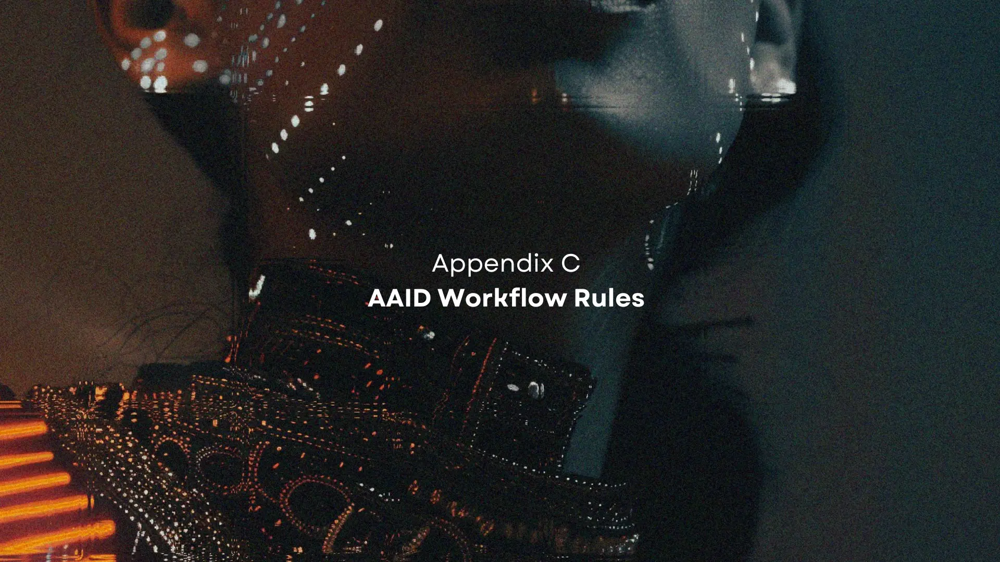

# Appendix C: AAID Workflow Rules

Configure your AI environment to understand the `AAID` workflow. These are simple text instructions, no special `AAID` app or tool is required.

| ☝️                                                                                                                                                                                                                                                                                                                                                                                                                          |
| --------------------------------------------------------------------------------------------------------------------------------------------------------------------------------------------------------------------------------------------------------------------------------------------------------------------------------------------------------------------------------------------------------------------------- |
| **Note on AI instruction following accuracy**: At the time of writing, current AIs are good, but not at all perfect, at following instructions and rules such as the **AAID AI Workflow Rules**. Sometimes you may need to remind the AI if it for example forgets a TDD phase, or moves directly to GREEN without stopping for user review at RED.  As LLMs improve over time, you'll need to worry less about this. |

## AAID AI Workflow Rules/Instructions

_This is the official `AAID` workflow rules. But feel free to customise it._

[AAID AI Workflow Rules/Instructions](../../rules/aaid/aaid-development-rules.mdc)

## Usage Guide

**For Cursor:**

- Project‑specific: commit a rule file in `.cursor/rules/` so it's version controlled and scoped to the repo.
- Global: Add to User Rules in Cursor Settings
- Simple alternative: Place in `AGENTS.md` in project root

**For Claude Code:**
Place in `CLAUDE.md` file in your project root (or `~/.claude/CLAUDE.md` for global use)

> [!TIP]
> **Or install as a plugin (recommended for Claude Code)**: the `aaid-tdd` and `aaid-bdd` plugins package these rules as skills that only load when TDD/BDD work is actually triggered, so AAID stays out of the way on unrelated work. See [Claude Code Plugins](../../README.md#claude-code-plugins) for install steps.

**For other AI tools:**
Look for "custom instructions", "custom rules", or "system prompt" settings

---

⬅️ Back to the main guide: [AAID Workflow and Guide](../../docs/aidd-workflow.md)
