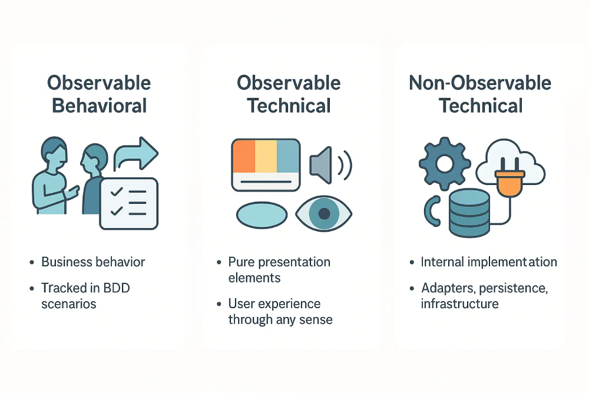

# Appendix D: Handling Technical Implementation Details


While the main `AAID` guide focuses on BDD/TDD for business logic and system **behavior**, real applications need infrastructure elements and presentation layers as well. This appendix shows how to apply `AAID` principles to these technical implementation details.

## Table of Contents

- [Implementation Categories](#implementation-categories)
  - [The Three Implementation Categories](#the-three-implementation-categories)
  - [Why These Categories Matter](#why-these-categories-matter)
  - [Adapters in Hexagonal Architecture: Infrastructure as Non-Observable Technical](#adapters-in-hexagonal-architecture-infrastructure-as-non-observable-technical)
- [AAID Implementation Matrix: Build Types and Verification](#aaid-implementation-matrix-build-types-and-verification)
- [Scaffolding and Prerequisites](#scaffolding-and-prerequisites)
- [Examples of Implementation Categories in Practice](#examples-of-implementation-categories-in-practice)
- [Specifications for Technical Details](#specifications-for-technical-details)
  - [What Goes Where](#what-goes-where)
  - [Example Story with Linked Technical Tasks](#example-story-with-linked-technical-tasks)
  - [How Non-Functional Requirements (NFRs) Fit In](#how-non-functional-requirements-nfrs-fit-in)
- [Practical Workflow Integration](#practical-workflow-integration)
- [AI Roadmaps for Technical Implementation](#ai-roadmaps-for-technical-implementation)
  - [Non-Observable Technical Roadmap Template](#ai-technical-roadmap-template)
  - [Observable Technical (Presentation) Roadmap Template](#ai-presentation-roadmap-template)
- [TDD Workflow for Non-Observable Technical](#tdd-workflow-for-non-observable-technical)
  - [Test Naming Philosophy](#test-naming-philosophy)
  - [How Each Layer Defines Behavior](#how-each-layer-defines-behavior)
  - [Testing Technical Elements](#testing-technical-elements)
- [Validation Workflow for Observable Technical](#validation-workflow-for-observable-technical)

## Implementation Categories



### The Three Implementation Categories

The `AAID` workflow divides all development work into three implementation categories to maintain clear separation of concerns:

- **🎯 Observable Behavioral**: Business behavior that users can observe (tracked in BDD scenarios)
- **👁️ Observable Technical**: Pure presentation elements that users experience through any sense but aren't behavior (visual styling, audio feedback, screen reader announcements, haptic patterns)
- **⚙️ Non-Observable Technical**: Infrastructure implementations that bridge your domain to the outside world — whether you call them adapters (Hexagonal), repositories/gateways (Clean/DDD), or controllers (MVC) — handling all external interactions like persistence, caching, external APIs, messaging, plus supporting utilities and configuration

> **Technical** as in _**technical implementation details**_.

### Why These Categories Matter

A good system is, almost by definition, one that's easy to change. These three implementation categories provide the conceptual clarity developers need to build systems with that property.

Without this clarity, developers — and AI agents working with or for them — mix **WHAT** the system does (behavior) with **HOW** it does it (technical implementation) or **HOW** it presents (styling). This confusion couples things that should stay independent: specifications become polluted with technical constraints, tests become brittle by coupling to implementation details, and changes to one aspect force changes to others unnecessarily.

Each category gets the right approach: TDD with unit tests and complete test isolation for behavioral logic, TDD with integration tests and un-mocked managed dependencies for Non-Observable Technical, and manual validation for pure presentation.

Applying the wrong approach makes change expensive; trying to TDD CSS wastes time, while testing implementation details means tests break whenever you change your app's technical plumbing.

In addition, the three Implementation Categories also helps you choose the right test type for what you're building. See the "How We Test/Validate" in the [AAID Implementation Matrix](#aaid-implementation-matrix-build-types-and-verification) below.

### Adapters in Hexagonal Architecture: Infrastructure as Non-Observable Technical

The Non-Observable Technical category encompasses all infrastructure elements. In Hexagonal Architecture specifically, the term "adapters" refers to the elements within the infrastructure layer that bridge between your core business logic and the outside world. Whether you call them adapters (Hexagonal), repositories/gateways (Clean Architecture/DDD), or controllers (MVC), they all serve the same purpose of translating between your domain and external systems.

All adapters are infrastructure elements and thus **Non-Observable Technical**, regardless of their output. This might seem counterintuitive for adapters with visual effects (like CLI renderers), but the distinction is important:

- We **test the adapter's technical contract** (Non-Observable Technical)
- We **manually validate pure presentation** (Observable Technical)
- The fact that the adapter's technical contract might produce visible output doesn't change what we're testing

Examples of infrastructure elements using Hexagonal Architecture terminology:

### Driving Adapters (Inputs)

These bring requests _into_ the domain:

- REST/HTTP controllers
- GraphQL resolvers (queries, mutations)
- CLI parsers
- Message-queue **consumers**
- Webhook handlers
- Schedulers / cron jobs
- File/FS watchers

### Driven Adapters (Outputs)

These are called _by_ the domain to interact with the outside:

- Database repositories (persistence)
- External API clients
- Email/SMS/Push senders
- Message-queue **publishers**
- Cache adapters (Redis, Memcached)
- Filesystem writer adapters
- Renderers / presenters (CLI renderer, templating engine)
- Loggers / metrics collectors

## AAID Implementation Matrix: Build Types and Verification

| Category                        | What We Test/Validate                    | What kind of Acceptance Criteria? | How We Test/Validate                                                                                                | Typical Items                                                                                                                                                                                                                       | Hexagonal Architecture Examples                                                                                                                                                                                               | Uses BDD scenarios? | Uses TDD? |
| ------------------------------- | ---------------------------------------- | --------------------------------- | ------------------------------------------------------------------------------------------------------------------- | ----------------------------------------------------------------------------------------------------------------------------------------------------------------------------------------------------------------------------------- | ----------------------------------------------------------------------------------------------------------------------------------------------------------------------------------------------------------------------------- | ------------------- | --------- |
| **🎯 Observable Behavioral**    | Business behavior                        | Gherkin scenarios                              | <ul><li>Unit tests (TDD)</li><li>Acceptance tests (BDD)</li></ul>                                                   | <ul><li>Domain logic</li><li>Pure functions/morphisms</li><li>Use cases</li><li>Business rules</li></ul>                                                                                                                            | Core domain (inside hexagon): <ul><li>Entities</li><li>Value Objects</li><li>Domain Services</li><li>Application Services defining ports</li></ul>                                                                            | **Yes**             | **Yes**   |
| **👁️ Observable Technical**     | User presentation (any sense perception) | Presentational Acceptance Criteria + NFRs      | <ul><li>Manual review</li><li>Visual regression</li><li>Accessibility audits</li><li>Cross-browser checks</li></ul> | <ul><li>CSS styling</li><li>Layouts</li><li>Animations</li><li>Screen reader text</li><li>Audio cues</li><li>Haptic feedback</li></ul>                                                                                              | Presentation layer (outside hexagon): <ul><li>Pure sensory elements without logic</li></ul>                                                                                                                                   | **No**              | **No**    |
| **⚙️ Non-Observable Technical** | Infrastructure & technical contracts     | Technical Acceptance Criteria + NFRs           | <ul><li>Integration tests (managed deps)</li><li>Contract tests (unmanaged deps)</li></ul>                          | <ul><li>Infrastructure elements for external interactions:<ul><li>Controllers, repositories, services, DAOs, clients</li><li>Handle persistence, caching, APIs, messaging</li></ul></li><li>Supporting utilities & config</li></ul> | Adapters implementing domain-defined ports: <ul><li>Driving adapters (REST controllers, etc)</li><li>Driven adapters (repositories implementing persistence ports, etc)</li><li>All adapters depend on domain ports</li></ul> | **No**              | **Yes**   |

> The key distinction: **Observable** categories involve what users directly experience (behavior or sensory presentation), while **Non-Observable Technical** involves the infrastructure implementations and technical contracts that enable those experiences, even when those implementations produce observable output.

## Scaffolding and Prerequisites

Basic project scaffolding—running framework generators, configuring linters and formatters, installing packages, setting up test runners, configuring commit hooks—sits outside the `AAID` workflow as prerequisite work. Set these up yourself without TDD, before beginning feature development.

It is when you start to implement custom infrastructure with testable behavior—database adapters, authentication services, custom middleware—that you follow `AAID` as Non-Observable Technical with TDD.

| 🔍                                                                                                                                                                                                                                                                                                               |
| ---------------------------------------------------------------------------------------------------------------------------------------------------------------------------------------------------------------------------------------------------------------------------------------------------------------- |
| **How to verify scaffolding?** Basic tooling has no custom behavior to test. Verify by running it; if it works, you're done. [Acceptance tests](../appendix-a/docs/aaid-acceptance-testing-workflow.md) will catch integration issues if your project setup breaks. `AAID` applies when you write _custom code_. |

The remainder of this appendix focuses on that latter category: implementing and testing custom infrastructure elements using `AAID`.

## Examples of Implementation Categories in Practice

**TicTacToe Game Example:**

- **Observable Behavioral**: "Player wins with three in a row"
- **Observable Technical**: Board colors, X/O fonts, victory sound effect, screen reader announcements
- **Non-Observable Technical**: Infrastructure elements: CLI renderer adapter, CLI input parser adapter, board state persistence adapter

**Todo Application Example:**

- **Observable Behavioral**: "User archives completed todos"
- **Observable Technical**: Archive button styling, success toast visual design, completion sound
- **Non-Observable Technical**: Infrastructure elements: REST controller (input adapter), email notification adapter, database repository (persistence adapter), cache adapter (Redis)

**Autocomplete Search Example:**

- **Observable Behavioral**: "Search suggestions update as user searches"
- **Observable Technical**: Dropdown styling, loading spinner animation, keyboard highlight style
- **Non-Observable Technical**: Infrastructure elements: debounced API client adapter, search result cache adapter, request cancellation handler

| 💻                                                                                                                                                                                                                                                                                                                                                                                                                                                                                                                                                                                                                                                                                                                                                                                                                                                                                                                           |
| ---------------------------------------------------------------------------------------------------------------------------------------------------------------------------------------------------------------------------------------------------------------------------------------------------------------------------------------------------------------------------------------------------------------------------------------------------------------------------------------------------------------------------------------------------------------------------------------------------------------------------------------------------------------------------------------------------------------------------------------------------------------------------------------------------------------------------------------------------------------------------------------------------------------------------- |
| **Note for Frontend Developers**: Many frontend developers believe TDD isn't suitable for their work. This is a misconception! The confusion stems from trying to test the wrong things or not recognizing testable behavior in components.<br><br>**Frontend Observable Behavioral - (Uses TDD)**:<br>• "Cannot submit order with invalid email address"<br>• "Shopping cart recalculates total when quantity changes"<br>• "Search results update as user refines their query"<br><br>**Frontend Observable Technical - (No TDD, manual validation)**:<br>• "Error message appears in #DC2626 red with 14px font"<br>• "Button hover transition takes 200ms with ease-in-out"<br>• "Success sound is not too loud"<br><br>**Frontend Non-Observable Technical - (Uses TDD)**:<br>• "HTTP request retries on network failure"<br>• "Form data serializes to JSON for server"<br>• "Draft state persists in browser storage" |

## Specifications for Technical Details

### What Goes Where

The Product Discovery & Specification phase should explicitly separate behavioral and technical concerns:

```markdown
Specifications include:

- User stories with BDD examples (Observable Behavioral)
- Technical requirements as separate linked tasks:
  - Presentation/UI Tasks (Observable Technical: pure styling/accessibility/sensory feedback)
  - Technical Tasks (Non-Observable Technical: infrastructure elements — adapters/repositories/gateways handling persistence, caching, APIs, etc.)
- Ubiquitous language glossary, PRD, etc.
```

| ☝️                                                                                                                                                                                                                                                                                                      |
| ------------------------------------------------------------------------------------------------------------------------------------------------------------------------------------------------------------------------------------------------------------------------------------------------------- |
| **During team collaboration**: When discussing requirements, technical constraints are raised and discussed but kept OUT of BDD scenarios. They become separate technical tasks linked to the story. This keeps BDD scenarios focused on behavior while ensuring technical work is visible and tracked. |

### Example Story with Linked Technical Tasks

This shows how a user story and its linked technical tasks would appear in project management tools like Jira:

```markdown
Title: User archives completed todos

User Story:

As a user, I want to archive completed todos, so that my active list stays clean
and I can focus on current tasks.

Acceptance Criteria:

<< BDD scenarios: system behavioral specifications >>

Linked Presentation/UI Tasks:

- UI-103: Style archived todo visual state (grayed out) [Figma link]
- ACC-105: Add screen reader announcement for archive action

Linked Technical Tasks:

- TECH-105: Configure Redis cache adapter for archived todos
- TECH-106: Add performance monitoring adapter for archive operation
- TECH-107: Implement batch archive job for bulk operations (if complex)
```

> See the main article for this user story example, [but with the BDD scenarios included](https://github.com/dawid-dahl-umain/augmented-ai-development/blob/main/docs/aidd-workflow.md#prerequisite-spec-to-dev).

### How Non-Functional Requirements (NFRs) Fit In

[NFRs](https://en.wikipedia.org/wiki/Non-functional_requirement) (performance, security, accessibility, etc.) are handled as technical requirements, not business behaviors. They are specified _inside_ the technical tasks linked to a story, never in BDD scenarios.

**Counter-example: What NOT to do**

```gherkin
❌ Wrong: BDD Scenario polluted with NFRs

Scenario: Archive todo with performance requirements
  Given the system has 1000 concurrent users
  When they all archive todos simultaneously
  Then each request completes in under 200ms
  And the database uses less than 100MB of memory
  And the response includes proper CORS headers

✅ Right: BDD Scenario focused on behavior

Scenario: User archives completed todo
  Given I have a completed todo "Buy milk"
  When I archive the todo
  Then the todo appears in my archived list
  And it no longer appears in my active list
```

The performance, security, and technical constraints belong in the linked technical tasks. Specifically:

- NFRs like accessibility or responsiveness are detailed within **Linked Presentation/UI Tasks**
- NFRs like performance or security are detailed within **Linked Technical Tasks**

This keeps NFRs out of BDD scenarios entirely, while ensuring they're properly tracked and validated.

Here's how the linked tasks from the story example above could look when expanded with their NFRs:

**Example Linked Technical Task with NFRs:**

```markdown
Tag: [Technical Task]
Linked Story: [STORY-123 "User archives completed todos"]

Title: Configure Redis cache adapter for archived todos

Objective: Implement caching layer for archived todo retrieval.

Acceptance Criteria:

- Caches archived todos with 1-hour TTL
- Invalidates cache on todo un-archive
- Falls back to database on cache miss
- Integration tests verify cache behavior

Non-Functional Requirements (NFRs):

- Performance: Cache hit rate > 80%; retrieval < 50ms
- Reliability: Graceful degradation if Redis unavailable
- Monitoring: Metrics for hit/miss rates and latency

References:

- Redis cluster configuration docs
- Caching strategy guidelines
```

**Example Linked Presentation Task with NFRs:**

```markdown
Tag: [Presentation Task]
Linked Story: [STORY-123 "User archives completed todos"]

Title: Style archived todo visual state

Objective: Make archived items visually distinct.

Acceptance Criteria:

- Matches Figma archived state
- Dark mode variant applied
- Mobile layout preserves hierarchy

Non-Functional Requirements (NFRs):

- Accessibility: WCAG 2.1 AA contrast; SR announces "archived"; focus visible
- Responsiveness: 320–1920 px
- Compatibility: last 2 major browser versions

References:

- Figma link; design tokens
```

Keep NFRs **out** of BDD scenarios while ensuring they're **visible** and **testable** in the linked technical tasks. How you structure the technical task tickets themselves is flexible. Teams can organize NFRs within acceptance criteria, dedicated NFR sections, checklists, or any format that fits their workflow and tooling.

## Practical Workflow Integration

This section shows how to apply the standard `AAID` stages when working with technical implementation details. You use the same familiar 4-stage workflow from the main article (see [diagram](../../aaid-workflow-diagram.mermaid)), adapting it for technical elements.

### Stage 1: Context Providing

When working on technical elements, add technical context to your `@project-context`, or make a new context command `@project-context-technical-implementation-details`, for:

- Architecture documentation (layer boundaries, patterns)
- Technical patterns already in use (whether using hexagonal, MVC, or other architectures)
- Infrastructure constraints
- Design system/style guide

### Stage 2: Planning

Create a roadmap for your technical/presentation feature:

- **Non-Observable Technical**: One roadmap per infrastructure element — adapters/repositories/gateways ([@ai-technical-roadmap-template](../../.cursor/commands/planning/ai-technical-roadmap-template.md))
- **Observable Technical (UI)**: One roadmap per presentation element ([@ai-presentation-roadmap-template](../../.cursor/commands/planning/ai-presentation-roadmap-template.md))

### Stage 3: TDD Starts

| 👁️                                                                                                                                                                            |
| ----------------------------------------------------------------------------------------------------------------------------------------------------------------------------- |
| **For Observable Technical:** Stages 3 and 4 are skipped (see [diagram](../../aaid-workflow-diagram.mermaid)). Proceed directly to implementation and validation without TDD. |

**Recommended approach: Domain-first**
Build pure business logic first, then add technical elements. This ensures your core domain remains decoupled from technical concerns and follows the natural flow of dependencies.

Alternative approaches for specific situations:

- **Walking skeleton**: For early end-to-end validation, build a minimal end-to-end feature through all layers, then expand
- **Parallel tracks**: When team size allows, develop domain and technical elements simultaneously

### Stage 4: TDD Cycle

The workflow recommends adapting based on what you're building:

- **Building domain logic?** → Unit tests with mocks (as described in main guide)
- **Building Non-Observable Technical?** → Integration/contract tests based on dependency type
- **Building Observable Technical?** → _N/A: Implementation and validation without TDD_

## AI Roadmaps for Technical Implementation

Create focused roadmaps for individual technical implementation elements that complement your behavioral roadmap.

### `@ai-technical-roadmap-template`

For Non-Observable Technical elements (infrastructure elements — adapters/repositories/gateways):

[View template](https://github.com/dawid-dahl-umain/augmented-ai-development/blob/main/.cursor/commands/planning/ai-technical-roadmap-template.md)

### `@ai-presentation-roadmap-template`

For Observable Technical elements (pure presentation/UI):

[View template](https://github.com/dawid-dahl-umain/augmented-ai-development/blob/main/.cursor/commands/planning/ai-presentation-roadmap-template.md)

## TDD Workflow for Non-Observable Technical

The RED → GREEN → REFACTOR cycle applies to Non-Observable Technical implementation, with test types matched to the element type.

### Test Naming Philosophy

**Key Principle: "Behavior" is contextual to the abstraction layer.**

Even when testing technical elements, focus test names on **behavior from the element's user's perspective**. Here "user" means the element's consumer, not the "end user" (as in BDD).

- Another developer using your API
- A system consuming your adapter's output
- An internal module depending on your infrastructure

For technical elements, "behavior" means the **technical promise** they fulfill (parsing, formatting, error codes), not business behavior. This is still behavior, just at a different abstraction level.

### How Each Layer Defines Behavior

To understand why testing "technical behavior" isn't a contradiction, consider how each architectural layer has different users who care about different behaviors:

```
End User: "My completed task moves to the archive"
     ↓
Domain: "Todo transitions to archived state"
     ↓
REST Adapter: "Handles archive requests with proper responses"
     ↓
Cache Adapter: "Invalidates active todo cache on archive"
     ↓
Database Repository: "Stores todo with archived flag and timestamp"
```

This aligns with architectural patterns like Ports and Adapters—each port defines expected behavior that its adapters must fulfill.

**Examples showing the distinction:**

For a CLI Input Adapter:

- ✅ Behavior: `'understands move command with position'`
- ❌ Implementation: `'uses regex /move (\d+)/ to extract number'`

For a Cache Adapter:

- ✅ Behavior: `'retrieves cached todos within 50ms'`
- ❌ Implementation: `'uses Redis GET with serialized JSON'`

For a Database Repository:

- ✅ Behavior: `'persists todo with generated ID'`
- ❌ Implementation: `'executes INSERT statement with RETURNING clause'`

The test name describes the **expected behavior** (what the element promises to its users), not the **mechanism** (how it fulfills that promise). This way, if you switch technologies, the test name remains valid even if the test implementation needs updating.

### Testing Technical Elements

When testing infrastructure code, your approach changes based on whether you control/manage the external resource (like your own database) or not (like Stripe's API).

**Test Types by Dependency:**

- **Managed dependencies** (your database, cache, queues) → **Integration** tests with real resource(s)
- **Governed Unmanaged dependencies** (microservices, internal services) → **Bidirectional contract** tests with provider coordination
- **External Unmanaged dependencies** (Stripe, SendGrid, third-party APIs) → **Unidirectional contract** tests with consumer-side verification

See [Appendix E: Dependencies and Mocking](../appendix-e/dependencies-and-mocking.md) for detailed guidance on all dependency categories and how each test type handles them.

| ☝️                                                                                                                                                                                                                                                                                                                                                                                                                                                                         |
| -------------------------------------------------------------------------------------------------------------------------------------------------------------------------------------------------------------------------------------------------------------------------------------------------------------------------------------------------------------------------------------------------------------------------------------------------------------------------- |
| **Principle of single testing responsibility**: When testing technical elements, don't overlap with domain tests. If the domain already ensures that `order total = items + tax`, technical tests shouldn't repeat it. Instead, focus on the adapter's own responsibility: <br><br>**Input Adapters** → parsing, validation, error translation, etc <br>**Output Adapters** → formatting, serialization, persistence, caching, external API calls, message publishing, etc |

**Modified TDD Cycle for Technical Elements:**

🔴 **RED Phase - Integration Test**

```ts
describe("FileStorageAdapter", () => {
  const storagePath = "./test-storage"

  afterEach(() => fs.rm(storagePath, { recursive: true, force: true }))

  it("stores provided content", async () => {
    // Given
    const adapter = new FileStorageAdapter({ baseDir: storagePath }) // Real file system

    // When
    const result = await adapter.write("test-file.txt", "Test content")

    // Then
    expect(result.isOk()).toBe(true)

    const stored = await fs.readFile(result.value, "utf-8")

    expect(stored).toBe("Test content")
  })

  // Next test
})

// Note: Domain logic (what to store, when to store) is tested separately.
// This tests only the adapter's technical contract with the file system.
```

🟢 **GREEN Phase**

```ts
// Port (defined in domain)

interface WritePort {
  write(
    filename: string,
    content: string
  ): Promise<Result<string, FileStorageError>>
}

export interface StoragePort extends WritePort {}
```

```ts
// Adapter (implements port)

class FileStorageAdapter implements StoragePort { ... }
```

- Implement the actual technical element/adapter
- For **Managed dependencies**: use real dependencies in tests
- For **Unmanaged dependencies**: use toggleable mocks/stubs in tests

🧼 **REFACTOR Phase**

- Focus on code quality fundamentals
- Consider modularity, abstraction, cohesion, separation of concerns, readability
- Ensure proper error handling and logging
- Clean up; remove unecessary comments

## Validation Workflow for Observable Technical

Pure sensory elements that don't contain logic are validated differently from TDD:

1. **Implement** based on design specifications (Figma, style guide, audio specs)
2. **Validate** through:
   - Manual design review (primary)
   - Visual regression tests
   - Accessibility checks
   - Cross-browser testing
   - Audio/haptic testing where applicable
3. **Refine** based on feedback
4. **Final review** with stakeholders

| ☝️                                                                                                                                                                                                           |
| ------------------------------------------------------------------------------------------------------------------------------------------------------------------------------------------------------------ |
| **The "feel" test**: Some Observable Technical aspects can only be validated by humans. A perfectly passing visual regression test doesn't guarantee good UX. This is where manual review remains essential. |

---

`AAID` adapts to each implementation category: TDD for behavioral and technical work, validation for presentation, while maintaining disciplined development throughout.

---

⬅️ Back to the main guide: [AAID Workflow and Guide](../../docs/aidd-workflow.md)
