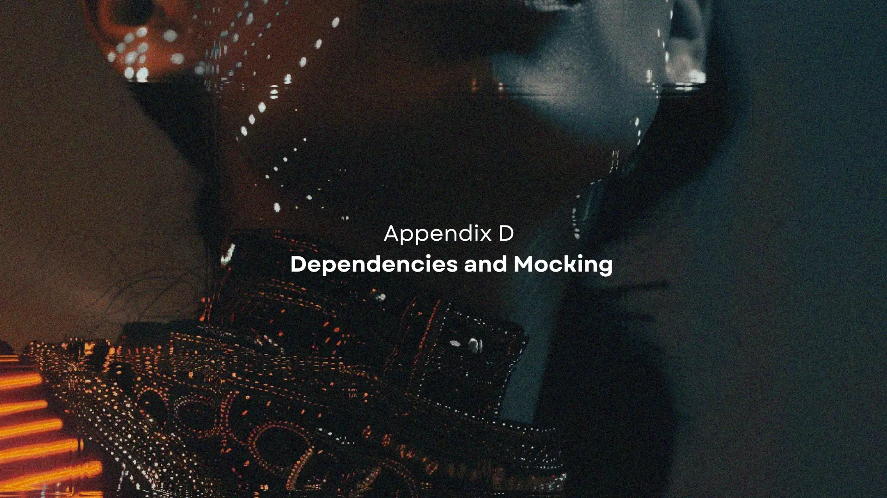
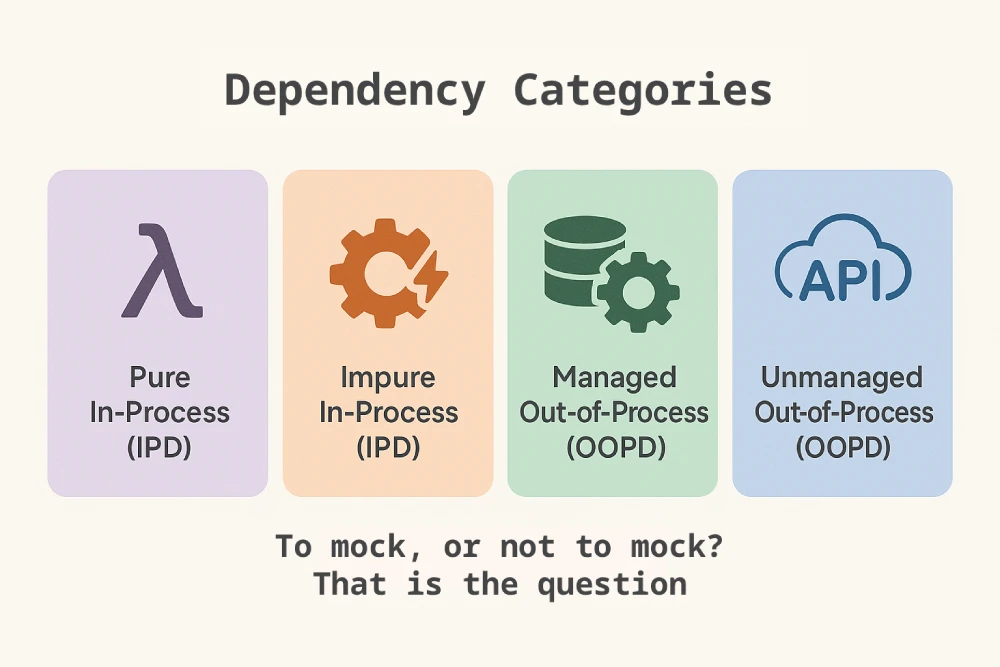
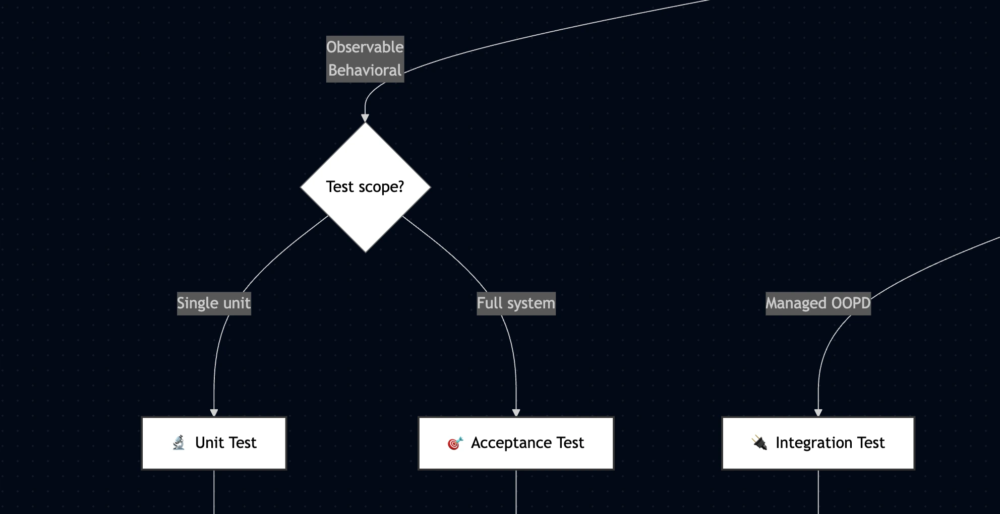

# Appendix E: Dependencies and Mocking



`AAID` uses two categorization systems that work together:

- **[Implementation Categories](../appendix-d/handling-technical-implementation-details.md#implementation-categories)** categorize what you're building and determine which test type to use
- **Dependency Categories** (this guide) categorize the dependencies of what you're building and determine your mocking strategy

Once you've determined your test type from the Implementation Matrix, use this guide during **Stage 2: Planning** and **Stage 4: TDD Cycle** to understand how to handle dependencies for that test type.

## Table of Contents

- [Dependency Categories](#dependency-categories)
- [Test Type Overview](#test-type-overview)
- [Dependency Handling Matrix](#dependency-handling-matrix)
- [Decision Flow Diagram](#decision-flow-diagram)
- [Understanding Each Test Type](#understanding-each-test-type)
  - [Unit Tests](#-unit-tests)
  - [Integration Tests](#-integration-tests)
  - [Bidirectional Contract Tests](#-bidirectional-contract-tests)
  - [Unidirectional Contract Tests](#️-unidirectional-contract-tests)
  - [Acceptance Tests](#-acceptance-tests)
  - [Visual/Sensory Validation](#️-visualsensory-validation)
- [The Test Pyramid in Practice](#the-test-pyramid-in-practice)

## Dependency Categories



`AAID` categorizes dependencies into four primary types to determine how they should be handled in tests:

| Category                            | Description                                                                            | Examples                                                                              |
| ----------------------------------- | -------------------------------------------------------------------------------------- | ------------------------------------------------------------------------------------- |
| **Pure In-Process (IPD)**           | Functions/modules with no side effects; deterministic and safe to use directly         | Utility functions, pure calculations, data transformations, immutable data structures |
| **Impure In-Process (IPD)**         | Functions/modules with internal side effects or shared state                           | Logging, metrics collection, in-memory caches, global state managers                  |
| **Managed Out-of-Process (OOPD)**   | External systems/resources you control and can reset/manage state for testing          | Your database, Redis cache, message queues, file systems you manage                   |
| **Unmanaged Out-of-Process (OOPD)** | External systems/services with independent lifecycles; interact through contracts only | See sub-categories below                                                              |

### Unmanaged OOPD Sub-Categories

Unmanaged OOPD dependencies have independent lifecycles and contract-based interaction, but differ in governance control:

| Sub-Category                | Inherent Property                                                                                   | Examples                                                                                            |
| --------------------------- | --------------------------------------------------------------------------------------------------- | --------------------------------------------------------------------------------------------------- |
| **Governed Unmanaged OOPD** | Independent lifecycle but within organizational/governance boundary; provider coordination possible | Your microservices, internal services across teams, partner services with formal testing agreements |
| **External Unmanaged OOPD** | Independent lifecycle and outside organizational/governance boundary; no provider coordination      | Third-party APIs (Stripe, SendGrid, Twilio), public APIs, SaaS platforms, external webhooks         |

## Test Type Overview

Each test type serves a different purpose and operates at a different level of your system:

| Test Type                            | Entry Point                                  | Scope                                                    | Purpose                                                                    | Relative Speed                                     |
| ------------------------------------ | -------------------------------------------- | -------------------------------------------------------- | -------------------------------------------------------------------------- | -------------------------------------------------- |
| 🔬 **Unit Tests**                    | Domain class/function directly               | Single unit of domain logic in complete isolation        | Verify business rules and domain behavior are technically correct          | Fastest                                            |
| 🔌 **Integration Tests**             | Adapter instantiation directly               | Single adapter + its immediate managed dependencies only | Verify adapter's technical contract with its direct managed dependencies   | Medium                                             |
| 🤝 **Bidirectional Contract Tests**  | Adapter instantiation directly               | Single adapter + Governed Unmanaged OOPD contract        | Verify both consumer and provider correctly implement the contract         | Fast (mocked) / Medium (real with provider states) |
| ➡️ **Unidirectional Contract Tests** | Adapter instantiation directly               | Single adapter + External Unmanaged OOPD contract        | Verify consumer correctly implements the contract; detect provider changes | Fast (mocked) / Fast (minimal real API checks)     |
| 🎯 **Acceptance Tests**              | System boundary (HTTP endpoint, CLI command) | Full system through all layers                           | Verify complete business requirement is satisfied                          | Slowest\*                                          |
| 👁️ **Visual/Sensory Validation**     | Browser/device                               | Presentation layer only                                  | Verify aesthetic and sensory qualities meet design specs                   | Manual/varies                                      |

> \* _With proper functional and temporal isolation plus mocked unmanaged dependencies, acceptance tests should still run reasonably fast. If a single test takes over a minute, investigate for issues with test setup, lack of isolation, or improper mocking_

## Dependency Handling Matrix

Now for the key question: how does each test type handle the four dependency categories?

| Test Type                            | Pure IPD | Impure IPD       | Managed OOPD                                   | Governed Unmanaged OOPD                                   | External Unmanaged OOPD                              |
| ------------------------------------ | -------- | ---------------- | ---------------------------------------------- | --------------------------------------------------------- | ---------------------------------------------------- |
| 🔬 **Unit Tests**                    | Real     | Mocked           | Mocked                                         | Mocked                                                    | Mocked                                               |
| 🔌 **Integration Tests**             | Real     | Real or Mocked\* | **Real** (only direct dependencies of adapter) | Mocked                                                    | Mocked                                               |
| 🤝 **Bidirectional Contract Tests**  | Real     | Real or Mocked\* | Mocked\*\*                                     | **Toggleable** (mocked for dev, real with provider state) | Not applicable                                       |
| ➡️ **Unidirectional Contract Tests** | Real     | Real or Mocked\* | Mocked\*\*                                     | Not applicable                                            | **Toggleable** (mocked for dev, minimal real checks) |
| 🎯 **Acceptance Tests**              | Real     | Real             | Real (all managed dependencies)                | Mocked                                                    | Mocked                                               |
| 👁️ **Visual/Sensory Validation**     | N/A      | N/A              | N/A                                            | N/A                                                       | N/A                                                  |

> \* _Impure IPD may be real in integration and contract tests if stable and doesn't compromise test reliability_

> \*\* _Contract test adapters often have no managed dependencies since they focus on external service interaction. When present (e.g., caching, logging), mock them to keep tests focused on the contract_

<a id="decision-flow-diagram"></a>

## Decision Flow Diagram

When you're writing tests and wonder "Should I mock this dependency?", use this decision flow to find your answer.

This diagram visualizes the Dependency Handling Matrix as an interactive decision tree, guiding you from your test type to the correct mocking strategy for each dependency.

> 💡 **New to `AAID`?** The diagram starts with "What are you building?" referring to the [Three Implementation Categories](../appendix-d/handling-technical-implementation-details.md#implementation-categories) (Observable Behavioral, Non-Observable Technical, Observable Technical). These categories determine which test type to use.



| 🔗                                                                                                       |
| -------------------------------------------------------------------------------------------------------- |
| Click [this link](./dependencies-mocking-decision-flow.mermaid) to **view** the full diagram in Mermaid. |

> If the diagram is not rendered on mobile, copy/paste the mermaid code into a [mermaid editor](https://mermaid.live).

## Understanding Each Test Type

### 🔬 Unit Tests

Unit tests verify domain logic in complete isolation. They mock all external dependencies to keep tests fast (milliseconds) and focused solely on business rules. If a test needs real database access or network calls, it's not a unit test.

### 🔌 Integration Tests

Integration tests verify that a specific adapter correctly integrates with its immediate managed dependency. Unlike acceptance tests that test the full system, integration tests instantiate the adapter directly with only the managed resource it's responsible for (e.g., testing a database repository adapter with a real database connection).

The test stays at the adapter layer. Domain logic and other adapters aren't involved in the test - not because they're mocked, but because integration tests have a narrow scope focused on a single adapter's technical contract.

**Key principle:** Only the managed dependencies directly related to the adapter's responsibility are included. Testing an HTTP adapter includes the real HTTP server layer. Testing a repository adapter includes the real database. Other infrastructure and domain layers remain outside the test scope.

### 🤝 Bidirectional Contract Tests

Bidirectional contract tests verify that both consumer and provider correctly implement a shared contract. They apply to **Governed Unmanaged OOPD** dependencies where you have organizational/governance boundary access enabling provider coordination.

In contract testing terminology: the **consumer** is your code calling the API, and the **provider** is the service being called.

**When to use:** Your microservices, internal services across teams, partner services with formal testing agreements; any provider where coordination is possible.

**How it works:**

Contract testing follows the traditional [Pact](https://docs.pact.io/)-style approach where both sides verify the contract:

- **Consumer side:** Tests generate contracts with mocked provider responses
- **Provider side:** Verification tests use [provider states](https://docs.pact.io/getting_started/provider_states) to inject test data into datastores
- **Development:** Use mocks for fast feedback
- **Pre-deployment:** Toggle to real connections with provider states for full verification
- **Result:** Both sides verify the contract is honored, ensuring integration works

**Key characteristic:** The governance boundary enables bidirectional verification. Both consumer and provider participate in contract validation.

### ➡️ Unidirectional Contract Tests

Unidirectional contract tests verify that your consumer correctly implements an external API's contract when the provider cannot participate in verification. They apply to **External Unmanaged OOPD** dependencies outside your organizational/governance boundary.

**When to use:** Third-party APIs (Stripe, SendGrid), public APIs, SaaS platforms—any provider where you cannot coordinate verification.

**How it works:**

Contract testing adapts for providers you don't control through a consumer-focused verification strategy:

- **Consumer side:** Build test infrastructure that mocks only the external API interactions your system uses—feature by feature, add support as needed. Keep mocks simple: simulate behavior just enough to verify your adapter handles responses correctly (success, errors, edge cases)
- **Provider side:** Cannot participate in verification (outside governance boundary)
- **Development:** Use mocks for fast feedback and reliable test execution
- **Pre-deployment:** Toggle to minimal real API checks for interface verification—separate, lightweight tests against the real external API to detect contract changes
- **Result:** Minimal real API checks increases probability of catching breaking changes early

**Real API verification approach:**

When running checks against the real external API:

- Focus on read-only operations where possible to avoid side effects
- Use sandbox environments when available
- Mutating operations (create/update/delete) should preferably be avoided. They are inherently undeterministic actions, and polluting the external service with garbage data is not polite
- Keep these minimal verification tests separate from your main test suite

This two-part approach maintains speed and reliability (mocked tests) while catching breaking changes early (minimal real checks).

**Key characteristic:** The governance boundary limits verification to consumer-side only—you cannot verify the provider's implementation.

### 🎯 Acceptance Tests

Acceptance tests verify complete business requirements through the full system, entering via the outer boundary (HTTP endpoints, CLI commands) exactly as a user or external system would. Unlike integration tests that target a single adapter in isolation, acceptance tests flow through all layers verifying the entire system works together.

`AAID` structures these tests using Dave Farley's Four-Layer Model (Executable Specs, DSL, Protocol Drivers, SUT). The DSL translates BDD scenarios into executable specifications, while protocol drivers handle the technical interaction with the system. All managed dependencies (database, cache, queues) run real; only unmanaged ones (third-party APIs) are mocked for test suite stability.

See [Appendix A: AAID Acceptance Testing Workflow](../../appendices//appendix-a/docs/aaid-acceptance-testing-workflow.md) for the complete architectural pattern.

### 👁️ Visual/Sensory Validation

Pure presentation elements (styling, animations, audio) are validated through manual review, visual regression tests, and accessibility audits rather than TDD or any kind of test automation.

## The Test Pyramid in Practice

The relative speed column reflects the test pyramid principle: more fast tests at the bottom, fewer slow tests at the top.

```
          /\
         /  \  Acceptance (slowest, fewest)
        /----\
       /      \
      / IT/CT  \ Integration/Contract (medium, medium quantity)
     /----------\
    /    Unit    \ Unit Tests (fastest, most numerous)
   /--------------\
```

**Speed relationships:**

- **Unit tests:** Fastest - no I/O, all external dependencies mocked
- **Integration tests:** Medium - real managed dependencies (DB, cache) add I/O overhead
- **Bidirectional contract tests:** Fast when mocked (dev), medium when toggled to real connections (provider state setup requires writing test data)
- **Unidirectional contract tests:** Fast when mocked (dev), fast when toggled to real API (minimal read-only checks detect interface changes)
- **Acceptance tests:** Slowest relative to others, but should still be reasonably fast with proper isolation and mocking

**Trade-offs:**

- **Unit tests:** Maximum speed and isolation, but don't verify real integrations
- **Integration tests:** Real dependencies add confidence but cost more time than unit tests
- **Bidirectional contract tests:** Verify both sides of contract, but requires organizational coordination between consumer and provider teams
- **Unidirectional contract tests:** No provider coordination needed, but cannot control provider state for comprehensive testing scenarios
- **Acceptance tests:** Highest confidence but slowest execution relative to other test types

Choose the right level: unit tests for business logic, integration tests for adapter behavior, bidirectional contract tests for Governed Unmanaged OOPD, unidirectional contract tests for External Unmanaged OOPD, acceptance tests for complete features.

---

⬅️ Back to Appendix D: [Handling Technical Implementation Details](../handling-technical-implementation-details.md)
