# AAID: Augmented AI Development

_A Disciplined TDD Approach to AI-Assisted Software Development_

## Table of Contents

- [What Is AAID and Why It Matters](#what-is-aaid)
- [Who This Guide Is For](#who-this-guide-is-for)
- [Built on Proven Foundations](#built-on-proven-foundations)
- [Works with Any AI Tool](#works-with-any-ai-tool)
- [Developer Mindset](#developer-mindset)
- [Prerequisite: Product Discovery & Specification Phase](#prerequisite)
- [AAID Workflow Diagram](#workflow-diagram)
- [AAID Development Stages](#development-stages)
  - [Stage 1: Context Providing](#stage-1-context)
  - [Stage 2: Planning](#stage-2-planning)
  - [Stage 3: TDD Development Starts](#stage-3-tdd-starts)
  - [Stage 4: The TDD Cycle](#stage-4-tdd-cycle)
- [Continuing the TDD Cycle](#continuing-tdd-cycle)
- [Conclusion: The Augmented Advantage](#conclusion)
- [Appendices (Optional)](#appendices)
  - [Appendix A: Unit Testing and Acceptance Testing](#appendix-a)
  - [Appendix B: Helpful Commands (Reusable Prompts)](#appendix-b)
  - [Appendix C: Cursor User Rules (Example)](#appendix-c)

---

<a id="what-is-aaid"></a>

## **What Is AAID and Why It Matters**

**AUGMENTED AI DEVELOPMENT `AAID`** (**/eɪd/** - pronounced like "aid") is a disciplined approach where developers augment their capabilities by integrating with AI, while maintaining full architectural control. You direct the agent to generate tests and implementation code, reviewing every line and ensuring alignment with business requirements.

**You're not being replaced. You're being augmented.**

This separates professional software development from "vibe coding." While vibe coders blindly accept AI output and ship buggy, untested code they can't debug, `AAID` practitioners use TDD (Test-Driven Development) to ensure reliable agentic assistance.

<a id="who-this-guide-is-for"></a>

## Who This Guide Is For

**AAID is for maintainable software** - whether you're a professional developer or building a personal project you'll actually maintain. If you just need quick scripts or throwaway prototypes, other AI approaches work better.

**What you need:**

- Basic understanding of how AI prompts and context work
- Some experience with automated testing
- Patience to review what the AI writes (no blind copy-pasting)

**What you don't need:**

- TDD experience (you'll learn it here)
- Specific tech stack knowledge
- Deep AI expertise

The result? **Predictable** development with **production-ready** quality. While the initial setup takes more discipline than blindly copying AI output, you'll move faster overall - no debugging mysterious AI-generated bugs or untangling code you don't understand.

This guide shows you exactly how, from context-setting through disciplined TDD cycles, to ship features that deliver real business value.

It's also an incredibly fun way to work!

<a id="built-on-proven-foundations"></a>

## **Built on Proven Foundations**

Unlike most other AI-driven workflows, `AAID` doesn't try to reinvent product discovery or software development. Instead it stands on the shoulders of giants, applying well-established methodologies:

- **Kent Beck**'s TDD cycles
- **Dave Farley**'s Continuous Delivery and four-layer model
- **Robert C. Martin**'s Three Laws of TDD
- **Dan North**'s BDD approach
- **Alberto Brandolini**'s Event Storming technique
- **Aslak Hellesøy**'s BDD and Gherkin syntax for executable specifications
- And more.

These battle-tested practices become your foundation that guides AI-assisted development.

<a id="works-with-any-ai-tool"></a>

## Works with Any AI Tool

The workflow applies to any AI-assisted environment - **Cursor**, **Claude Code**, **Gemini CLI**, etc. The principles are the same; only the mechanics differ.

E.g. the reusable prompt Commands you'll learn about in [Appendix B](#appendix-b), use **Notepads** in Cursor or **Custom slash commands** in Claude Code/Gemini CLI.

<a id="developer-mindset"></a>

## Developer Mindset

Success with `AAID` as a professional developer requires a specific mindset:

1. **🧠 Don't check your brain at the door**

You need to comprehend every line of code, every test, every refactoring. The AI generates code, but you decide what stays, what changes, and why.

Without this understanding, you're just _hoping_ things will work, which is sure to spell disaster in any production-grade project.

2. **👶🏻 Baby steps**

This mentality is what really sets this AI workflow apart from others. Here, instead of letting the AI go off and produce a lot of dangerous garbage code, you make sure to remain in control by iterating in small, focused steps.

One test at a time. One feature at a time. One refactor at a time.

This is why the TDD cycle in `AAID` adds multiple review checkpoints—**AWAIT USER REVIEW**—after each phase (🔴 **RED**, 🟢 **GREEN**, and 🧼 **REFACTOR**).

<a id="prerequisite"></a>

## Prerequisite: Product Discovery & Specification Phase

Before development begins, professional teams complete a product specification phase involving stakeholders, product owners, tech leads, product designers, developers, QA engineers, architects. From a high level it follows some kind of refinement-pattern like this:

**Client's Vague Wish → Stories → Examples**

Using techniques like Impact Mapping, Event Storming, and Story Mapping, teams establish specifications that represent the fundamental business needs that must be satisfied. These specifications can include:

- User stories with BDD examples
  - Or a [Story Map](https://jpattonassociates.com/wp-content/uploads/2015/03/story_mapping.pdf) containing the user stories + BDD examples
  - User stories with technical (non-behavioral) requirements such as caching, infra, monitoring, etc
- PRD (Product Requirements Document)
- Ubiquitous language documentation. (A common language shared among stakeholders, developers, and anyone taking part in the project)
- Any additional project-specific requirements

The exact combination varies by project.

### From Specification to Development

Here's how a typical user story with BDD examples can look. This spec will then be used to serve as the objective foundation for the `AAID` workflow, aligning development with the needs of the business.

**User Story Example:**

```gherkin
Title: User archives completed todos

User Story:
As a user, I want to archive completed todos, so that my active list stays clean
and I can focus on current tasks.

Acceptance Criteria:

Feature: User archives completed todos

Scenario: Archive a completed todo
  Given the user has a completed todo "Buy milk"
  When they archive "Buy milk"
  Then "Buy milk" should be in archived todos
  And "Buy milk" should not be in active todos

Scenario: Cannot archive an incomplete todo
  Given the user has an incomplete todo "Walk dog"
  When they attempt to archive "Walk dog"
  Then they should see an error message
  And "Walk dog" should remain in active todos

Scenario: Restore an archived todo
  Given the user has archived todo "Review code"
  When they restore "Review code"
  Then "Review code" should be in active todos
```

<a id="workflow-diagram"></a>

## AAID Workflow Diagram

Now that you have your specifications from the product specification phase (like the user story above), here's how the `AAID` development process transforms them into fully tested and working software.

This diagram presents the formal workflow; detailed explanations for each step follow in the **AAID Development Stages** section below.

```mermaid
graph TD
    Start["🚀 Development Phase Begins<br/>(After Product Design)"]

    Start --> ContextPhase["📚 Stage 1: <br> CONTEXT PROVIDING"]

    ContextPhase --> C1["1. Add High-Level Context<br/>(@project-context)"]
    C1 --> C2["2. Add Specification Context<br/>(Stories, BDD Scenarios)"]
    C2 --> C3["3. Add Relevant Code Context<br/>(Dependencies, Utils, References)"]

    C3 --> PlanningPhase["🎯 Stage 2: <br> PLANNING STAGE"]

    PlanningPhase --> P1["Discuss Feature with AI Agent<br/>(Like with Human Colleague)"]
    P1 --> P2{"Does AI Need<br/>More Context?"}
    P2 -->|Yes| P3["Provide Additional Context"]
    P2 -->|No| P4["Request Feature Roadmap<br/>(@ai-roadmap-template)"]
    P3 --> P1
    P4 --> P5["📋 Review Roadmap Carefully"]
    P5 --> P6{"Is Roadmap Aligned with Business Needs? (Specifications)"}
    P6 -->|No| P7["Refine Roadmap with AI"]
    P7 --> P4
    P6 -->|Yes| TDDPhase

    TDDPhase["✅ Stage 3: <br> TDD DEVELOPMENT BEGINS"]

    TDDPhase --> InitChoice{"Choose TDD<br/>Approach"}

    InitChoice -->|Test List| TL1["📝 Create Complete Test List<br/>(Markdown or Skipped Tests)"]
    InitChoice -->|Single Test| ST1["📝 Write Simplest First Test"]

    TL1 --> TL2["Review Against Specifications"]
    ST1 --> CycleStart
    TL2 --> CycleStart

    CycleStart["🔄 Stage 4: <br> TDD CYCLE (3 Steps Per Test)"]

    %% RED PHASE
    CycleStart --> Red["🔴 RED: Write Failing Test"]
    Red --> R1["1. Collaborate with AI to Write Test<br/>(@red-&-stop)"]
    R1 --> R2["2. Run Test - Verify Failure"]
    R2 --> R3["3. Handle Unexpected Results"]
    R3 --> RedReview

    RedReview["⏸️ AWAIT USER REVIEW (RED)<br/><b>AI MUST STOP HERE</b>"]
    RedReview --> RedApprove{"Approve<br/>RED Phase?"}
    RedApprove -->|No| R1
    RedApprove -->|Yes| Green

    %% GREEN PHASE
    Green["🟢 GREEN: Make Test Pass"]
    Green --> G1["1. Collaborate with AI to Write Code<br/>(@green-&-stop)"]
    G1 --> G2["2. Run Tests - Verify Success"]
    G2 --> G3["3. Handle Test Failures"]
    G3 --> GreenReview

    GreenReview["⏸️ AWAIT USER REVIEW (GREEN)<br/><b>AI MUST STOP HERE</b>"]
    GreenReview --> GreenApprove{"Approve<br/>GREEN Phase?"}
    GreenApprove -->|No| G1
    GreenApprove -->|Yes| Refactor

    %% REFACTOR PHASE
    Refactor["🧼 REFACTOR: Improve Code"]
    Refactor --> RF1["1. Collaborate with AI to Refactor<br/>(@refactor-&-stop)"]
    RF1 --> RF2["2. Run Tests - Verify Stability"]
    RF2 --> RF3["3. Handle Refactoring Errors"]
    RF3 --> RefactorReview

    RefactorReview["⏸️ AWAIT USER REVIEW (REFACTOR)<br/><b>AI MUST STOP HERE</b>"]
    RefactorReview --> RefactorApprove{"Approve<br/>REFACTOR Phase?"}
    RefactorApprove -->|No| RF1
    RefactorApprove -->|Yes| NextTest

    %% ITERATION OR COMPLETION
    NextTest{"More Tests<br/>Needed?"}
    NextTest -->|Yes, Test List| PickNext["📌 Select Next Test from List<br/><i>→ Return to RED phase<br/>with next test</i>"]
    NextTest -->|Yes, Single| CreateNext["📝 Design Next Test Case<br/><i>→ Return to RED phase<br/>with new test</i>"]
    NextTest -->|No| Complete

    Complete["✨ Feature Complete<br/>(All Tests Green)"] --> Deploy["📦 Ready for Deployment Pipeline"]

    %% STYLES - NO CHANGES
    style Start fill:#f9f9f9,stroke:#333,stroke-width:3px,color:#000
    style ContextPhase fill:#1976d2,stroke:#0d47a1,stroke-width:3px,color:#fff
    style C1 fill:#e3f2fd,stroke:#1976d2,stroke-width:2px,color:#000
    style C2 fill:#e3f2fd,stroke:#1976d2,stroke-width:2px,color:#000
    style C3 fill:#e3f2fd,stroke:#1976d2,stroke-width:2px,color:#000
    style PlanningPhase fill:#f57c00,stroke:#e65100,stroke-width:3px,color:#fff
    style P1 fill:#fff3e0,stroke:#f57c00,stroke-width:2px,color:#000
    style P2 fill:#fff3e0,stroke:#f57c00,stroke-width:2px,color:#000
    style P3 fill:#fff3e0,stroke:#f57c00,stroke-width:2px,color:#000
    style P4 fill:#fff3e0,stroke:#f57c00,stroke-width:2px,color:#000
    style P5 fill:#fff3e0,stroke:#f57c00,stroke-width:2px,color:#000
    style P6 fill:#fff3e0,stroke:#f57c00,stroke-width:2px,color:#000
    style P7 fill:#fff3e0,stroke:#f57c00,stroke-width:2px,color:#000
    style TDDPhase fill:#388e3c,stroke:#1b5e20,stroke-width:3px,color:#fff
    style InitChoice fill:#e8f5e9,stroke:#388e3c,stroke-width:2px,color:#000
    style TL1 fill:#e8f5e9,stroke:#388e3c,stroke-width:2px,color:#000
    style TL2 fill:#e8f5e9,stroke:#388e3c,stroke-width:2px,color:#000
    style ST1 fill:#e8f5e9,stroke:#388e3c,stroke-width:2px,color:#000
    style CycleStart fill:#7b1fa2,stroke:#4a148c,stroke-width:3px,color:#fff
    style Red fill:#ffebee,stroke:#d32f2f,stroke-width:3px,color:#000
    style R1 fill:#ffebee,stroke:#d32f2f,stroke-width:2px,color:#000
    style R2 fill:#ffebee,stroke:#d32f2f,stroke-width:2px,color:#000
    style R3 fill:#ffebee,stroke:#d32f2f,stroke-width:2px,color:#000
    style RedReview fill:#fff9c4,stroke:#f9a825,stroke-width:4px,color:#000
    style RedApprove fill:#fff9c4,stroke:#f9a825,stroke-width:2px,color:#000
    style Green fill:#c8e6c9,stroke:#388e3c,stroke-width:3px,color:#000
    style G1 fill:#c8e6c9,stroke:#388e3c,stroke-width:2px,color:#000
    style G2 fill:#c8e6c9,stroke:#388e3c,stroke-width:2px,color:#000
    style G3 fill:#c8e6c9,stroke:#388e3c,stroke-width:2px,color:#000
    style GreenReview fill:#fff9c4,stroke:#f9a825,stroke-width:4px,color:#000
    style GreenApprove fill:#fff9c4,stroke:#f9a825,stroke-width:2px,color:#000
    style Refactor fill:#f3e5f5,stroke:#7b1fa2,stroke-width:3px,color:#000
    style RF1 fill:#f3e5f5,stroke:#7b1fa2,stroke-width:2px,color:#000
    style RF2 fill:#f3e5f5,stroke:#7b1fa2,stroke-width:2px,color:#000
    style RF3 fill:#f3e5f5,stroke:#7b1fa2,stroke-width:2px,color:#000
    style RefactorReview fill:#fff9c4,stroke:#f9a825,stroke-width:4px,color:#000
    style RefactorApprove fill:#fff9c4,stroke:#f9a825,stroke-width:2px,color:#000
    style NextTest fill:#f5f5f5,stroke:#666,stroke-width:2px,color:#000
    style PickNext fill:#fef9e7,stroke:#f9a825,stroke-width:2px,color:#000
    style CreateNext fill:#fef9e7,stroke:#f9a825,stroke-width:2px,color:#000
    style Complete fill:#4caf50,stroke:#2e7d32,stroke-width:3px,color:#fff
    style Deploy fill:#4caf50,stroke:#2e7d32,stroke-width:3px,color:#fff
```



<a id="development-stages"></a>

## AAID Development Stages

<a id="stage-1-context"></a>

### 📚 Stage 1: Context Providing


Before any AI interaction, establish comprehensive context. The AI needs to understand the project landscape to generate relevant code.

| ☝️                                                                                                                                                                                                                                                                                                                                                                                                                                                                   |
| -------------------------------------------------------------------------------------------------------------------------------------------------------------------------------------------------------------------------------------------------------------------------------------------------------------------------------------------------------------------------------------------------------------------------------------------------------------------- |
| **Note on commands**: Throughout this guide, you'll see references like @project-context. These are Cursor notepad commands: pre-written **reusable** **prompts** with optional file references that you can quickly invoke with the @ key. They help you be clear and direct without typing lengthy instructions each time.<br><br>**You use these commands to augment your implementation speed.**<br><br>Find their implementations in [Appendix B](#appendix-b). |

**Steps:**

1. **Add High-Level Context** (using `@project-context` notepad command)

   - Project README, architecture docs, package.json, etc
   - Overall system design and patterns
   - `AAID` Testing strategy documentation

   | 🤖                                                                                                                                                     |
   | ------------------------------------------------------------------------------------------------------------------------------------------------------ |
   | This will make the AI read through and summarize the basic project context, and how to do things. This is similar to onboarding a new human colleague. |

2. **Add Specification Context**

   - Relevant user stories with BDD scenarios
   - PRD sections relevant to current feature
   - Any wireframes or design specifications

   | 🤖                                                                                           |
   | -------------------------------------------------------------------------------------------- |
   | The AI is now fundamentally aligned with your goal to create business value for your client. |

3. **Add Relevant Code Context**

   - Direct dependencies of the feature; code, tests, documentation, utility functions, etc
   - Similar existing features as reference
   - Test examples from other parts of the codebase

   | 🤖                                                                                                                                                                                                                                                                                                                                                                                  |
   | ----------------------------------------------------------------------------------------------------------------------------------------------------------------------------------------------------------------------------------------------------------------------------------------------------------------------------------------------------------------------------------- |
   | Together with automated checks like linting & formatting, and your AI IDE/CLI's User Rules, this step will ensure the AI stays consistent with the style of your codebase.<br><br>Together with your architecture and testing strategy documentation that should've been added in step 1, this step will ensure the AI knows how to depend on or, while testing, mock related code. |

<a id="stage-2-planning"></a>

### 🎯 Stage 2: Planning (High-Level Approach)


With the AI agent now informed of the feature's context, collaborate to understand the feature at a **high level** before diving into TDD. This is _not_ about prescribing implementation details, those will emerge through TDD. Instead, it's about making sure you and the AI are on the same page before testing and coding starts.

#### Planning vs TDD Discovery

The planning stage provides a roadmap of _what_ to build and _which tests_ to write. TDD will still discover _how_ to build it through the red/green/refactor cycle. This isn't traditional upfront design—you're aligning on scope and test sequence, not implementation.

**What Planning IS:**

- Understanding which parts of the system are involved
- Creating a test roadmap (what to test, in what order)
- Recognizing existing patterns to follow
- Mapping out the feature's boundaries and key interfaces
- Identifying external dependencies to mock

**What Planning IS NOT:**

- Designing specific classes or methods
- Defining data structures
- Prescribing implementation details
- Making architectural decisions tests haven't forced yet

Think of it like navigation: Planning sets the destination, TDD finds the path.

| ☝️                                                                                                                                                                                                |
| ------------------------------------------------------------------------------------------------------------------------------------------------------------------------------------------------- |
| If you and the AI have different ideas of what is supposed to be built, many times using AI can actually slow progress down rather than speed it up. The AI planning stage eliminates this issue. |

**Steps:**

1. **Discuss the Feature**

   - Discuss and explore freely, as you would with a human
   - Is everything crystal clear given the provided specifications? Does the AI have any questions?
   - Share any constraints or technical considerations
   - Explore potential approaches with the AI
   - Clarify ambiguities; make sure the AI makes no wild assumptions

2. **Check for Additional Context**

   - Ask: "_Do you need any other context to understand the feature's scope and boundaries?_"
   - Provide any missing domain knowledge or system information

3. **Request Feature Roadmap** (using `@ai-roadmap-template`)

   - Generate a high-level roadmap before any coding
   - Focus on test scenarios and their logical sequence
   - Keep at "mermaid diagram" level of abstraction
   - An actual mermaid diagram can be generated if applicable

4. **Review and Refine**
   - Carefully review the roadmap to ensure alignment with business needs
   - Check that it addresses all the business specifications
   - Ensure it respects existing project patterns and boundaries
   - Verify the test sequence builds incrementally from simple to complex
   - Iterate with the AI if adjustments are needed

> ☝️ **Note on task lists**: Many other AI workflows (such as [Task Master](https://github.com/eyaltoledano/claude-task-master)) generate "task lists" with checkboxes in the planning stage. The idea is the AI will then arbitrarily check off items as "done" as it goes. But how can you **trust** the AI's judgment for when something is actually done?
>
> 
>
> In addition, with such checkboxes, you must manually re-verify everything after future code changes, to prevent **regressions**.
>
> That's why you don't use checkbox-planning in `AAID`. Instead you express completion criteria as good old **automated tests**. Tests aren't added as an afterthought, they're treated as first-class citizens.
>
> Automated tests = **objective** and **re-runnable** verification, eliminating both aforementioned problems of **trust** and **regression**.

If the roadmap looks good, now is when disciplined development actually starts!

<a id="stage-3-tdd-starts"></a>

### ✅ Stage 3: TDD Development Starts


Choose one of these two approaches for implementing your tests when starting work on a new feature:

**Option 1: Test List Approach**
Collaborate with the AI to create the main test cases (unimplemented) upfront as a roadmap. It is okay to add more tests later as you think of them.

Use the Roadmap from "**Stage 2: Planning**" directly or as inspiration for the test list.

```jsx
describe("User archives completed todos", () => {
  it.skip("should archive a completed todo");
  it.skip("should not archive an incomplete todo");
  it.skip("should restore an archived todo");
});
```

| ☝️                                                                                                                                                                                                                                                                                               |
| ------------------------------------------------------------------------------------------------------------------------------------------------------------------------------------------------------------------------------------------------------------------------------------------------ |
| It is extremely important that the tests are not yet implemented at this stage. This is because TDD's iterative cycle prevents you from baking implementation assumptions into your tests. Writing all tests upfront risks testing your preconceptions rather than actual behavior requirements. |

**Option 2: Single Test Approach**
Start with the simplest test and then build incrementally:

```jsx
describe("User archives completed todos", () => {
  it("should archive a completed todo", () => {
    // To be implemented
  });
});
```

<a id="stage-4-tdd-cycle"></a>

### 🔄 Stage 4: The TDD Cycle


| 🤖                                                                                                                                                                                                                                                                                                                                                                                                                                                                                                |
| ------------------------------------------------------------------------------------------------------------------------------------------------------------------------------------------------------------------------------------------------------------------------------------------------------------------------------------------------------------------------------------------------------------------------------------------------------------------------------------------------- |
| **TDD Commands Enforce the Three Laws**: The reusable TDD commands (`@red-&-stop`, `@green-&-stop`, `@refactor-&-stop`) enforce Robert C. Martin's Three Laws of TDD by putting the AI into a disciplined **mode**.<br><br>• **RED Mode**: Write a minimal failing test.<br>• **GREEN Mode**: Write the simplest code to pass.<br>• **REFACTOR Mode**: Improve code while keeping tests green.<br><br>Re-issue the command with your feedback to lock the AI into the rules of the current phase. |

For each test, follow this disciplined 3-phase cycle:

🔴 **RED Phase** →
**`AWAIT USER REVIEW`** →
🟢 **GREEN Phase** →
**`AWAIT USER REVIEW`** →
🧼 **REFACTOR Phase** →
**`AWAIT USER REVIEW`** →
**Next test** → _(cycle repeats)_

> **Note**: Each phase follows the same internal pattern:
>
> - _Collaborate and generate with AI_ ¹
> - _Run tests_
> - _Handle potential issues_
> - _Await review_

> ¹ 🦾 **Proficiency Note**: As you master `AAID`, the initial "collaborate" step often becomes autonomous AI generation using your established commands and context. This speeds up the workflow a lot. You might simply invoke `@red-&-stop` and let the AI generate appropriate code, then focus your attention on the `AWAIT USER REVIEW` checkpoints. This dual-review structure (light collaboration + formal review) is what enables both speed and control.

Let's walk through a full TDD cycle using this consistent structure.

---

**User Story Specification:**

Let's use this simple spec as a basis.

```gherkin
Title: User adds a new todo

User Story:
As a user, I want to add a new todo to my list, so that I can keep track of my tasks.

Acceptance Criteria:

Feature: Add a new todo

Scenario: Add a new active todo
  Given the user has an empty todo list
  When they add a new todo "Buy groceries"
  Then "Buy groceries" should be in their active todos
  And the todo should not be completed
```

| ☝️                                                                                                                                                                                                                                                                                                |
| ------------------------------------------------------------------------------------------------------------------------------------------------------------------------------------------------------------------------------------------------------------------------------------------------- |
| **Unit tests build incrementally**, testing one behavior at a time. They don't need to map 1:1 with acceptance criteria, that's the acceptance test's job.<br><br>More on this distinction in [Appendix A: Unit Testing and Acceptance Testing](#appendix-a-unit-testing-and-acceptance-testing). |

---

### 🔴 RED Phase

1. **Collaborate with AI to write test** (`@red-&-stop`)
   - Un-skip the first test if using test list
   - Or write the first test from scratch if using single test approach
2. **Run test and verify failure**
   - **It should fail the way you expect it to fail**
   - Compilation failures count as valid test failures
3. **Handle unexpected results**
   - If test passes unexpectedly, investigate together with AI
   - Debug until test fails appropriately

**Example RED phase prompt:**

```
@red-&-stop

// link/paste the business specification, e.g the BDD scenario
```

_Because of the context that has been provided in the previous steps, the prompt often doesn't have to be longer than this._

**Generated test:**

```tsx
// todo.service.test.ts

describe("addTodo", () => {
  it("should add a todo with the correct text", () => {
    // Given an empty state

    // When
    const result = addTodo("Buy groceries"); // Fails: 'addTodo' is not defined

    // Then
    expect(result.text).toBe("Buy groceries");
  });
});
```

| ⏸️ **STOP: AWAIT USER REVIEW**                                                                                                                                                                                                                                                                                                                                                                                                                                                                                                                                                                                                                      |
| --------------------------------------------------------------------------------------------------------------------------------------------------------------------------------------------------------------------------------------------------------------------------------------------------------------------------------------------------------------------------------------------------------------------------------------------------------------------------------------------------------------------------------------------------------------------------------------------------------------------------------------------------- |
| AI agent must `AWAIT USER REVIEW` before proceeding to GREEN.<br><br>**During RED phase review, evaluate:**<br>🔴 Tests behavior (what the system does), not implementation (how it does it)<br>🔴 In the test phase you design the API of what you are building; its user interface. So—does it feel nice to use?<br>🔴 Is the test hard to understand or set up? That could be a sign you need to rethink your approach. Clean code always starts with a clean test<br>🔴 Clear test name describing the requirement<br>🔴 Proper Given/When/Then structure<br>🔴 Mock external dependencies to isolate the unit; test should run in milliseconds |

**Optional: example RED Phase follow-up prompt:**

```
@red-&-stop

- Create todo service class instead of function
- Inject repository
- Start with "completed" attribute only
```

_Often follow-ups like these are not needed because of Stage 1.3: Add Relevant Code Context, and 2.3 Request Feature Roadmap_

**Test after RED review:**

```tsx
// todo.service.test.ts
// Both imports will fail - files don't exist yet (compilation failure = valid test failure)

import { TodoService } from "./todo.service";
import type { Todo } from "./interfaces/todo.interface";

describe("TodoService", () => {
  it("should add a todo with completed set to false", () => {
    // Given
    const mockRepository = {}; // Start minimal - no API assumptions yet
    const service = new TodoService(mockRepository);

    // When
    const result = service.addTodo("Buy groceries");

    // Then
    expect(result.completed).toBe(false);

    // Note: You're testing ONE behavior. The repository.save()
    // will be forced by a future test, not this one.
  });
});
```

---

### 🟢 GREEN Phase

1. **Collaborate with AI to write code** (`@green-&-stop`)
   - Write only enough to make the test pass
   - No extra logic for untested scenarios

| ☝️                                                                                                                                                                                                                                                                                                                             |
| ------------------------------------------------------------------------------------------------------------------------------------------------------------------------------------------------------------------------------------------------------------------------------------------------------------------------------ |
| **Why simplest first?** One test can only verify one thing, so complex code means untested parts. If your over-engineered solution breaks, you're debugging the test failure AND untested logic simultaneously. Simple code gets you stable fast and forces each new feature to get its own test, keeping everything verified. |

2. **Run tests to verify success**
   - Current test should pass
   - All other existing tests still pass
3. **Handle test failures**
   - Debug together with AI if test fails
   - Iterate until all tests pass

**Example GREEN phase prompt:**

```
@green-&-stop
```

**Generated code:**

```tsx
// interfaces/todo.interface.ts

export interface Todo {
  text: string;
  completed: boolean;
}
```

```tsx
// todo.service.ts

import type { Todo } from "./interfaces/todo.interface";

export class TodoService {
  constructor(private repository: unknown) {} // 'unknown' is fine - no test demands otherwise

  addTodo(text: string): Todo {
    // Simplest code to pass the test
    return { text: "", completed: false };
  }
}
```

| ⏸️ **STOP: AWAIT USER REVIEW**                                                                                                                                                                                                                                                             |
| ------------------------------------------------------------------------------------------------------------------------------------------------------------------------------------------------------------------------------------------------------------------------------------------ |
| AI agent must `AWAIT USER REVIEW` before proceeding to REFACTOR.<br><br>**During GREEN phase review, evaluate:**<br>🟢 The code is the simplest possible solution to make the test pass<br>🟢 No unnecessary abstractions or future-proofing<br>🟢 Code structure follows project patterns |

### 🧼 REFACTOR Phase

| ❕  | This phase is the main reason developers won't be replaced any time soon |
| --- | ------------------------------------------------------------------------ |

1. **Collaborate with AI to refactor** (`@refactor-&-stop`)
   - Collaborate to enhance code while keeping tests green
   - Apply patterns that improve current code quality
2. **Run tests to verify stability**
   - No regressions introduced
3. **Handle refactoring errors**
   - Fix any issues if refactoring breaks tests
   - Debug if code quality improvements cause problems
   - Iterate until all tests remain green

**Example REFACTOR phase prompt:**

```
@refactor-and-stop

// Note: The AI may suggest minimal refactoring since you only have one test.
// But you can guide it toward patterns that improve current code quality.

- Extract Todo model class
- Put interface there
- Model should be immutable
```

**Generated refactored code:**

```tsx
// models/todo.model.ts

export interface Todo {
  text: string;
  completed: boolean;
}

export class TodoModel implements Todo {
  constructor(
    public readonly text: string = "",
    public readonly completed: boolean = false
  ) {}

  static create(): Todo {
    // For now just handles completed status
    // Future tests will force us to handle text properly
    return new TodoModel("", false);
  }
}
```

```tsx
// services/todo.service.ts

import { type Todo, TodoModel } from "../models/todo.model";

export class TodoService {
  constructor(private readonly repository: unknown) {}

  addTodo(text: string): Todo {
    // Still ignoring text parameter - test doesn't check it yet
    // Repository still unused - no test requires persistence yet
    return TodoModel.create();
  }
}
```

| ⏸️ **STOP: AWAIT USER REVIEW**                                                                                                                                                                                                                                                                                                                                                                                                                                                                                                                                                                                                                      |
| --------------------------------------------------------------------------------------------------------------------------------------------------------------------------------------------------------------------------------------------------------------------------------------------------------------------------------------------------------------------------------------------------------------------------------------------------------------------------------------------------------------------------------------------------------------------------------------------------------------------------------------------------- |
| AI agent must `AWAIT USER REVIEW` before proceeding to next test. Final overall review opportunity.<br><br>**During REFACTOR phase final review, evaluate:**<br>🧼 Apply your engineering expertise to assure quality<br>🧼 Focus on fundamentals: modularity, abstraction, cohesion, separation of concerns, coupling management, readability, testability<br>🧼 Remove unnecessary comments, logs, debugging code<br>🧼 Consider potential security vulnerabilities<br>🧼 Optional: Conduct manual user testing for what you've built. Check the "_feel_"—only humans can do that!—and UX<br>🧼 Optional: Run AI bug finder for additional safety |

**Optional: example REFACTOR Phase follow-up prompt:**

```
@refactor-&-stop

- Remove all comments
```

_Often these prompts aren't needed due to the reusable Commands, User Rules, and context provided earlier._

**Code after REFACTOR review:**

```tsx
// services/todo.service.ts

export class TodoService {
  constructor(private readonly repository: unknown) {}

  addTodo(text: string): Todo {
    return TodoModel.create();
  }
}
```

**_Congratulations_,** you made it through all the `AAID` steps! While the workflow might seem overwhelming at first, with practice it becomes habit, and the speed increases accordingly.

---

<a id="continuing-tdd-cycle"></a>

## Continuing the Stage 4: TDD Cycle

After completing the first cycle, you'd repeat the process with the next test that forces the code to evolve:

**Second cycle** might test: `'should create todo with provided text'`

- Forces: `return { text, completed: false }`

**Third cycle** might test: `'should persist new todos'`

- A repository interface to define the persistence contract, replacing the `unknown` type.
- Forces: Repository to have a `save` method
- Forces: `this.repository.save({ text, completed: false })`

**Fourth cycle** might test: `'should return persisted todo with ID'`

- Forces: Return value from repository.save with ID included

Each cycle follows the same disciplined flow: 🔴 **RED** → **Review** → 🟢 **GREEN** → **Review** → 🧼 **REFACTOR** → **Final review**. The tests gradually shape the implementation, ensuring every line of production code exists only because a test demanded it.

You use these tests to prove the exact code the AI must write. Vibe-coding features without a failing test to guide it creates buggy code you can't control.

---

<a id="conclusion"></a>

## **Conclusion: The Augmented Advantage**

With `AAID`, your bottleneck shifts from implementation to strategy. You're no longer limited by coding, but by your ability to architect and review.

And so your role evolves: you become the business-aligned strategist directing computational power. This human-machine fusion grounds AI's raw speed and intelligence in professional discipline. The TDD cycle ensures that augmented speed never descends into chaos.

Done right, the outcome is clear: delivering value predictably at unprecedented pace. And honestly? Augmenting your capability while retaining full control feels incredible!

---

<a id="appendices"></a>

> ### End of Guide
>
> You’ve reached the end of the `AAID` guide. The appendices below are optional reference material you can dip into as needed.

---

<a id="appendix-a"></a>

## Appendix A: Unit Testing and Acceptance Testing

This article on `AAID` focuses on TDD (Test-Driven Development) for **Unit Testing**, which ensures you actually write your code correctly and with high quality.

**Acceptance Testing**, on the other hand, verifies that your software aligns with business goals and is actually _done_. It serves as an executable definition-of-done.

Understanding how these two testing strategies complement each other is crucial for professional developers, as both are invaluable parts of writing production-grade software.

| ☝️                                                                                                                                                                                                                                                                                                                                                                                                                                                                                                                                           |
| -------------------------------------------------------------------------------------------------------------------------------------------------------------------------------------------------------------------------------------------------------------------------------------------------------------------------------------------------------------------------------------------------------------------------------------------------------------------------------------------------------------------------------------------- |
| Acceptance Testing is similar to E2E testing; both test through the system boundaries.<br><br>The key difference: AT mocks external dependencies you don't control (third-party APIs, etc) while keeping internal dependencies you do control (your database, etc) real. E2E mocks nothing and runs everything together.<br><br>Problem with E2E: Tests fail due to external factors (third-party outages, network issues) rather than your code. Acceptance Testing isolates your system so failures indicate real business logic problems. |

The two kinds of tests answer different questions:

- **TDD (Unit Tests)**: "_Is my code technically correct?_"
- **ATDD (Acceptance Tests)**: "_Is my system releasable after this change?_"

### Key Differences

**Unit Tests (TDD/`AAID`)**

- Answer: "_Is my code technically correct?_"
- Fine-grained, developer-focused testing
- Mock all external dependencies
- Test suite should run in seconds to tens-of-seconds
- Apply design pressure through testability
- Guide code quality and modularity
- Part of the fast feedback loop in CI/CD

Example of what a unit test looks like:

```tsx
describe("TodoService", () => {
  it("should archive a completed todo", async () => {
    // Given
    const completedTodo = { id: "todo-1", title: "Buy milk", completed: true };
    mockTodoRepository.findById.mockResolvedValue(completedTodo);

    // When
    const result = await service.archiveTodo("todo-1");

    // Then
    expect(result.isOk()).toBe(true);
    expect(mockTodoRepository.moveToArchive).toHaveBeenCalledWith(
      completedTodo
    );
    expect(mockTodoRepository.removeFromActive).toHaveBeenCalledWith("todo-1");
    expect(mockEventBus.publish).toHaveBeenCalledWith({
      type: "todo.archived",
      todoId: "todo-1",
    });
  });
});
```

**Acceptance Tests (ATDD/BDD)**

- Answer: "_Does the system meet business requirements?_"
- Business specification validation through user-visible features
- Test in production-like environment through system boundaries
- Mock unmanaged external dependencies (like third-party APIs)
  - Don't mock managed external dependencies (like app's database)
- Test suite will run in minutes (slower than unit tests)
- Map directly to user stories/acceptance criteria
- Verify the system is ready for release
- Stakeholder-focused (though developers implement)

Example of what an acceptance test looks like (using the [Four-Layer](https://dojoconsortium.org/assets/ATDD%20-%20How%20to%20Guide.pdf) model pioneered by Dave Farley):

| Layer                             | Description                             |
| --------------------------------- | --------------------------------------- |
| 1. Executable Specification       | The test                                |
| 2. Domain-Specific Language (DSL) | Business vocabulary                     |
| 3. Driver                         | Bridge between DSL and SUT              |
| 4. System Under Test (SUT)        | Production-like application environment |

```tsx
describe("User archives completed todos", () => {
  it("should archive a completed todo", async () => {
    // Given
    await dsl.user.startsWithNewAccount();
    await dsl.user.hasCompletedTodo("Buy milk");

    // When
    await dsl.todo.archive("Buy milk");

    // Then
    dsl.todo.confirmInArchive("Buy milk");
    dsl.todo.confirmNotInActive("Buy milk");
  });
});
```

_Acceptance tests know nothing about how our app works internally. Even if the app changes its technical implementation details, this specification (test) will remain valid._

In acceptance tests, every DSL call follows the same flow: **Test → DSL → Driver → SUT**.

The DSL provides business vocabulary (like `user` or `archive todo`), while the driver **connects to your SUT from the outside (through APIs, UI, or other entry points)**. This separation keeps tests readable and maintainable.

Notice how unit tests directly test the class with mocks, while acceptance tests use this DSL layer to express tests in business terms.

| 🔌                                                                                                                                                                                                                                                                                                                                       |
| ---------------------------------------------------------------------------------------------------------------------------------------------------------------------------------------------------------------------------------------------------------------------------------------------------------------------------------------- |
| **Note on Integration Testing**: While this guide focuses on unit testing through TDD, `AAID` also applies to integration testing. It uses real managed resources (databases, file systems) but mocks external unmanaged dependencies (third-party APIs). The same disciplined cycle applies: AI generates, human reviews, tests verify. |

In `AAID`, AI helps you rapidly write unit tests and implementations. Knowing the difference between unit and acceptance testing prevents you from mistaking 'technically correct code' for 'done features,' a crucial distinction in professional development.

---

<a id="appendix-b"></a>

## Appendix B: Helpful Commands (Reusable Prompts)

Here are examples of some helpful reusable prompt commands—e.g. Cursor notepads or whatever your AI IDE or CLI offers—to help you speed up your prompting. Use them or change them as you wish.

### **Setup & Planning Commands**

### `@project-context`

```
# Project Context
## General
@README.md @package.json @tsconfig.json db.schema

## Architecture
@docs/architecture.md

## Testing Strategy
@docs/testing.md

## Code Style
@docs/code-style.md

// Adjust for your project

Summarize what you learned and confirm when ready.
```

### `@ai-roadmap-template`

| ☝️                                                                                                                                                           |
| ------------------------------------------------------------------------------------------------------------------------------------------------------------ |
| Some tools have dedicated mechanics for planning. Claude Code for example has [Plan Mode](https://claudelog.com/mechanics/plan-mode/). Use it if beneficial. |

```markdown
# AI Roadmap Template

Create a high-level feature roadmap that aligns developer and AI understanding before TDD begins. This roadmap guides test sequence without prescribing implementation details: those should be designed by the TDD process itself.

**First, if anything is unclear about the requirements or scope, ask for clarification rather than making assumptions.**

## Roadmap Requirements

**Include:**

- Test progression from simple to complex
- System boundaries and interaction points
- External dependencies to mock
- Existing patterns to follow from the codebase

**Exclude:**

- Specific class/method names
- Data structures or schemas
- Any implementation decisions tests haven't forced yet

## Format

\`\`\`markdown

# Feature Roadmap: [Feature Name]

## Overview

[2-3 sentences describing the business value and scope]

## System View

[Create a diagram ONLY if the feature involves multiple components/services interacting,
complex flows, or state transitions that benefit from visualization.
Otherwise, write "No diagram needed - [brief reason]"]

<!-- If diagram is beneficial, choose appropriate type:
- Mermaid diagram for component interactions
- State diagram for workflows
- Sequence diagram for complex flows
- Or describe the system view in text -->

## Test Scenario Sequence

> Focus on behavior (what), not implementation (how)

1. [Simplest scenario - usually happy path]
2. [Next complexity - validation/business rules]
3. [Edge cases and error handling]
4. [Integration points if needed]
<!-- Continue as needed -->

## Boundaries & Dependencies

- **External Systems**: [What to mock in unit tests]
- **Internal Patterns**: [Existing patterns to follow]
- **Integration Points**: [Where integration tests may be needed]

## Non-Functional Requirements

<!-- Include ONLY if explicitly required by specifications -->

- **Performance**: [Specific latency/throughput needs]
- **Security**: [Auth/encryption requirements]
- **Observability**: [Logging/metrics needs]

## Notes

[Important constraints, clarifications, or open questions]
\`\`\`

## Example (Backend Service)

\`\`\`markdown

# Feature Roadmap: Archive Completed Todos

## Overview

Users can archive completed todos to declutter their active list. Archived items remain accessible and restorable.

## System View

\`\`\`mermaid
graph LR
API[API Layer] --> Service[Todo Service]
Service --> Repo[Repository]
Service --> Events[Event Bus]
Repo --> DB[(Database)]
\`\`\`

## Test Scenario Sequence

1. Archive a single completed todo
2. Prevent archiving incomplete todos
3. Verify todo moves between active/archived lists
4. Restore archived todo to active
5. Emit events for downstream systems
6. Handle repository failures gracefully

## Boundaries & Dependencies

- **External Systems**: Database, Event Bus (mock in unit tests)
- **Internal Patterns**: Service/Repository pattern from existing code
- **Integration Points**: Repository tests will need database connection

## Notes

- Archive operation should be idempotent
  \`\`\`

## Alternative Examples

- **Frontend**: Focus on user interactions and state changes
- **DevOps/Infra**: Focus on deployment stages and rollback scenarios
- **Data Pipeline**: Focus on transformation stages and validation points

## When to Update This PLan

Regenerate if requirements change, test order needs adjustment, or system boundaries shift. Don't add implementation details discovered through TDD.
```

### TDD Development Commands

These commands embed the Three Laws of TDD:

1. **No behavioral production code without a failing test**
2. **Write only enough test code to fail**
3. **Write only enough production code to pass**

Each command enforces these laws at the appropriate phase.

| ☝️                                                                                                                                                                                    |
| ------------------------------------------------------------------------------------------------------------------------------------------------------------------------------------- |
| These commands assume greenfield TDD. For adding tests to legacy code, create tweaked prompts tailored to that scenario, as retrofitting tests follows slightly different principles. |

### **`@red-&-stop`**

```
RED Phase: Ensure the final output is a single, minimal failing test, then STOP.

**Core Principle:** The goal is to produce one failing test. Write only enough of the test to demonstrate the failure. No production code should be written yet.

1.  Write the *minimal* unit test necessary to demonstrate a failure for the current requirement. Compilation failures count as test failures, e.g. if the function doesn't exist.
2.  Do not write more test code than is needed to fail.
3.  Review the test for quality:
    - Test behavior (what the system does), not implementation (how it does it)
    - Properly mocks external dependencies.
    - Follows a clear Given/When/Then structure.
    - Tests only one specific behavior.
    - Is robust to change, e.g. not testing hardcoded strings
    - Contains no conditional logic (if/else, loops).
4.  Run the test and confirm that it fails for the expected reason.
5.  If the test passes, investigate immediately.
6.  Report the failing test and test code for user review, then STOP.

AWAIT USER APPROVAL before proceeding to the GREEN phase.
```

### **`@green-&-stop`**

```
GREEN Phase: Make the test pass with minimal code, then STOP.

**Core Principle:** Write only enough production code to pass the failing test.

1.  Write the *absolute minimum* amount of behavioral code required to make the current test pass.
2.  Do not add any logic for future or untested scenarios or edge cases. Hardcoded values or such "cheats" may be valid if tests doesn't demand otherwise; future tests will force generalization.
3.  Ensure all other existing tests continue to pass.
4.  If the test still fails, debug with minimal necessary changes.
5.  Report the passing test and the minimal code written for user review, then STOP.

AWAIT USER APPROVAL before proceeding to the REFACTOR phase.
```

### **`@refactor-&-stop`**

```
REFACTOR Phase: Improve code quality, then STOP.

**Core Principle:** With a passing test, you can now clean up the code and add non-behavioral improvements.

1.  Review the code that now has a passing test.
2.  Refactor to improve code quality (e.g. modularity, abstraction, cohesion, separation of concerns, coupling management, readability, testability) while ensuring all tests remain green.
3.  If necessary, add non-behavioral code such as logging, styling, performance optimizations, etc at this stage.
4.  If the code is already clean, state that no refactoring is needed.
5.  Run all tests to verify they are still passing.
6.  Report the changes made (or the decision not to refactor) for user review, then STOP.

AWAIT USER APPROVAL before proceeding to the next test.
```

### Investigation & Problem Solving Commands

### `@analyze-&-stop`

```
Analyze and research any relevant files for context, report back then STOP.
I repeat: DO NOT CHANGE ANY CODE AFTER THE COMMAND:

1. Analyze issue or task at hand
2. Research any relevant files for context
	a. Optional: use the web tool for documentation
3. Analyze how to solve it or how to move forward
4. Report back with your findings
5. STOP. DON'T CHANGE, ADD, OR DELETE ANYTHING.
```

### `@analyze-command-&-stop`

| ☝️                                                                                                     |
| ------------------------------------------------------------------------------------------------------ |
| The user discusses or simply types out the command, for example: "`@analyze-command-and-stop` test:db" |

```
Run the command, but if it fails, analyze, report back then STOP.
I repeat: DO NOT CHANGE ANY CODE AFTER THE COMMAND:

1. Run command
2. Analyze the result
3. Report back with your findings
4. STOP. DON'T CHANGE, ADD, OR DELETE ANYTHING.
```

### `@debug-&-stop`

```
Debug and research any relevant files for context, report back then STOP.
I repeat: DO NOT CHANGE ANY CODE AFTER THE COMMAND:

1. Add debug logs
2. Research any relevant files for context
	a. Optional: use the web tool for documentation
3. Run the command necessary to analyze the logs
4. Report back with your findings
5. STOP. DON'T CHANGE, ADD, OR DELETE ANYTHING.
```

### `@minimal-fix-&-analyze-&-stop`

```
Implement the simplest and cleanest fix, analyze and research any relevant files for context, then verify if the fix was successful or not, report back then STOP.

I repeat: DO NOT CHANGE ANY CODE AFTER THE COMMAND:

1. Research any relevant files for context
2. Implement the cleanest and simplest fix
3. Verify success or failure of the fix by running tests and/or code
4. Analyze result
3. Report back with your findings
4. **STOP**. DON'T CHANGE, ADD, OR DELETE ANYTHING.
```

### Git Commands

### `@git-commit`

```
@docs/git-commit-message-guidelines.md

- Do "git add ." to add all changes
- Follow our git commit message guidelines and construct a good and clean commit message
- Commit with that message
- Do not push. The user will do that manually
```

These are just some examples of AI Commands. Feel free to change them, create new ones, or not use them at all.

---

<a id="appendix-c"></a>

## Appendix C: Cursor User Rules (Example)

Configure your AI environment for consistent quality. Here is an example Cursor instruction file to ensure the agent follows your `AAID` testing strategy.

```markdown
# User Rules: AAID Testing & Code Standards

## Core Principle

Augmenting a developer following **AAID** (Augmented AI Development) - disciplined TDD where the developer maintains architectural control while the AI generates tests and implementation under review.

## Test Execution (Always Required)

- Run tests immediately after ANY code changes - never skip
- Use project's test runner without watch mode: `pnpm exec vitest run [file]`
- Execute within Agent context, not via user terminal

## Test Structure Requirements

- Align with business specifications (user stories, BDD scenarios)
- **Use ONLY these comments in tests:**
  \`\`\`
  // Given
  // When
  // Then
  \`\`\`
- NO other comments - self-documenting code only
- No conditionals/loops in tests (use `it.each` for variations)
- Test names describe business behavior, not implementation
- Avoid brittle assertions on hardcoded strings or UI text
- Use `.skip` only for test list roadmaps (never implement multiple tests upfront)

## AAID TDD Cycle - MANDATORY STOPS

### 🔴 RED Phase → **AWAIT USER REVIEW**

- Write minimal failing test for ONE behavior
- Compilation failures count as valid failures
- Focus on API design - how will code be used?
- Test what system does, not how it does it
- Run test and verify it fails as expected

### 🟢 GREEN Phase → **AWAIT USER REVIEW**

- Write ONLY enough code to pass the test
- No logic for untested scenarios
- Hardcoded values acceptable if test doesn't demand more
- All external dependencies must be mocked (tests run in milliseconds)
- Run tests and verify all pass

### 🧼 REFACTOR Phase → **AWAIT USER REVIEW**

- Apply engineering principles: modularity, abstraction, cohesion, SoC
- Remove debugging artifacts and unnecessary comments
- Add non-behavioral improvements (logging, performance) here only
- Run tests and verify all remain green
- If code is already clean, state "no refactoring needed"

## Context & Planning Alignment

- Follow Feature Roadmap test sequence (simple → complex)
- Use established project patterns and conventions
- Each test builds incrementally on previous ones
- Let tests drive design - no premature optimization
```
