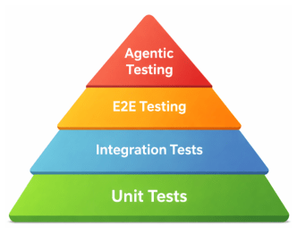

# agentic-testing

Claude drives the running app in a real browser the way a person would and judges whether
it is fit to release.



Everything below asserts: it checks that the code did what someone said it would. Agentic
testing judges, which is the only way to catch a cramped layout, a flow that technically
works and feels broken, or the test nobody remembered to write.

## Goals, not journeys

The idea the rest follows from. A goal is an outcome a user wants to reach, not a sequence
of clicks, so Claude finds its own route there; scripting the steps would just produce a
slow, flaky end-to-end test that costs more than the real one.

The goals go in a checklist you can see before any driving starts, which stops the list
quietly shrinking to match whatever got done. Done means every goal was driven, not that
nothing looked broken.

[SKILL.md](SKILL.md) is the whole thing, and it is short.

## Argument

Optional. It names a target, a lens, or both, and marks where to go deepest rather than
where to stop.

```
/agentic-testing
/agentic-testing accessibility
/agentic-testing the checkout flow on mobile
```

Without one, Claude takes the latest work and weighs every lens that applies.

## Credit

Diagram and framing from Slack's [Agentic testing: where agents fit in the E2E testing
stack](https://slack.engineering/agentic-testing-where-agents-fit-in-the-e2e-testing-stack/),
including the finding that agents verify goals where tests enforce journeys, and that
reliability falls off as a flow gets longer.
