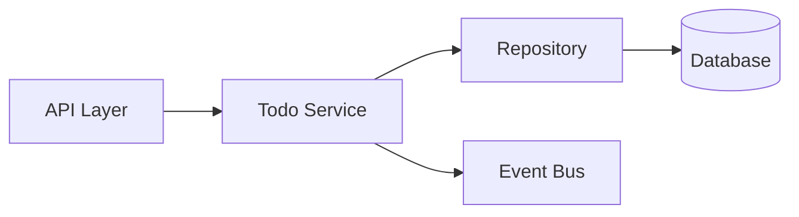

# AI Roadmap Template

Create a high-level feature roadmap that aligns developer and AI understanding before TDD begins. This roadmap guides test sequence without prescribing implementation details: those should be designed by the TDD process itself.

When done, ask user if the roadmap file should be saved to /ai-roadmaps directory in root. Create directory if not exists.

**First, if anything is unclear about the requirements or scope, ask for clarification rather than making assumptions.**

## Roadmap Requirements

**Include:**

-   Test progression from simple to complex
-   System boundaries and interaction points
-   External dependencies to mock
-   Existing patterns to follow from the codebase

**Exclude:**

-   Specific class/method names
-   Data structures or schemas
-   Any implementation decisions tests haven't forced yet

## Format

```markdown
# Feature Roadmap: [Feature Name]

## Overview

[2-3 sentences describing the business value and scope]

## System View

[Create a diagram ONLY if the feature involves multiple components/services interacting,
complex flows, or state transitions that benefit from visualization.
Otherwise, write "No diagram needed - [brief reason]"]

<!-- If diagram is beneficial, choose appropriate type:
- Mermaid diagram for component interactions
- State diagram for workflows
- Sequence diagram for complex flows
- Or describe the system view in text -->

## Spec references

-   Reference the authoritative specifications for this feature (e.g., user story + BDD scenarios, PRD sections, RFCs/design docs, Jira tickets, Story Maps, Ubiquitous Language docs). Keep concise.
-   Include stable identifiers or links/paths (doc path, epic/story IDs, section headings).

## Test Scenario Sequence

<!-- Focus on behavior (what), not implementation (how) -->
<!-- Unit-level plan for technical correctness/edge cases; multiple tests may derive from one BDD scenario. -->

1. [Simplest scenario - usually happy path]
2. [Next complexity - validation/business rules]
3. [Edge cases and error handling]
4. [Integration points if needed]
 <!-- Continue as needed -->

## Boundaries & Dependencies

-   **External Systems**: [What to mock in unit tests]
-   **Internal Patterns**: [Existing patterns to follow]
-   **Integration Points**: [Where integration tests may be needed]

## Non-Functional Requirements

<!-- Include ONLY if explicitly required by specifications -->

-   **Performance**: [Specific latency/throughput needs]
-   **Security**: [Auth/encryption requirements]
-   **Observability**: [Logging/metrics needs]

## Notes

[Important constraints, clarifications, or open questions]
```

## Example (Backend Service)

````markdown
# Feature Roadmap: Archive Completed Todos

## Overview

Users can archive completed todos to declutter their active list. Archived items remain accessible and restorable.

## System View


````

## Spec references

-   User Story + BDD scenarios: specs/todos.feature
    -   Scenario: Archive completed
    -   Scenario: Prevent archiving incomplete
    -   Scenario: Restore
-   PRD: docs/product/todos.md#archiving
-   Jira: TODO-456

## Test Scenario Sequence

1. Archive a completed todo moves it from active to archived
2. Archive is idempotent when the todo is already archived
3. Prevent archiving an incomplete todo returns a domain error and leaves state unchanged
4. Restore an archived todo moves it back to active
5. Restore is idempotent when the todo is already active

## Boundaries & Dependencies

-   **External Systems**: Database, Event Bus (mock in unit tests)
-   **Internal Patterns**: Service/Repository pattern from existing code
-   **Integration Points**: Repository tests will need database connection

## Notes

-   Archive operation should be idempotent

```

## Alternative Examples
- **Frontend**: Focus on user interactions and state changes
- **DevOps/Infra**: Focus on deployment stages and rollback scenarios
- **Data Pipeline**: Focus on transformation stages and validation points

## When to Update This Plan
Regenerate if requirements change, test order needs adjustment, or system boundaries shift. Don't add implementation details discovered through TDD.
```
